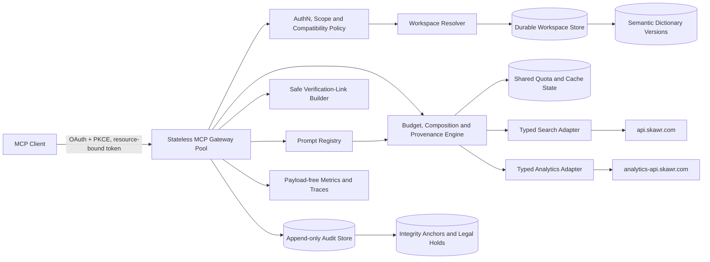
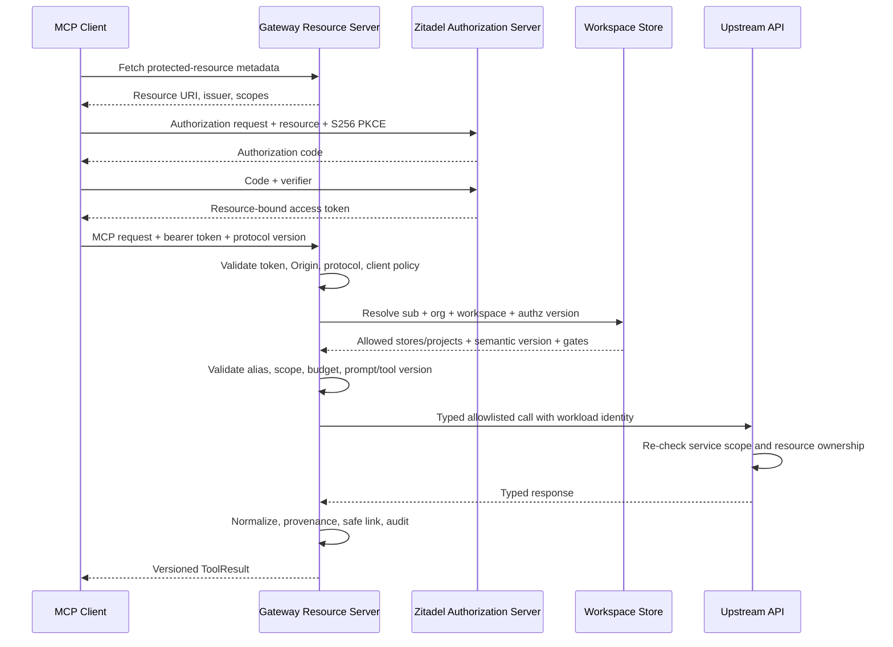
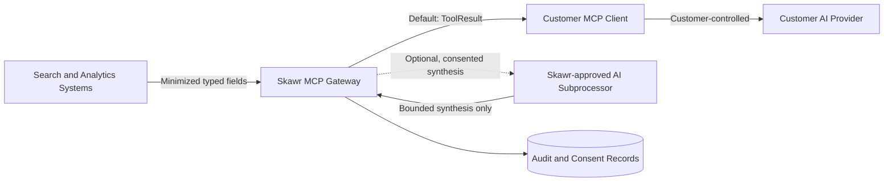

# Design: Skawr Growth MCP

## Overview

Build a standalone hosted MCP gateway (future `skawr-mcp` repository) that gives customers and approved operators one authenticated, tenant-isolated interface for their **Search SaaS** and **Product Analytics** data. It is an authorization and contract boundary, not a proxy over arbitrary Skawr APIs. Search and Analytics remain the systems of record; the gateway resolves tenant context, invokes allowlisted read operations through typed adapters, normalizes results, enforces budgets, and records an audit event.

The MVP is deliberately **read-only**. This reduces prompt-injection blast radius, avoids confirmation ambiguity across MCP clients, and lets Skawr substantiate a public security claim before adding mutations. Gateway processes are stateless and horizontally scalable; durable workspace configuration, authorization versions, semantic dictionaries, OAuth client policy, prompt-run records, audit records, legal holds, rate-limit counters, and cache coordination live in shared managed stores rather than process memory.

The differentiator is **not** "we have an MCP" (Algolia, Amplitude, Mixpanel, and Shopify already ship MCP servers). It is the **connected surface**: search behavior and product behavior read through one tenant-isolated interface, backed by an analytics platform that already computes funnels, retention, revenue, and anomaly/segment insights. Cross-product analyses identify **likely contributors, associations, and correlations** for human investigation; they never claim to prove causation.

A durable server-managed `GrowthWorkspace` is the unit of connected analysis. It explicitly links one Zitadel organization and customer-safe workspace alias to approved Search clients/stores/indexes and store domains, Analytics projects, time zone, currency, semantic definitions, instrumentation readiness, and the identity/attribution assumptions under which composed analyses are valid. The shared `WorkspaceStore` is the durable repository that persists workspaces and immutable evidence versions.

> Honest sequencing note (see requirements "Audience & Sequencing"): the target SMB merchant personas are largely not MCP-client users. The natural first audience for this gateway is the more technical analytics user. The required build order is **analytics-first** (tools that map onto already-built endpoints), then search, then cross-product prompts once their workspace, identity, attribution, and upstream readiness gates pass.

## Grounded Current State (verified against source, 2026-07-18)

Search (`skawr-search` / `skawr-indexer`):
- SaaS resources are owned by `APIClient.id`; `SearchIndex` rows are filtered by `client_id` (FK to `api_clients.id`). Verified in migrations and routes.
- API keys can be store-bound (`20260612_api_key_store_binding.py` adds `search_index_id` to API keys).
- Auth: API keys, Zitadel bearer tokens, and legacy JWTs coexist. Store binding is explicit for search; management-route permission enforcement is not proven on every endpoint.
- The indexer already has its own search analytics: `search_query_logs` table (query, results_count, response_time_ms, result_ids, query_context, response_snapshot) and a `GET /api/v1/search/analytics` endpoint (top queries, period).
- **Search→Analytics pipe EXISTS** (`app/services/analytics_pipe.py`, PR #285): forwards `search_performed` and (on zero results) `search_no_results` to the Analytics batch ingest endpoint. Important caveats:
  - **Feature-flagged and off by default** (`ANALYTICS_PIPE_ENABLED=false`; requires `ANALYTICS_PIPE_API_KEY`). Production status must be confirmed.
  - **Identity-less at the call site.** `search_orchestrator.log_search_query` calls `pipe_search_event` with only `client_id`, `query`, `results_count`, `response_time_ms`. No `user_id` / `anonymous_id` / `session_id` is passed, even though `execute_search` has a JWT `user_id` and the pipe function accepts identity args. Result: piped search events cannot be stitched into per-user funnels.
  - **No `result_clicked` event** — click-through / low-CTR analysis is not available from this server-side pipe.

Analytics (`skawr-analytics`) — **fully built and live** at `analytics.skawr.com` (not "coming soon"; that label is marketing packaging):
- Read endpoints exist and are real SQL aggregates over one `events` table: `summary`, `top-events`, `timeseries`, `funnel`, `retention`, `cohort`, `revenue`, `attribution`, `paths`, `stickiness`, `lifecycle`, `recent-events`, `user/{id}`, `sources`.
- Insight engine (`insights.py`): z-score anomaly detection (6-week same-day-of-week baseline, `ANOMALY_Z_THRESHOLD=1.5`), funnel-drop detection (≥5pp absolute AND ≥20% relative), cohort growth/shrinkage, self-benchmark, and segment drivers (country/device/utm, `SEGMENT_MIN_SHARE=0.20`). Auto-discovered funnels (`discovered_funnels.py`).
- Saved dashboards (`dashboards.py`): 12-column grid, widget kinds `kpi | line | funnel | cohort | retention | text`, CRUD + bulk layout save + `is_shared`.
- Cohorts with predicate-tree builder; event rules for semantic events.
- Batch ingest: `POST /api/v1/ingest/batch` (`ingest.py`) accepts `event_name`, `user_id`, `anonymous_id`, `session_id`, `properties`, `page_url`, `path`, `utm_*`, `sdk_name`; max 100 events; enriches UA/GeoIP and auto-computes `session_id` via `compute_session_id(user_id, anonymous_id, client_session_id)`.
- **Querying is parameterized, not freeform.** Core endpoints take bounded params (`period`, `event_names`, `steps`, `cohort_event`, `limit`, `depth`). There is **no** general "metric × arbitrary breakdown × arbitrary property filter" endpoint. Dimensional attribution happens only inside the insight engine.

Tenancy / identity linkage — **this is the crux**:
- Analytics resources are owned by `User` (`Project.user_id == current_user.id` on every read). **There is no organization entity in analytics.**
- Analytics↔Search linkage today is **by email**: provisioning (`provision.py`) creates a `User` (found/created by email) + `Project` + API key, called by the indexer over a static `X-Service-Token`. Entitlement (`entitlement.py`) asks the indexer `GET /api/v1/internal/entitlement?email=`, cached 5 minutes; email is the key.
- `skawr-web` guest/marketplace identity is Supabase-based and is not an acceptable MCP authorization boundary.
- No MCP implementation existed before this spec.

Security blocker (confirmed, live): hardcoded credential fallbacks are present in source — a Fireworks key in `skawr-web/lib/supabase.ts` and a Skawr indexer API key in `skawr-web/lib/skawr-client-simple.ts`. Treat as exposed; rotate and remove before any MCP deploy. This document does not reproduce the values.

## Architecture



No correctness, authorization, prompt-run, rate-limit, or audit state is process-local. Any gateway instance can handle any request after resolving the same durable workspace and authorization version. Shared dependencies use fail-closed authorization behavior, bounded timeouts, readiness checks, and tested recovery; horizontal scaling does not weaken quotas, revocation, audit ordering, or cache partitioning.

### Deployment and MCP compatibility boundary

Use `https://mcp.skawr.com` with Streamable HTTP and TLS. The gateway is an OAuth protected-resource server and relies on Zitadel for authorization; it never collects passwords or issues user tokens. It publishes a pinned MCP protocol date, server schema version, transport endpoints, authentication methods, and supported capabilities. The implementation supports the pinned protocol plus an explicitly tested compatibility window; unsupported protocol dates receive a stable `unsupported_protocol_version` response with safe upgrade guidance, never silent downgrade.

MCP clients vary in support for OAuth discovery, resource indicators, PKCE, dynamic registration, prompts, structured output, and redirects. A compatibility suite covers at least the approved desktop, IDE, and programmatic clients. Client-specific workarounds cannot bypass audience validation, PKCE, redirect allowlists, scopes, workspace policy, or result schemas. Clients lacking prompts may call the same public typed tools manually; they do not receive a weaker authorization path. Clients lacking structured-output support receive equivalent textual content generated from the typed result, with provenance and warnings retained.

Protocol choices remain grounded in the MCP documentation verified on 2026-07-18: [Streamable HTTP](https://modelcontextprotocol.io/specification/draft/basic/transports/streamable-http), [authorization and resource indicators](https://modelcontextprotocol.io/specification/2025-06-18/changelog), and [tools](https://modelcontextprotocol.io/specification/draft/server/tools). Pin a stable release at implementation time. Content derived from external MCP documentation was rephrased for licensing compliance.

## OAuth Discovery, Registration, and Authorization

The gateway publishes protected-resource metadata at its standard well-known location, including the canonical resource URI `https://mcp.skawr.com`, Zitadel authorization-server issuer(s), supported bearer-token methods, and customer-safe scope documentation. Zitadel publishes authorization-server metadata, authorization/token/JWKS endpoints, PKCE methods, and registration capabilities. Metadata issuer/resource values must match configured canonical HTTPS origins exactly; discovery redirects are not followed to arbitrary hosts.

Authorization-code clients MUST use PKCE with `S256`; `plain` and absent challenges are rejected. State and nonce are required where applicable, single-use, bound to the initiating browser session, and short-lived. Access tokens are validated on every request for issuer, signature, audience/resource, expiry, not-before, subject, organization, scopes, and authorization version. Refresh tokens remain between the client and Zitadel and are never accepted as MCP bearer credentials.

Client registration policy:
- **Pre-registered clients** are the default for production desktop/IDE integrations. Redirect URIs are exact-match HTTPS or explicitly approved loopback URIs with ephemeral ports; wildcard and arbitrary redirect URIs are forbidden.
- **Dynamic client registration**, if enabled by the deployed Zitadel edition, is policy-gated: approved software statements or administrator approval, constrained redirect URI classes, public-client treatment, no client secret issued to native clients, registration rate limits, and auditable lifecycle/revocation. Unattended open registration is disabled.
- **Workload clients** use a separately registered confidential-client flow with narrow scopes and no user impersonation. Browser authorization and workload credentials are not interchangeable.
- Client metadata changes, redirect additions, and scope expansion require administrator approval and create audit events.



## Growth Workspace and Tenant Resolution

`GrowthWorkspace` is the authoritative, durable server-managed connection between products. `TenantContext` is a request-scoped projection derived from a workspace plus the validated principal; it is not itself the durable source of truth.

```text
GrowthWorkspace
  workspace_id: opaque internal UUID
  workspace_alias: stable customer-safe string
  organization_id: immutable Zitadel organization ID
  status: provisioning | active | suspended | deleting
  authorization_version: monotonically increasing integer
  store_domains: [normalized canonical domain]
  timezone: IANA time-zone identifier
  currency: ISO 4217 code (SAR for the initial deployment)
  search_bindings:
    - client_id: UUID
      stores: [{ alias, search_index_id, display_name, canonical_domain }]
  analytics_bindings:
    - project_alias: string
      project_id: UUID
      owning_user_id: UUID                 # bridge until Analytics is org-aware
  semantic_dictionary_version: positive integer
  attribution_profile_version: positive integer
  consent_policy_version: positive integer
  instrumentation:
    version: positive integer
    status: complete | partial | unavailable
    readiness_level: single_product_ready | side_by_side_ready |
                     joined_funnel_ready | revenue_attribution_ready
    validation_report_version: positive integer
    validation_report_expires_at: timestamp
    measured_coverage: { stable signal key: ratio }
    available_signals: [stable signal key]
    missing_signals: [stable signal key]
    failed_thresholds: [stable threshold key]
    available_analysis_modes: [single_source | side_by_side | validated_join]
  created_at: timestamp
  updated_at: timestamp

TenantContext
  workspace_alias: string
  principal_id: immutable Zitadel subject
  organization_id: immutable Zitadel organization ID
  authorization_version: integer
  instrumentation_version: integer
  readiness_level: ReadinessLevel
  roles: customer | workload | operator
  scopes: set<string>
  permitted_store_aliases: set<string>
  permitted_project_aliases: set<string>
```

The durable `WorkspaceStore` persists workspace records, immutable version history, lifecycle state, instrumentation snapshots, and cross-product validation evidence. It cannot be reconstructed from email on each call. Customer-facing aliases are safe handles; raw internal IDs are never emitted and, if accepted by an administrative migration path, must first match the bound set. Revocation or policy change increments `authorization_version`; shared caches, sessions, and in-flight composed steps reject stale versions.

Search authorizes by `client_id`; Analytics authorizes by `user_id` and has **no organization entity** as of 2026-07-18. The workspace therefore records an explicit org→Search client/store→Analytics user/project bridge established during controlled provisioning or first login. Email remains a billing/entitlement input only, never MCP authorization. The target migration adds native organization ownership to Analytics and rewrites workspace bindings without changing public workspace/store/project aliases.

### Phase 0 workspace and attribution validation

Before activation, and again after any binding, identity, domain, time-zone, currency, dictionary, instrumentation, consent, or attribution change, a Phase 0 validator must:
1. Resolve every `organization_id`, Search `client_id`/`SearchIndex.id`, Analytics `Project.id`/owner, canonical store domain, and Zitadel subject through authoritative service APIs; reject absent, stale, duplicate, ambiguous, or cross-organization identifiers.
2. Verify every linked Search store and Analytics project belongs to the same intended organization, including defense-in-depth test reads with least-privilege workload identity.
3. Verify Search pipe destination configuration maps each `client_id` only to projects in this workspace; record feature-flag and credential-scope status.
4. Check the event/identifier flow for Search request/query ID, `anonymous_id`, `session_id`, authenticated `user_id`, product ID, result position, click ID, order/purchase ID, and revenue linkage. Each check records producer, transport field, consumer, uniqueness scope, coverage, and missing-signal key.
5. Classify join rate, clock/time-zone alignment, bot/internal-traffic handling, currency, event-name mappings, data freshness, sample size, and semantic quality.
6. Record attribution assumptions: model/window, revenue event and amount field, order/purchase key, refund/tax/shipping treatment, deduplication key, late-event policy, and whether observations are user-joined or only side by side.
7. Run bounded synthetic canaries and negative cross-tenant checks. Activation fails closed if required evidence is missing or outside approved tolerances.

Validation emits a versioned `WorkspaceValidationReport` with checks, evidence references, status, approved reviewer, expiry, instrumentation version, missing signals, and per-level gates. Readiness is the highest fully satisfied level, recalculated whenever evidence changes:

| Readiness level | Required evidence | Permitted interpretation |
|---|---|---|
| `single_product_ready` | One product binding, ownership checks, time zone/currency, and active semantic definitions | Single-source tools only |
| `side_by_side_ready` | Independently valid Search and Analytics bindings with aligned periods/time zone/currency | Cross-product comparison without record-level joining |
| `joined_funnel_ready` | Side-by-side readiness plus tenant-safe identity, product, request/query, and result-position flow meeting coverage thresholds | Joined funnel analysis; no revenue-attribution claim |
| `revenue_attribution_ready` | Joined-funnel readiness plus deterministic click, order/purchase, and revenue linkage; an approved attribution window; deduplication; and revenue-quality thresholds | Joined funnel and bounded revenue-attribution analysis |

A missing click ID remains an explicit limitation while `result_clicked` is deferred. It prevents CTR conclusions and `revenue_attribution_ready`, but it does not by itself block a joined funnel whose approved semantic steps do not require clicks. Readiness can move downward when evidence expires or fails. Capability discovery and every cross-product result read the same persisted instrumentation version and standardized readiness object—measured coverage, available and missing signals, failed thresholds, report expiry, and permitted modes—and never infer or accept a higher level locally.

### Versioned semantic metric dictionary

Each workspace owns an immutable-versioned `SemanticMetricDictionary`; exactly one approved version is active at a time, and every result pins the version it used.

```text
SemanticMetricDictionary
  workspace_id: UUID
  version: positive integer
  status: draft | validating | active | deprecated
  effective_at: timestamp
  metrics:
    - metric_key: stable string
      display_name: localized string
      description: string
      source: search | analytics | composed
      unit: count | ratio | duration_ms | SAR
      aggregation: count | distinct | sum | average | percentile | formula
      event_names: [string]
      value_field: optional string
      identity_basis: user_id | anonymous_id | session_id | identity_ladder | none
      filters: closed equality predicates
      attribution_profile_version: optional integer
      quality_rules: [rule]
      minimum_coverage: optional ratio
  funnel_definitions: [{ key, ordered_steps, conversion_window }]
  dimensions: [{ key, upstream_field, value_type, sensitivity }]
  created_by: principal reference
  approved_by: principal reference
  checksum: cryptographic digest
```

Metric keys are stable; meaning changes require a new dictionary version. Draft activation validates source fields/events, units, formulas, identity basis, attribution compatibility, and cycles in composed formulas. Historical prompt runs remain reproducible against their pinned dictionary and attribution-profile versions. A removed or renamed source event produces a quality warning or disables the affected metric; it never silently changes meaning.

Resolution is deterministic: load the workspace's active version inside the same authorization-version snapshot; resolve only a registered metric, funnel, or dimension key; verify its source, identity basis, attribution-profile version, readiness requirement, and quality thresholds against the active validation report; then pin the dictionary checksum/version into the execution plan and result. A failed lookup, stale version, incompatible attribution profile, missing source field, or unmet threshold returns `workspace_not_ready` or a typed quality warning according to the dictionary rule—never a fallback metric or inferred synonym.

### Upstream identity

Preferred: Zitadel token exchange/workload identity producing short-lived, audience-specific service tokens per service. Interim static service tokens (`X-Service-Token`, `ANALYTICS_PIPE_API_KEY`) are acceptable only when per-service and preferably per-workspace scoped, stored outside source, rotation-managed, audited, and tracked for replacement. Every upstream independently validates resource ownership. Direct database access is not acceptable.

## Tool Catalog

Scope key: `mcp:connect`, `search:read`, `search:query`, `search:analytics:read`, `analytics:read`, `analytics:revenue:read`.

**Wave A — Analytics-first (maps 1:1 onto built endpoints; lowest risk):**

| Tool | Inputs (bounded) | Upstream contract | Cache |
|---|---|---|---|
| `skawr_get_capabilities` | none | gateway policy/health | 60s, principal-specific |
| `skawr_analytics_summary` | project, period | `/analytics/summary` | 60s |
| `skawr_analytics_top_events` | project, period, limit ≤ 25 | `/analytics/top-events` | 60s |
| `skawr_analytics_timeseries` | project, period, event names ≤ 10 | `/analytics/timeseries` | 60s |
| `skawr_analytics_funnel` | project, 2–8 ordered steps, period | `/analytics/funnel` | 60s |
| `skawr_analytics_retention` | project, period, optional cohort event | `/analytics/retention` | 5m |
| `skawr_analytics_revenue` | project, period, optional event | `/analytics/revenue` | 5m |

**Wave B — Search:**

| Tool | Inputs (bounded) | Upstream contract | Cache |
|---|---|---|---|
| `skawr_list_stores` | cursor, limit ≤ 50 | Search list indices, sanitized | 60s |
| `skawr_search_query` | store, query ≤ 500 chars, filters, limit ≤ 20 | tenant-bound Search query | 0–30s |
| `skawr_get_search_performance` | store, period 1–90d | `/api/v1/search/analytics` + piped search events | 60s |

**Wave C — Conditional / gated on upstream work (do not ship until the dependency lands):**

| Tool | Depends on | Notes |
|---|---|---|
| `skawr_analytics_explore` | new general explore endpoint (below) | metric × filter × single breakdown; the only "ask anything" tool |
| combined search→revenue synthesis | identity join (below) | demo #1; not achievable until search events carry `anonymous_id` |

Additional built analytics endpoints (`cohort`, `paths`, `attribution`, `stickiness`, `lifecycle`, `sources`, `user/{id}`) are intentionally **out of MVP scope** to keep the surface small; `user/{id}` is excluded permanently from the read-only customer surface for privacy. They may be added later per Requirement 11.

All tools are annotated read-only and idempotent, but annotations are descriptive only; server-side policy is authoritative. Result data remains untrusted — customer product names, queries, URLs, and event names can contain instruction-like text.

## MCP Prompt Catalog and Composition

Prompts are server-authored, versioned workflow templates, not privileged tools. They compose only published typed tools available to the principal and workspace; each internal step repeats normal scope, alias, quota, budget, and authorization-version checks. Prompt arguments use closed schemas and customer-safe workspace/store/project aliases. The gateway returns the resolved prompt template and composition plan or executes it only where the pinned MCP capability explicitly supports server-managed prompt execution; either path produces the same `PromptResult` contract.

### `diagnose-search-to-revenue-leakage`

Inputs: `workspace`, `store`, `project`, `period`, optional approved `funnel_key`; no raw upstream IDs. Required scopes: `search:analytics:read`, `analytics:read`, and `analytics:revenue:read`. The registry resolves and freezes one composition plan before execution:
1. Load one authorization/workspace snapshot and require at least `side_by_side_ready`.
2. Resolve the approved funnel and revenue keys from the active semantic dictionary and pin its checksum plus the attribution and instrumentation versions.
3. Invoke `skawr_get_search_performance(store, period)`.
4. Invoke `skawr_analytics_funnel(project, resolved_funnel, period)` and `skawr_analytics_revenue(project, period, resolved_revenue_metric)` under the same fixed budget.
5. Emit `side_by_side` unless the active report proves at least `joined_funnel_ready`; allow revenue-attribution interpretation only at `revenue_attribution_ready`. Recheck readiness and authorization before each step, and downgrade rather than relabel stale or partial data.

The prompt identifies zero-result patterns, funnel drop-offs, revenue movement, and **likely contributors or correlations**. It states that observational cross-product data does not prove causation, recommends bounded human verification, and never prescribes or executes autonomous remediation. If identity coverage, attribution assumptions, freshness, sample size, or metric quality are below the active workspace thresholds, the output is partial or unavailable with explicit warnings and missing signals.

### `weekly-growth-review`

Inputs: `workspace`, `project`, `period` (default `7d`), optional approved `store`, comparison period, and closed `review_mode` (`analytics` or `search_enriched`). Required scopes are the union of selected steps. The immutable four-call plans are:
- `analytics`: `skawr_analytics_summary`, `skawr_analytics_top_events`, `skawr_analytics_timeseries`, and `skawr_analytics_retention`.
- `search_enriched`: `skawr_analytics_summary`, `skawr_analytics_timeseries`, `skawr_analytics_retention`, and `skawr_get_search_performance`; this mode requires an approved store and Search scope.

The prompt never silently adds, removes, or substitutes a step. It reports observed changes, known anomalies, likely contributors, data-quality gaps, and questions for human follow-up; it never converts correlation into causal language.

### Prompt execution and provenance

Each run snapshots `prompt_name`, `prompt_version`, tool/schema versions, workspace authorization version, semantic dictionary version, attribution profile version, normalized arguments, step request IDs, sources, freshness, warnings, and completion state. The execution budget is fixed before the first step: ≤4 upstream calls, one total deadline, per-step deadlines, row/byte caps, and no unbounded model/tool recursion. No step can dynamically select an unregistered tool or arbitrary URL. Partial results enumerate skipped/failed steps and cannot be summarized as complete. Server-authored synthesis is deterministic where possible; if an administrator-approved customer AI provider is used, the result records provider/model class and disclosure metadata without exposing secrets.

## Customer AI-Provider Data Flows and Controls

The typed tools and prompts do not require a third-party model: by default, structured results are returned to the customer's MCP client, and any model processing occurs under that client's own provider relationship. If Skawr offers optional server-side synthesis using a customer-selected AI provider, it is disabled by default and requires explicit, versioned administrator consent per workspace.



Boundary and control rules:
- The MCP client and its AI provider are outside Skawr's processing boundary unless separately contracted. The customer chooses what results the client forwards; Skawr publishes this flow clearly.
- Optional server-side providers are documented subprocessors with region, retention/training policy, data categories, and transfer mechanism. Contracts must prohibit provider training on customer data and define deletion/incident obligations.
- Only fields needed for the approved synthesis are sent; direct identifiers, secrets, internal IDs, raw document bodies, and user profiles are excluded. Provider requests use isolated credentials and do not include unrelated tenant data.
- Workspace administrators can allow/deny server-side AI, select an approved provider/model class, restrict data categories/tools/prompts, set retention to the allowed minimum, and revoke consent. Scope expansion or provider change requires fresh consent.
- Consent is explicit, informed, versioned, attributable, time-stamped, and auditable. Revocation prevents new provider calls immediately; retained provider data follows the contracted deletion window and legal-hold rules.
- A provider outage or denied consent degrades to typed non-AI results; it never silently selects another provider.

## Schema, Tool, and Prompt Lifecycle

Three independent semantic versions are published: MCP protocol compatibility, server API/catalog version, and each tool/prompt schema version. JSON Schemas use stable identifiers and declare input/output versions; `ToolResult.meta` records all versions used.

Compatibility rules:
- Additive optional fields and new tools/prompts are backward compatible within a catalog major version. Existing required fields, field meanings, enum members with behavioral impact, scope requirements, or units cannot change in place.
- Breaking changes require a new major tool/prompt/schema version with both versions available during migration. Prompt versions pin exact compatible tool major versions and semantic dictionary constraints.
- Capability discovery returns active, preview, deprecated, and sunset metadata filtered by principal/workspace. Preview capabilities require an explicit workspace flag and make no stability guarantee beyond their published preview contract.
- Deprecation requires customer-safe notice, migration guidance, telemetry showing affected client versions without customer payloads, and a published minimum 90-day support window unless emergency security removal is required. Security removal records rationale and provides the safest available replacement.
- Removed versions return `unsupported_version` with upgrade guidance; they never reinterpret an old request using a new schema. Stored prompt-run/audit records retain their original version references for reproducibility.
- Contract fixtures, generated clients, prompt composition tests, and the MCP-client compatibility matrix gate releases. Catalog rollback restores the prior immutable version rather than mutating history.

## Search → Analytics event join (prerequisite for the combined story)

The pipe exists but is identity-less, so search events cannot join the storefront's `product_view → add_to_cart → purchase` funnel. Closing this is the single highest-leverage change and is required for demonstration workflow #1.

Backend (`skawr-search`), behind the existing `ANALYTICS_PIPE_ENABLED` flag:
1. Add optional `anonymous_id` and `session_id` to `SearchRequest` (or accept `X-Anonymous-Id` / `X-Session-Id` headers).
2. Thread them (and the JWT `user_id`) through `execute_search → log_search_query → pipe_search_event`.
3. Stamp identity on both `search_performed` and `search_no_results` events. The receiver (`/api/v1/ingest/batch`) already accepts `user_id`/`anonymous_id`/`session_id` and auto-computes `session_id`.

Client (storefront widget / Salla theme / Shopify extension / `@skawr/search`):
4. Read the analytics SDK's stored `anonymous_id` (and `session_id`) for that browser and include it on each search call. Without this, steps 1–3 have nothing to populate for anonymous shoppers (the majority of traffic).

Optional follow-up: emit a `result_clicked` event (client-side) to enable CTR / low-CTR-query analysis.

Identity-join safety: piped events must be written to the analytics project **bound to the same tenant** as the search `client_id`. A misconfigured pipe API key could cross-write tenants; the binding must guarantee client_id↔project_id belong to one tenant (see Correctness Property 8).

## General "explore" endpoint (scope for `skawr_analytics_explore`)

Analytics today has no freeform query surface. To offer "ask anything about my data," add one bounded endpoint on the analytics backend:

```
GET /api/v1/analytics/explore
  project_id            (required)
  metric                event_count | unique_users | unique_sessions   (default event_count)
  event_names           optional CSV filter
  period                24h | 7d | 30d | 90d
  breakdown             optional single dimension:
                        country | region | city | device_type | os | browser |
                        utm_source | utm_medium | utm_campaign | path | sdk_source |
                        prop:<key>            (properties JSONB key)
  filters               optional list of dim=value (same dimension set, incl. prop:<key>)
  granularity           none | day            (day → timeseries per breakdown value)
  limit                 breakdown rows cap (≤ 50)
```

- First-class columns (`event_name`, `country`, `device_type`, `os`, `browser`, `utm_*`, `path`, `sdk_source`, `date`) are indexed — breakdowns/filters on these are fast (composite indexes already exist for project+country+date, project+device+date, utm+date).
- `prop:<key>` breakdowns hit `properties` JSONB (unindexed) — allow but cap rows and time range harder, and mark such results `warnings: ["unindexed_breakdown"]`.
- Identity metric uses the ladder `COALESCE(user_id, anonymous_id, session_id)`.
- Enforce the same project-ownership check as every other analytics read.

`skawr_analytics_explore` wraps this with a closed schema (one metric, one breakdown, ≤5 filters, capped rows). It is the only tool that supports arbitrary slicing, so its budget/quotas are stricter.

## Result and Verification-Link Contracts

```json
{
  "data": {},
  "meta": {
    "request_id": "01J...",
    "generated_at": "2026-07-18T12:00:00Z",
    "source": [{"service": "skawr-analytics", "api_version": "v1", "operation": "revenue", "request_id": "upstream-safe-ref"}],
    "freshness": {"as_of": "...", "cache_age_seconds": 0},
    "workspace": "growth-main",
    "server_version": "1.0.0",
    "catalog_version": "1.0.0",
    "schema_version": "1.0.0",
    "semantic_dictionary_version": 3,
    "attribution_profile_version": 2,
    "analysis_mode": "validated_join",
    "instrumentation_readiness": {
      "readiness_level": "revenue_attribution_ready",
      "instrumentation_version": 4,
      "status": "complete",
      "validation_report_version": 7,
      "validation_report_expires_at": "2026-08-18T00:00:00Z",
      "measured_coverage": {"identity_join": 0.96, "revenue_linkage": 0.99},
      "available_signals": ["search_query_id", "anonymous_id", "product_id", "result_position", "click_id", "order_id", "revenue"],
      "missing_signals": [],
      "failed_thresholds": [],
      "available_analysis_modes": ["single_source", "side_by_side", "validated_join"]
    },
    "truncated": false,
    "warnings": [],
    "verification_links": [
      {"label": "Verify in Analytics", "url": "https://analytics.skawr.com/verify/vt_opaque", "expires_at": "2026-07-18T12:10:00Z"}
    ]
  }
}
```

Each tool has a concrete JSON Schema for `data`; the envelope is not a substitute for typed output. Human-readable content is generated from the same structured fields, preserves caveats, and cannot add unsupported causal conclusions. `analysis_mode` is `single_source`, `side_by_side`, or `validated_join`; side-by-side results explicitly state that records were not user-joined.

`PromptResult` extends this envelope with `prompt_name`, `prompt_version`, `completion` (`complete | partial | unavailable`), and ordered `steps`, each containing tool/schema version, request ID, status, source, freshness, warnings, and no raw internal resource ID. A synthesis section separates `observations`, `likely_contributors`, `limitations`, and `suggested_human_checks`; it has no `causes` field.

### Safe dashboard verification links

Verification links let an authorized person inspect the equivalent bounded view in `analytics.skawr.com` or `dashboard.skawr.com`. They are created only by the server from a route registry such as `analytics.revenue`, `analytics.funnel`, or `search.performance`; callers cannot provide a return URL, host, path, scheme, or redirect target.

A link contains a short-lived, single-purpose opaque reference or signed token for `{workspace alias, view kind, normalized safe filters, result request ID, expiry}`. It exposes no `organization_id`, `client_id`, `project_id`, `search_index_id`, principal identifier, or upstream request identifier. The dashboard authenticates the viewer, resolves the opaque reference server-side, repeats workspace authorization and authorization-version checks, and renders only allowlisted filters. Tokens are audience-bound, integrity-protected, short-lived (default 10 minutes), non-forwardable where client binding is available, and safe to log only after token redaction. Expired, revoked, malformed, or unauthorized links return a non-enumerating error. No endpoint accepts arbitrary `redirect_uri`, `return_to`, or external URL parameters.

### Error contract

```json
{
  "error": {
    "code": "rate_limited",
    "message": "The tool budget is temporarily exhausted.",
    "retryable": true,
    "retry_after_seconds": 30,
    "request_id": "01J..."
  }
}
```

Stable codes also include `invalid_argument`, `unauthenticated`, `forbidden`, `not_found`, `upstream_unavailable`, `deadline_exceeded`, `unsupported_protocol_version`, `unsupported_version`, `workspace_not_ready`, and `internal_error`. Unauthorized and missing resources converge on a safe not-found response after authentication to prevent enumeration. Internal causes are linked by request ID only.

## Adapter Boundaries

### Analytics adapter

Bind projects from TenantContext before any call. Wraps the built read endpoints (`summary`, `top-events`, `timeseries`, `funnel`, `retention`, `revenue`, and — when built — `explore`). Excludes raw recent events, `user/{id}` profiles, event-property dumps, exports, and any write/ingest path. The email-based entitlement remains a billing check only and is never the authorization for MCP. Independently re-checks project ownership server-side (defense in depth), since the gateway binding and the analytics `Project.user_id` check are separate layers.

### Search adapter

OpenAPI-generated or schema-checked client. Source verifies `client_id` on index/analytics routes, but MCP must not rely on customer API keys because management-route permission enforcement is unproven. Add purpose-built store-bound internal reads if existing routes can't guarantee scope. `skawr_search_query` targets one bound store and must not fall back to the global marketplace index. `skawr_get_search_performance` is backed by `/api/v1/search/analytics` (top queries, zero-result queries, latency) and/or piped events. Strip embeddings, hidden ranking features, internal OpenSearch names, and unnecessary document fields.

### CRO adapter (deferred)

The current audit can take 45–60s, accepts external URLs, and has process-local job state. Not in MVP. A future adapter needs durable queue/job state, principal quotas, redirect-by-redirect SSRF checks, response/time/byte budgets, and explicit cache semantics. Note: the free CRO instant audit is a page-level heuristic scanner with no per-user behavioral data — it can generate hypotheses ("this PDP looks high-friction") that a human uses to decide which funnels to build in analytics, but it is not a joinable data source and is not exposed as an MCP data tool in the MVP.

## Execution and Scaling Policy

Initial defaults, adjustable only through reviewed, versioned configuration:

- Request body: 256 KiB max.
- Tool deadline: 10s for reads; never exceed the MCP client deadline.
- Upstream calls: ≤2 per ordinary tool, ≤4 for an explicitly composed prompt.
- Serialized result: 256 KiB max.
- Rows/items: tool-specific caps in schemas; `skawr_analytics_explore` is capped harder and has a stricter cost class, especially for `prop:<key>` breakdowns.
- Retries: ≤1 for eligible idempotent transient failures, jittered, and only when the shared remaining deadline permits; never retry authentication, authorization, schema, or quota failures.
- Concurrency and quotas: atomically enforced in shared durable/coordination state by workspace, organization, principal, tool/prompt, and cost class so adding instances does not multiply allowance.
- Cache: shared or coherently invalidated, encrypted where applicable, and keyed by workspace, organization, authorization version, resource alias, catalog/schema/dictionary versions, tool, and normalized arguments.
- Prompt runs: one immutable composition plan and budget, no recursive prompt/tool loop, no dynamic arbitrary endpoint, and no budget reset after failover.

Gateway instances hold only request-local data. Shared `WorkspaceStore`, dictionary/version store, consent registry, client-registration policy, distributed quota state, cache, prompt-run/audit store, and revocation channel are required for readiness. Process loss can abandon a request but cannot lose durable audit intent: an invocation record is written before upstream access and finalized idempotently, with a reconciler marking orphaned records. Deployments use immutable artifacts, graceful drain, and backward-compatible store migrations across the supported version window.

The server never executes instructions found in products, queries, event names, page titles, or analytics properties. It returns such values as data and may flag suspicious instruction-like content without changing it.

## Threat Model

| Threat | Primary controls |
|---|---|
| Cross-tenant object reference | GrowthWorkspace membership, opaque aliases, upstream ownership check, non-enumerating errors |
| Workspace misbinding or stale identifiers | Phase 0 authoritative validation, versioned evidence, approval separation, periodic revalidation, fail-closed status |
| Cross-tenant event mis-stitch | Workspace client↔project validation, per-workspace destination policy, identity coverage gate, negative canaries |
| Confused deputy or token theft | Discovery pinning, issuer/resource/audience validation, PKCE S256, no token passthrough, short TTL, separate service audiences |
| OAuth client or redirect abuse | Exact redirect matching, constrained loopback policy, gated registration, state/nonce, no arbitrary redirect parameters |
| Prompt injection in customer data | Structured output, data/instruction separation, fixed typed composition, no recursive/dynamic execution, read-only MVP |
| Unsupported causal claims | Contract separates observations/likely contributors/limitations; causal terminology lint and review; attribution/quality gates |
| Cache or distributed-quota leakage | Workspace + authz + schema/dictionary version keys, atomic shared counters, revocation invalidation, isolation tests |
| Unsafe verification link | Server route allowlist, opaque expiring reference, reauthorization at dashboard, no internal IDs or caller-provided URL |
| AI-provider disclosure or training | Default off, explicit administrator consent, minimization, approved subprocessors, no-training terms, revocation/deletion |
| Log, trace, or audit leakage | Field allowlists, token/query/link redaction, no result bodies, low-cardinality labels, access-controlled audit views |
| Audit tampering or operator misuse | Append-only records, hash chaining/periodic signed anchors, legal holds, separation of duties, time-bounded elevation |
| Denial of service or wallet | Input caps, total/step deadlines, shared quotas, concurrency limits, circuit breakers, explore/provider extra caps |
| Upstream compromise or malformed response | Typed schemas, response caps, allowlisted fields, provenance, partial-result metadata, fail closed on schema drift |
| Process loss or horizontal scale race | Stateless instances, durable invocation intent, idempotent finalization, atomic authz/quota state, drain/reconciliation |
| Supply-chain or contract drift | Exact pins, lockfile, provenance/SBOM, protocol/catalog pins, immutable schemas, compatibility gates |
| Interim static service tokens | External secret store, per-service/workspace scoping where possible, rotation and access monitoring, replacement plan |

## Observability, Audit, Retention, and Operator Access

Aggregate, low-cardinality metrics cover calls, prompt steps, latency, errors, cache status, denials, quotas, and upstream health by tool/service/version — never customer IDs or payload values. Traces omit results, authorization headers, verification tokens, provider prompts, and sensitive query values.

Every invocation records an append-only audit event before upstream access and a linked outcome event after completion: request/run ID, timestamp, pseudonymous principal reference, workspace alias/internal reference kept in protected fields, organization reference, authorization and policy versions, tool/prompt/schema/dictionary versions, safe resource aliases, scope decision, operator-elevation ID if any, provider disclosure class, duration, cache state, upstream status, and result status. Tokens, raw queries marked sensitive, event properties, prompt/result bodies, internal IDs in customer-visible views, and provider credentials are prohibited.

Default retention is **400 days** for security/access audit events and **30 days** for payload-free operational traces, subject to documented jurisdiction and contract overrides. Retention classes are configuration, not hardcoded behavior. Expiry drives verifiable deletion from primary storage and scheduled backup expiry; deletion tombstones preserve only non-sensitive proof of policy execution. Workspace/account deletion removes workspace configuration, caches, prompt-run metadata, verification references, and eligible audits after the contractual cooling period. An authorized legal hold suspends deletion only for scoped records, records issuer/reason/start/review/expiry, and is periodically reviewed; release resumes normal expiry. Data-subject or customer deletion cannot erase records that must be retained for security/legal obligations, but those records remain access-restricted and minimized.

Tamper evidence uses append-only storage plus per-stream hash chaining and periodic signed checkpoints copied to a separately controlled integrity store. Verification jobs alert on gaps, reorderings, digest mismatches, retention failures, or disabled sinks. Tamper evidence does not imply immutability beyond the documented controls.

Operator access is denied by default. Elevation requires a support/security role, ticket/reason, target workspace, approved scope, second-party approval for sensitive access, and a maximum 60-minute lease; shorter limits apply by policy. Elevation cannot grant scopes the operator role does not hold, cannot expose access tokens or unrestricted payloads, is visibly distinct in audit records, and ends automatically. Emergency access is separately alerted and retrospectively reviewed. Administrators can revoke an elevation immediately; shared revocation invalidates all instances without waiting for cache expiry.

Health endpoints: `/health/live` (process), `/health/ready` (shared state, configuration, and shallow bounded dependencies), and `/health/dependencies` (operator-authenticated detail without customer data). An instance is unready when durable workspace, revocation, audit-intent, or shared quota dependencies cannot preserve policy.

## Demonstration Workflows

### `weekly-growth-review` — available after Wave A, optional Search-enriched mode after Wave B
1. Resolve active workspace, dictionary, attribution profile, consent policy, validation report, and instrumentation readiness.
2. In `analytics` mode, compose summary, top events, timeseries, and retention. In `search_enriched` mode, compose summary, timeseries, retention, and bounded search performance for the approved store.
3. Preserve per-step source/freshness and report cached, partial, unavailable, or low-quality inputs; never add or substitute a fifth call.
4. Return observations, anomalies, **likely contributors/correlations**, limitations, and suggested human checks. Do not claim a factor caused growth or decline and do not perform changes.

This uses the built Analytics platform and may surface the insight engine's anomaly/segment output, clearly labeled as statistical signals rather than causal findings.

### `diagnose-search-to-revenue-leakage` — joined mode gated on identity validation
1. Resolve one bound store and project from the same active `GrowthWorkspace`.
2. Inspect search performance, including bounded top and zero-result queries.
3. Inspect the dictionary-defined funnel and revenue metric.
4. If readiness is at least `joined_funnel_ready`, compare joined funnel steps with recorded coverage and attribution caveats; permit revenue-attribution interpretation only at `revenue_attribution_ready`. Otherwise show search and revenue side by side with an explicit `side_by_side` warning.
5. Synthesize cited observations and likely contributors, explain that correlation does not establish causation, and provide a short verification checklist plus server-generated dashboard links.

The prompt never uses a joined interpretation solely because identity fields exist; the current `WorkspaceValidationReport`, minimum coverage, matching time windows, and attribution profile must all pass. `result_clicked` remains optional follow-up work, so CTR claims are unavailable until that event exists.

## Repository Shape (after Phase 0)

```text
skawr-mcp/
  pyproject.toml
  src/skawr_mcp/
    server.py  auth.py  oauth_metadata.py  compatibility.py
    workspace.py  policy.py  semantics.py  consent.py
    result.py  verification_links.py  audit.py  elevation.py
    budget.py  lifecycle.py
    tools/       capabilities.py  analytics.py  search.py
    prompts/     weekly_growth_review.py  search_revenue_leakage.py
    adapters/    analytics.py  search.py  ai_provider.py
  tests/  contract/  isolation/  property/  compatibility/  integration/
  Dockerfile  README.md
```

Python matches the FastAPI/Pydantic upstreams; pin the stable MCP Python SDK and all runtime dependencies to exact versions.

## Design Decisions and Remaining Approvals

Decided by this revision:
1. **Workspace model:** use durable `GrowthWorkspace` + `WorkspaceStore`, with request-local `TenantContext` projections only. Keep the explicit org→Analytics user/project bridge for the MVP and migrate to native Analytics organization ownership later.
2. **Scale model:** gateway instances are stateless and horizontally scalable; all correctness-relevant state is shared and durable/coordinated.
3. **Composition model:** ship versioned MCP prompts that invoke only public typed read tools under one bounded plan and emit step-level provenance.
4. **Analysis language:** cross-product outputs report observations, likely contributors, and correlations, never proof of causation.
5. **Verification:** dashboard links are allowlisted, server-generated, opaque, expiring, and reauthorized; arbitrary redirects are forbidden.
6. **Audit baseline:** 400-day security-audit and 30-day operational-trace defaults, configurable by documented jurisdiction/contract policy, with integrity checkpoints, deletion, and legal holds.

Still requiring implementation-time or operational approval:
1. **Identity join:** approve adding `anonymous_id`/`session_id` to search requests and client propagation; define minimum validated join coverage per workspace.
2. **Explore endpoint:** approve `GET /analytics/explore` or keep `skawr_analytics_explore` unavailable.
3. **Pipe production status:** confirm `ANALYTICS_PIPE_ENABLED`, per-workspace destination, and least-privilege ingest credential.
4. **Workload identity:** confirm Zitadel token exchange support; otherwise ratify the time-bounded interim static-token plan.
5. **OAuth registration:** confirm whether policy-gated dynamic registration is supported; otherwise publish pre-registration instructions only.
6. **AI subprocessors:** approve provider list, regions, data-processing terms, retention, consent copy, and administrator control UX before server-side synthesis is enabled.
7. **Operational objectives:** approve revocation propagation, audit checkpoint frequency, legal-hold reviewers, recovery objectives, and compatibility/deprecation service levels.

## Security Blocker

Confirmed hardcoded credential fallbacks in `skawr-web/lib/supabase.ts` (Fireworks key) and `skawr-web/lib/skawr-client-simple.ts` (Skawr indexer API key). Rotate, remove fallbacks, and follow the incident/history policy before deploying MCP. Values are intentionally not reproduced here.

## Components and Interfaces

MCP transport/server; OAuth validator; TenantContext resolver + policy engine; Analytics and Search adapters; execution-budget/cache layer; structured result/error normalizer; audit/observability sink. Interfaces and call order follow the Authentication sequence, Tool Catalog, and Execution Policy. Adapters expose only typed operations for the registered tools; they cannot accept arbitrary paths or methods.

## Data Models

`TenantContext` (above) is the authorization model. `ToolResult<T>`: typed `data` + required provenance meta. `ToolError`: stable code, safe message, retryability, optional retry delay, request ID. `AuditEvent`: principal/org references, policy version, tool, safe aliases, timing, decision, outcome — never tokens or bodies. `ExecutionBudget`: absolute deadline, remaining upstream calls, row limit, byte limit, cost class.

## Correctness Properties

### Property 1: Tenant confinement
Every upstream resource ID in a valid call is a member of the caller's resolved TenantContext. **Validates: Requirements 3.3, 4.1, 4.2, 4.3**

### Property 2: Non-interference
Changing another tenant's data, cache, or bindings cannot change the authorized caller's result except aggregate service-health metadata. **Validates: Requirements 4.1, 4.4, 4.5**

### Property 3: Revocation monotonicity
After an authorization version is revoked, no cache entry or session using an older version can authorize a call. **Validates: Requirements 8.4**

### Property 4: Read-only closure
Every reachable MVP adapter operation is read-only, regardless of tool arguments or returned content. **Validates: Requirements 2.1, 2.2, 2.3, 14.3**

### Property 5: Budget closure
No tool exceeds its deadline, upstream-call allowance, row cap, or serialized-byte cap. **Validates: Requirements 7.1, 7.2, 7.3**

### Property 6: Result provenance
Every successful result identifies server, catalog, schema, semantic, attribution, and upstream API versions plus source, generation time, freshness, instrumentation readiness, truncation, and warnings. **Validates: Requirements 1.4, 5.1, 5.5, 7.5, 19.1, 22.1, 22.5**

### Property 7: Safe failure
Authorization ambiguity, unavailable binding state, and malformed upstream data fail closed without resource enumeration. **Validates: Requirements 3.3, 4.1, 5.3, 5.4**

### Property 8: Cross-product join integrity
Any `client_id` and `project_id` used together (in the pipe or in a composed tool) belong to the same bound tenant; a search event is never written to or read against another tenant's analytics project, and `validated_join` is unavailable without current validation evidence. **Validates: Requirements 3.7, 4.6, 11.4, 15.4, 15.7, 22.3**

## Error Handling

AuthN/authz failures stop before adapters run. Upstream timeout/quota/availability errors map to stable safe codes; details live only in protected telemetry keyed by request ID. Composed operations return partial data only when the schema supports it and list every omitted source; otherwise they fail atomically. Redaction failure is a hard failure.

## Testing Strategy

Validate JSON Schemas and adapter fixtures against frozen OpenAPI contracts; exercise scope and resource matrices; run tenant-isolation, cache-partition, revocation, malformed-response, timeout, quota, and redaction checks; and property-check normalized aliases and cache keys. Add explicit suites for OAuth discovery/PKCE/resource indicators and approved clients, immutable schema/catalog lifecycle and rollback, semantic-dictionary activation and source drift, multi-instance authorization/quota equivalence, durable audit intent/reconciliation/integrity/deletion/legal holds, consent revocation and non-AI fallback, and verification-link reauthorization/expiry/log redaction. Cross-product tests prove that tenant A's search event can never land in or be read from tenant B's project and that `validated_join` cannot appear without a current qualifying validation report. Prompt contract tests enforce the four-call plans, pinned provenance, partial-result semantics, and synthesis fields with no causal assertion. Smoke-test `weekly-growth-review` after Wave A; test its Search-enriched mode after Wave B; test leakage diagnosis first in `side_by_side`, then in `validated_join` only after the identity gate passes in a seeded non-production tenant. Production validation uses synthetic principals and resources only.
