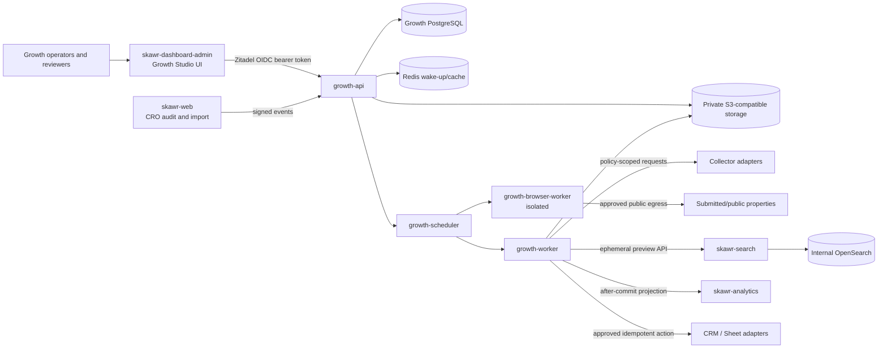
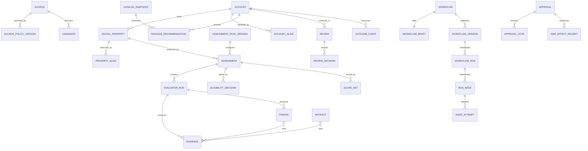

# Skawr Growth Studio — ChatGPT Consolidated Design

**Status:** Proposed for approval  
**Related specification:** [`requirements.md`](./requirements.md)  
**Supersedes:** The previous Claude design while incorporating the accepted durability, safety, and data-integrity mechanisms from [`design-kiro.md`](./design-kiro.md).

## Overview

Growth Studio is an internal account-intelligence and acquisition-orchestration control plane. It discovers permitted digital businesses, evaluates Search, bundled Analytics, CRO, and Engagement & Onboarding opportunities, composes commercially valid Growth Packages, and routes evidence-backed work through human approval before any CRM, sheet, publication, or communication action.

The design follows one invariant: **discovery proposes, evidence substantiates, deterministic rules prioritize, humans approve, and idempotent adapters act.** It builds horizontally through platform-neutral contracts and launches vertically with Saudi/MENA Commerce and Marketplace/Directory Assessment Packs.

The customer-facing Engagement & Onboarding editor, SDKs, renderers, audience engine, push delivery, and campaign runtime are out of scope and require a separate specification.

### Goals, non-goals, and principles

### Goals

- Establish `skawr-growth` as the bounded context that durably owns Accounts, DigitalProperties, policies, candidates, evidence, assessments, scoring, reviews, catalog snapshots, packages, workflows, approvals, outcomes, costs, and audit history.
- Launch a safe approved-URL/CSV path through evidence-backed review, bilingual artifact generation, optional Search preview, and approved manual export.
- Support a visual, adjustable, versioned workflow studio without allowing graphs to bypass policy, eligibility, human approval, consent, or suppression controls.
- Preserve horizontal extension points for collectors, evaluators, packs, node types, templates, catalog rules, and adapters without making future sources or archetypes MVP dependencies.
- Make every claim reproducible, every external action reviewable and effectively-once, and every durable transition recoverable after restarts or deploys.

### Non-goals

- Named-person enrichment, guessed contact details, personal-mobile extraction, automated bulk sending, or unattended follow-up sequences.
- Broad unreviewed internet scraping, authenticated scraping, CAPTCHA or bot-defense bypass, proxy evasion, or continuation after explicit denial.
- Owning Search tenant/index tables, OpenSearch, Analytics event storage, CRM records, or scraper-specific marketplace databases.
- Replacing `/cro/audit` or `/saas/import` as public acquisition experiences.
- Implementing customer-facing Search, Analytics, CRO delivery, or Engagement & Onboarding runtimes.
- Building a general-purpose low-code platform, plugin marketplace, arbitrary code runner, or cyclic workflow engine.

### Design principles

1. **Build horizontally, launch vertically.** Stable contracts support expansion while the MVP enables only two Assessment Packs and a narrow source set.
2. **Company/property, not people.** Identity centers on organizations and their properties; contact routes remain organization-level and purpose-bound.
3. **Evidence before claims.** Findings interpret immutable evidence; publishable prose cites reviewer-accepted evidence or approved catalog claims.
4. **Human before action.** Publication, CRM/sheet writes, and recipient-level actions require explicit approval, with dual control where configured.
5. **PostgreSQL is authoritative.** Redis accelerates wake-up, dispatch, rate limits, and caches; Redis loss cannot lose run truth or committed decisions.
6. **External products are contracts.** Growth integrates through versioned APIs, signed events, and adapters—never shared tables.
7. **Safety gates precede cost.** Policy, URL safety, cheap validation, applicability, and Eligibility execute before browser-heavy or paid work.
8. **Execution context is immutable.** Published versions, run snapshots, evidence, catalog snapshots, approvals, and side-effect receipts are append-only or superseded.

## Architecture



### Bounded contexts

| Context | Authoritative owner | Owned state | Growth contract |
|---|---|---|---|
| Growth control plane | `skawr-growth` | Identity graph, policy, evidence, assessments, scores, catalog snapshots, packages, workflows/runs, approvals, receipts, outcomes, costs, audit | `/api/v1/growth`, signed ingress, outbox adapters |
| Operator UI | `skawr-dashboard-admin` | Transient editor state and cached projections only | Growth REST/OpenAPI plus Zitadel OIDC |
| Public acquisition | `skawr-web` | Guest-facing audit/import UX and compatibility state during migration | Signed candidate/status events; no Growth DB access |
| Search | `skawr-search` | Catalog ingestion, preview indexes, query behavior, OpenSearch | Private ephemeral-preview API |
| Collection | Policy-approved adapters reusing safe `skawr-scraper` patterns | Short-lived execution state only | Typed `CollectorRequest` and `CollectorResult` |
| Product analytics | `skawr-analytics` | Product-usage telemetry and analytical projections | Sanitized after-commit batch events |
| Identity | Zitadel | Users, sessions, MFA, project roles | Dedicated Growth audience, JWKS, role claims |
| External systems | CRM and Sheet providers | Provider records | Approved, idempotent adapters |
| Binary storage | Private S3-compatible store | Evidence bodies, screenshots, artifacts, exports | Opaque object keys and short-lived authorized reads |

Search guest clients, audit email-keyed leads, imported-store IDs, and Growth Account IDs are distinct identities. Cross-system references are explicit aliases with provenance; none is silently promoted to an Account identity.

## 3. Runtime topology and deployment

| Process | Responsibility | Isolation |
|---|---|---|
| `growth-api` | REST, signed ingress, validation, queries/commands, Zitadel authorization, presigned artifact access | Traefik-facing; no browser runtime; constrained internal egress |
| `growth-scheduler` | Poll schedules, expire policies/previews/leases, materialize ready nodes, publish wake-ups | Internal; leader lease in PostgreSQL |
| `growth-worker` | Deterministic evaluators, rules, package composition, artifacts, outbox delivery, integrations | Internal; no arbitrary browsing; connector allowlist |
| `growth-browser-worker` | Browser collection and screenshots | Separate image/user/network; read-only root, dropped capabilities, seccomp, strict egress/DNS proxy, per-job storage and quotas, no production secrets |
| `growth-sweeper` | Lease recovery, policy/preview/evidence expiry, object reconciliation, retention, and suppression propagation | Internal; may share a process with scheduler initially but with named responsibilities |
| PostgreSQL 15 | Authoritative domain and workflow state | Dedicated Growth database or isolated schema/role; backed up |
| Redis 7 | Streams/wake-ups, fanout/rate semaphores, caches | Rebuildable; never required for correctness |
| S3-compatible store | Evidence/artifact blobs | Private, encrypted, lifecycle-managed, signed access |

The MVP uses a PostgreSQL scheduler and dispatcher. Ready rows are selected under row locks; Redis Streams carries only run/node/attempt identifiers. A missed or lost wake-up is repaired by the next database scan.

### Deployment and capacity

- `/health/live` reports liveness. `/health/ready` verifies database connectivity, migration compatibility, required configuration, and worker registry compatibility. Redis or optional adapters report degraded status without making PostgreSQL appear unavailable.
- Browser concurrency starts at one or two slots with CPU, memory, PID, time, page, byte, and egress budgets. Worker queues separate `cheap`, `browser`, `paid`, `integration`, and `artifact` work.
- OpenSearch remains internal to Search and is not part of Growth API readiness. Search preview or object-store outages pause only dependent nodes.
- Migrations run once under a release advisory lock and follow expand/contract sequencing. They do not run concurrently in every replica.
- API deploys use readiness and graceful drain. Workers stop leasing, complete or safely relinquish attempts, then restart. Releases declare supported run-snapshot and node-schema ranges.
- A worker that cannot deserialize every runnable snapshot version is not activated for those capabilities.
- Scheduler leadership uses a renewable PostgreSQL lease. Cron may trigger only a durable schedule tick; it never runs an inline pipeline.

## 4. Operator UI in `skawr-dashboard-admin`

Growth Studio is a route group inside the existing React 19/Vite/react-router/TanStack Query application. It reuses the app shell, Axios bearer-token seam, `@skawr/core`, tables, dialogs, Recharts, Sentry, and Zitadel PKCE.

| Route | Purpose |
|---|---|
| `/growth` | Growth Radar overview |
| `/growth/review` | Review queues, assignments, saved views, bulk-safe operations |
| `/growth/accounts` and `/growth/accounts/:id` | Account list and dossier with properties, identity history, evidence, findings, packages, and decisions |
| `/growth/flows` | Workflow and Funnel Template library |
| `/growth/flows/:id/edit` | Visual draft editor |
| `/growth/flows/:id/versions/:versionId` | Immutable version inspection, diff, and rollback target |
| `/growth/runs` and `/growth/runs/:id` | Run list and node-attempt trace |
| `/growth/policies` and `/growth/sources` | Policy versions, expiry, kill switches, and yield |
| `/growth/catalog`, `/growth/packages`, `/growth/recommendations` | Catalog administration and Package Composer review |
| `/growth/settings` | Packs, evaluators, budgets, roles, integrations, and retention |

Use `@xyflow/react`, pinned to an exact validated version, for the canvas only. The server graph remains library-neutral. Unknown node versions render read-only with an upgrade warning rather than losing data.

TanStack Query owns server state; feature-local editor state owns the open graph, selection, viewport, validation results, and dirty state. Undo/redo, autosave, collaborative cursors, and automatic graph layout are deferred post-MVP; explicit save and publish are sufficient initially. Draft updates use ETags and `If-Match`. Client validation is advisory; server validation and cost estimation are authoritative. Test and dry-run overlays never mutate the draft. The API enforces Viewer, Operator, Reviewer, Publisher, Administrator, and Outreach Approver permissions regardless of UI visibility.

### RBAC role responsibilities

| Role | Capabilities |
|---|---|
| Viewer | Read permitted Radar, account, workflow, and evidence views |
| Operator | Candidate intake, workflow drafts, tests, assignments, and refresh requests |
| Reviewer | Finding decisions, classification corrections, package review, and Eligibility resolution within policy |
| Publisher | Workflow/catalog/artifact publication as separately authorized |
| Administrator | Source policy, retention, secrets, identity correction, and role-sensitive configuration |
| Outreach Approver | Recipient/channel/message-specific external-action approval |

Dual approval is supported for configured sensitive actions (publication, CRM export, sending); it requires distinct users and is not automatically required for routine operations.

### Review queue and bulk actions

The review queue supports filtering by product/package, opportunity, archetype, capability, platform, geography, language, source, Eligibility, score bands, freshness, review state, owner, due date, first-party engagement, and risk flags. Saved views persist these filters.

MVP bulk actions are limited to: assignment, refresh request, monitor, report-generation approval, approved export, suppression, and rejection with reason. There is no bulk send.

The UI follows Skawr app conventions: compact typography, 34px rectangular controls, 12px cards, no marketing motion or glow, visible focus, keyboard operation, logical CSS properties, RTL artifact preview, and a list-based accessible alternative to the graph.

## Data Models

UUID primary keys, `timestamptz`, actor IDs, and monotonically increasing `row_version` are standard. Business state is normalized. JSONB is limited to schema-versioned registry configuration, typed node input/output, immutable snapshots, and provider metadata. Large content lives in object storage and is addressed by key and hash.



### Identity, source, and classification

- `accounts(id, legal_or_trade_name, primary_archetype_id, status, geography, row_version, merged_into_id?, created_at)`; status is `candidate|active|monitor|blocked|suppressed|merged|deleted`.
- `digital_properties(id, account_id, type, canonical_location, normalized_host?, geography, languages[], control_status, isolation_status, row_version)`. A partial unique index protects active normalized canonical locations while aliases preserve history.
- `account_aliases` and `property_aliases` retain alias type/value, source, observation interval, and evidence. Redirects are observations, never identity keys.
- `identity_change_sets(id, operation, reason, actor_id, created_at)` and `identity_change_members(before_id, after_id, role)` preserve merge/split lineage. Merged IDs are not deleted. Splits move only explicitly selected properties/evidence. Affected open runs pause for reviewed reassignment.
- `sources(id, type, canonical_name, status, kill_switch_at, owner_id)` and immutable `source_policy_versions(id, source_id, version, decision, allowed_fields, allowed_purposes, allowed_actions, legal_basis, robots_decision, retention_policy_id, reviewed_at, expires_at, approved_by)` govern every collection and use. Query-critical field/purpose/action rules use typed child rows; a signed canonical snapshot is captured by runs.
- `candidates(id, source_id, external_ref, submitted_location, payload_ref, policy_version_id, purpose, state, dedupe_key, received_at)` has unique source/external and event-deduplication constraints.
- `archetypes`, `capabilities`, `account_archetype_assertions`, and `property_capability_assertions` retain classifier/evaluator version, confidence, evidence, reviewer correction, and effective interval.

### Assessment, evidence, and review

- `collector_versions`, `evaluator_versions`, `assessment_packs`, and immutable `assessment_pack_versions` define schema IDs, applicability, locales, cost class, dependencies, lifecycle, and freshness. `pack_evaluators` binds ordered evaluator versions.
- `assessments(id, account_id, digital_property_id, pack_version_id, workflow_run_id, state, started_at, completed_at, actual_cost)` targets exactly one DigitalProperty. Account rollups are projections and cannot erase property differences.
- `evaluator_runs(id, assessment_id, evaluator_version_id, input_schema, input_payload, output_schema, output_payload, state, cost, started_at, completed_at)` records each execution.
- `evidence(id, property_id, source_id, policy_version_id, kind, observed_at, valid_until, method_id, method_version, content_hash, object_key?, sanitized_snippet?, confidence_basis, collection_purpose, retention_class, status, supersedes_id?)` is append-only. Corrections supersede rather than overwrite.
- `findings(id, assessment_id, evaluator_run_id, category, code, severity, statement_key, state, confidence, freshness_state, schema_version, structured_payload)` and `finding_evidence(finding_id, evidence_id, role, derivation)` provide relational citations. A finding cannot become reviewer-accepted without accepted evidence, except for a typed approved submitted-fact source.
- `finding_reviews`, `finding_corrections`, and `refresh_requests` preserve automated output, decision, reason, actor, and time. Automated and reviewer decisions are never overwritten.
- Evidence states distinguish `collected`, `policy_admissible`, `evaluator_validated`, `reviewer_accepted`, `rejected`, `stale`, and `retracted`. Pre-review scores use a versioned admissible-evidence snapshot and are marked provisional; reviewer changes trigger deterministic recomputation. Packages and publishable claims use reviewer-accepted findings only.

### Eligibility, scoring, catalog, and packages

- `rule_sets` and immutable `rule_set_versions(type, config, schema_version, effective_at, retired_at)` cover Eligibility, Fit, Confidence, Timing/Value, Risk, and routing.
- `eligibility_decisions(id, subject_type, subject_id, assessment_id?, rule_version_id, result, reason_codes[], evidence_snapshot_hash, created_at, resolved_by?, resolution_reason?, supersedes_id?)` support account, property, finding, and action scope. A hard blocker cannot become Pass without a new decision tied to a changed policy, suppression, safety, or basis condition.
- `score_sets(id, assessment_id, eligibility_id, state provisional|reviewed, fit, confidence, timing_value, risk, rule_versions, component_snapshot, evidence_snapshot_hash)` preserves independent values. No score can bypass Eligibility.
- Stable `catalog_items` and immutable `catalog_item_versions`, `offers`/`offer_versions`, `entitlements`, `offer_entitlements`, `commercial_constraints`, `pilot_approvals`, and `catalog_snapshots` encode lifecycle, dates, locales, regions, currencies, prerequisites, incompatibilities, implementation, approved claims, CTA, and scoped approval.
- `growth_packages` and immutable `growth_package_versions` define phases, prerequisites, incompatibilities, implementation requirements, and template compatibility.
- `package_recommendations(id, account_id, assessment_id, catalog_snapshot_id, original_package_version_id?, current_package_version_id?, route, rationale_snapshot, state)` plus `recommendation_findings` and `package_overrides` preserve the original recommendation and every reasoned revision.

### Workflow, action, governance, and learning

- `funnel_templates`/`funnel_template_versions`; `workflows`; one mutable `workflow_drafts(graph_payload, row_version, validation_hash)` per workflow; immutable `workflow_versions(graph_payload, registry_snapshot, policy_refs, pack_refs, rule_refs, template_ref, catalog_refs, published_by, published_at)`.
- `workflow_runs(id, workflow_version_id, account_id?, property_id?, mode, immutable_snapshot, state, checkpoint_seq, budget_snapshot, created_at, completed_at?)`; `run_nodes` materialize graph state; `node_attempts` store readiness, attempt number, lease owner/expiry/fencing token, typed input/output, error class, cost, and timestamps.
- `outbox_events` and `inbox_events` provide atomic publication and ingress deduplication. Outbox delivery is at-least-once; consumers and action receipts provide effectively-once behavior.
- `reviews`, `assignments`, `review_decisions`, `comments`, and `saved_views` use optimistic row versions. Mentions, notifications, and activity feeds remain post-MVP.
- `business_contact_points(id, account_id, classification, normalized_route_ciphertext, source_id, purpose, basis_or_consent_id, allowed_channels, evidence_id, expires_at, suppression_state)` permits only generic company routes or explicitly consented recipients. No Person entity exists.
- `consent_records` and append-only `suppression_entries(subject_type, subject_hash, scopes, reason, effective_at, lifted_at?)` preserve basis and keyed content-free tombstones.
- `propagation_jobs(id, subject_type, subject_hash, destination, operation, state, attempts, acknowledged_at?)` track correction/deletion/suppression across DB projections, objects, Search previews, caches, queues, artifacts, exports, and processors.
- `artifacts(id, account_id, type, locale, object_key, content_hash, evidence_snapshot_id, catalog_snapshot_id, template_version, model_version?, status, expires_at)`; `artifact_evidence` and `artifact_catalog_claims` enforce citations. `previews` retain Search reference, token hash, state, expiry, and deletion receipt.
- `approvals(id, subject_type, subject_id, action, payload_hash, requested_by, state, policy_snapshot, expires_at)` and `approval_votes` enforce exact-payload and distinct-actor approval. Payload changes invalidate approval.
- `side_effect_receipts(id, approval_id, adapter, operation, idempotency_key, request_hash, external_ref?, state, response_ref?, committed_at?)` has unique `(adapter, idempotency_key)` and supports unknown-outcome reconciliation.
- Append-only `outcome_events`, `cost_entries`, `security_events`, and `audit_log` are Growth-authoritative. `experiment_assignments` are post-MVP.

### Constraints and indexes

- Unique active canonical property, source-event/dedupe keys, stable-ID/version pairs, one active workflow draft, one adapter/idempotency receipt, and distinct approval voters.
- Partial indexes cover review queues, ready nodes, stale leases, unsent outbox events, policy expiry, evidence freshness, preview expiry, and suppression hashes.
- Checks enforce score ranges, date ordering, state transitions, property ownership, and zero real side effects in test/dry-run mode.
- High-volume audit, outcome, cost, and attempt tables are partitioned only after measured need.
- Database triggers are limited to append-only protection and audit metadata. Transactional services own domain transitions.

## Components and Interfaces

### Versioned contracts

All contracts use stable schema identifiers, semantic schema versions, RFC 3339 timestamps, UUIDs, and explicit locale/currency. Unknown required versions fail closed. Additive optional fields may be accepted only within a declared compatibility range.

### Collector and evaluator contracts

```python
class Collector(Protocol):
    id: str
    version: str
    async def collect(self, request: CollectorRequest) -> CollectorResult: ...

class Evaluator(Protocol):
    id: str
    version: str
    cost_class: Literal["cheap", "browser", "paid"]
    async def evaluate(
        self, context: EvaluationContext, evidence: Sequence[EvidenceRef]
    ) -> EvaluatorResult: ...
```

`CollectorRequest` includes the property, exact source-policy snapshot, purpose, allowed fields and hosts, URL-safety token, page/byte/time limits, robots decision, locale, retention, and trace identifiers. A collector returns typed observations, object references, denials, and exact cost. It cannot create Accounts/findings, change policy, or call undeclared destinations.

Evaluators are deterministic for the same versioned input unless their contract declares a timestamped external observation. They emit schema-valid evidence references, findings, limitations, metrics, and costs. Evaluators cannot route, score, compose packages, publish prose, or act externally.

### Workflow graph contract

Each node definition declares stable type/version, typed input/output ports, a configuration schema, required capabilities, cost class, and allowed modes. A graph stores versioned nodes, edges, parameters, and secret references—not secret values or canvas-library state.

A published run snapshot must include:

- graph and node configurations;
- node/contract registry versions;
- source-policy versions;
- pack, collector, and evaluator versions;
- Eligibility/scoring/routing rule versions and configuration;
- Funnel Template ID/version;
- catalog references;
- parameters, locale, mode, and cost/concurrency budgets.

### Signed event envelope

`skawr-web`, Search callbacks, and other service ingress use a CloudEvents-style envelope with source, event ID, type/version, subject, timestamp, trace context, and schema-versioned data. Transport adds key ID, timestamp, nonce, and HMAC over method, path, timestamp, nonce, and raw body. Growth rejects stale timestamps, reused nonces, unknown keys, body mismatch, and duplicate `(source,event_id)` while returning the original acknowledgement for valid replay.

## 7. Assessment architecture

### MVP Assessment Packs

| Pack | Applicability | Evaluator groups |
|---|---|---|
| Commerce | Public/submitted catalog and conversion journey with searchable inventory or credible search need | identity/platform, catalog sample, Search known-item, observable Analytics readiness, public CRO, safe Engagement need, package signals |
| Marketplace/Directory | Searchable listing/directory corpus and public discovery/detail journey | taxonomy/inventory, Search/filter tests, observable measurement, marketplace CRO, safe Engagement need, package signals |

Salla, Shopify, and Zid adapters may improve collection but are capabilities, never eligibility requirements. Registry schemas support future B2B Catalog, SaaS/Product, Content/Documentation, and Lead-Generation packs without enabling those evaluators in MVP.

### Evidence rules

- **Search:** Expected items derive only from permitted inventory, deterministic documented transformations, or a reviewed locale lexicon. Tests retain query, expected-item derivation, rank bucket, latency, autocomplete, zero-result recovery, timestamp, evaluator version, and screenshot/snippet. Arabic orthography, transliteration, mixed scripts, numerals, typo, SKU/model, and category/attribute variants retain provenance. Synthetic rates are labeled with sample and method and never represented as production traffic, conversion, revenue, or internal zero-result rates.
- **Analytics:** Public tags and merchant submissions support only observable-readiness statements. Absence is `not publicly observed`; presence never proves event quality, identity, governance, reporting quality, or use.
- **CRO:** Findings cover reproducible pricing/trust clarity, journey friction, intent-to-landing alignment, accessibility, mobile usability, and observable measurement readiness. Journeys stop before authentication, account creation, form submission, or transaction unless an approved sandbox authorizes them. Impact estimates require merchant inputs and remain labeled scenarios.
- **Engagement & Onboarding:** Absence of popup, banner, guidance, survey, or push is never evidence of need. A finding requires a demonstrated unmet journey need or harmful existing implementation. Concepts include frequency, accessibility, mobile/RTL/localization, performance, consent/opt-out, and anti-dark-pattern constraints and state that a separate product would deliver them.

LLMs run only after selected structured evidence and approved catalog claims exist. The phrasing service receives redacted inputs, returns citations to supplied IDs, and passes schema, citation, forbidden-claim, commercial-copy, and locale validation. Failure produces no publishable prose.

## 8. Eligibility, scoring, and routing

The rules engine has two non-interchangeable stages:

1. **Eligibility:** Evaluate policy authorization/expiry, denial, URL safety, suppression, basis/consent, personal-data dependency, evidence integrity, and action basis. Return `Pass`, `Review Required`, or `Blocked` with reason codes at account, property, finding, or action scope.
2. **Commercial dimensions:** Only for `Pass`, compute separate Fit, Confidence, Timing/Value, and Risk values. Persist every input, threshold/weight, rule version, evidence snapshot, and component result. No additive score can cancel a blocker.

Typed declarative rules operate only over approved fields. New operators require reviewed code. LLM output is never a rule input. Conflicting or stale evidence lowers Confidence or requires review; it never silently chooses a fact. An authorized reviewer may resolve `Review Required` with reason and evidence. A hard blocker requires the underlying condition to change.

Routes are `qualified_review`, `generate_then_review`, `monitor`, `opportunity_no_current_offer`, and `disqualified`. The no-current-offer route preserves demand for learning, omits purchase CTA, and never forces Analytics into Search or an unavailable offer.

## 9. Product catalog and Package Composer

A catalog publication snapshots product, service, tier, entitlement, offer, and Growth Package versions with lifecycle, dates, locales, regions, currencies, billing cadence, prerequisites, incompatibilities, implementation requirements, platform support, approvals, pricing policy, allowed claims, and CTA.

The deterministic composer:

1. Selects reviewer-accepted findings and applicable opportunities.
2. Filters offers to `available` or explicitly account/region/channel/date-approved `pilot`, then enforces locale, currency, archetype/capability, and commercial approval.
3. Expands prerequisites and entitlements and rejects incompatibilities or unmet implementation requirements.
4. Enforces Basic Analytics with the lowest Search tier, Advanced Analytics with second/higher Search tiers, and no standalone Analytics.
5. Distinguishes the free import/personalized preview from subscription access and enforces no Search free tier or subscription trial.
6. Minimizes scope against accepted needs, then prefers fewer phases and lower implementation effort using declared tie-breaks.
7. Emits `opportunity_no_current_offer` when no valid offer exists or creates ordered phases with prerequisites and reassessment points when immediate scope is unsuitable.

Annual copy is exactly `Save 17% with an annual subscription` or an approved localized equivalent; free-month wording is blocked. Reviewer overrides create a new revision, preserve the original and reason, and rerun all constraints before save or publication.

## 10. Visual workflows and Funnel Templates

The platform-neutral node registry groups nodes as source, policy, collection, classification, assessment, Eligibility/scoring, decision, human gate, artifact, action, outcome, and control. Connector details stay inside typed configuration and secret references.

Server-side publication validation requires:

- registered node and schema versions;
- typed port compatibility and required configuration;
- at least one source and permitted terminal;
- acyclicity, reachability, no orphan outputs, and deterministic joins;
- cost, fanout, browser, paid-evaluator, and concurrency limits;
- pack/package/template/archetype/capability/locale/catalog compatibility;
- all-path dominance by policy and URL-safety gates before collection;
- all-path dominance by current human approval and applicable consent/basis gates before publication, export, CRM, or communication;
- support for the requested live, test, or dry-run mode.

Runtime revalidation provides defense in depth even after publication. Recurrence creates scheduled new runs, never graph cycles.

Drafts use ETags. Publish creates an immutable version and cost estimate. Tests target one property; bounded dry runs target a capped sample and replace CRM, Sheet, publication, notification, and communication adapters with sandbox adapters. Simulated effects remain visibly labeled. Rollback selects a prior version for new runs; in-flight runs retain their original snapshot.

Initial templates are limited to **Inbound Growth Audit**, **Approved URL/CSV Discovery**, **Search Opportunity**, **Measurement Readiness**, **CRO Opportunity**, **Engagement Opportunity**, and composed **Growth Blueprint**. Partner Portfolio is enabled only with an approved partner source. Migration Watcher, Reactivation, and broad discovery remain post-MVP.

## 11. Durable PostgreSQL DAG execution

### State model

Run states are `pending -> running <-> paused -> completed|failed|cancelled|blocked|dead_lettered`, with `cancelling` intermediate. Node states are `pending -> ready -> leased -> running -> succeeded|skipped|blocked|failed|dead_lettered|cancelled`. Every accepted transition appends a run event.

### Execution algorithm

1. Starting a run transactionally captures the complete immutable snapshot and materializes `run_nodes`; source nodes become `ready`.
2. The scheduler selects due ready nodes using `FOR UPDATE SKIP LOCKED`, checks run/account/source/global budgets and current kill switches, inserts a `node_attempt` with renewable lease and fencing token, marks the node leased, commits, then emits a Redis wake-up.
3. A worker consumes identifiers only, claims the matching unexpired attempt in PostgreSQL, verifies capability and schema compatibility, marks it running, and heartbeats the lease. It uses the run snapshot rather than current mutable configuration.
4. The worker writes typed output, evidence/findings/cost, attempt and node state, downstream readiness, audit row, and outbox events in one transaction. Large objects upload first under temporary keys; committed records finalize references and an orphan sweeper removes abandoned objects.
5. Downstream nodes become ready only when required predecessors have accepted terminal outputs and edge predicates evaluate deterministically. Join inputs are ordered by edge and node ID.
6. Transient errors receive bounded class-specific retries with jitter and policy-bounded `Retry-After`. `401/403`, robots denial, explicit denial, prohibited/expired policy, suppression, unsafe URLs, and contract violations are terminal. Exhaustion enters review or dead letter.
7. Every external effect receives `idempotency_key = hash(run_id, node_id, logical_operation, target_scope, payload_version)`. The adapter creates or locks a durable receipt before calling, supplies the provider key where supported, and reconciles unknown outcomes before retry. A committed receipt returns its prior result.
8. Pause stops new leases; workers checkpoint at safe boundaries and relinquish. Cancel prevents new work and cooperatively stops active work without undoing committed receipts. Resume recomputes readiness from checkpoints. Dead-letter replay requires authorization, reason, current safety revalidation, and a linked new attempt.
9. Account concurrency keys serialize conflicting identity, review, package, and action changes. Source/property/account/global semaphores and monetary/unit budgets are checked at lease and before paid calls.
10. Fencing prevents a worker with an expired or superseded lease from committing. Scheduler recovery scans reclaim stale attempts only after checking heartbeat and receipt state.
11. The outbox dispatcher claims events with `SKIP LOCKED`. Consumers use inbox deduplication. Outbox delivery is at-least-once; idempotent consumers and side-effect receipts produce effectively-once observable actions.
12. Redis loss switches workers to reduced-rate PostgreSQL polling. Recreated wake-ups come from authoritative ready rows; no run state is reconstructed from Redis.

### Policy snapshot versus current authorization

A run snapshot records which policy version informed prior decisions. It preserves provenance and reproducibility but is not a permanent capability. The runtime rechecks current source decision, expiry, kill switch, suppression, purpose, destination, and action authorization:

- before every fetch or browser navigation;
- after DNS resolution and before connecting;
- at every redirect;
- before paid processing;
- before artifact publication or preview creation;
- before export, CRM mutation, or communication.

A newer prohibition, expiry, suppression, or kill switch stops pending work even when the run snapshot contained an earlier approval.

### Browser-worker write containment

Browser workers receive signed, short-lived work capabilities. They may write results only through a narrow authenticated result-ingestion endpoint or a database role restricted to attempt-result and evidence-staging tables. They cannot modify policy, Eligibility, review decisions, catalog, approvals, workflow control state, or Account identity. If a browser worker is compromised or unhealthy, its work capability is revoked, the worker is isolated, its lease expires, and only validated staged results are promoted.

### Artifact fallback on LLM unavailability

If the approved LLM phrasing processor is unavailable, times out, or produces invalid output, the system falls back to deterministic bilingual artifact templates with the same citation and catalog-claim validation. No artifact is blocked solely by LLM downtime, provided all evidence citations and commercial validations pass under template rendering.

This is a constrained domain DAG, not a generic orchestrator. Temporal can be reconsidered after sustained scale; Celery/Dramatiq may transport wake-ups but cannot become authoritative workflow state. Activepieces or similar tools may later act as adapters only.

## 12. Integration designs

### `skawr-web` audit and import

`/cro/audit` and `/saas/import` remain public, rate-limited acquisition surfaces. They emit signed `CandidateSubmitted`, `SubmissionUpdated`, `PreviewEngaged`, and `SubmissionClaimed` events. Growth returns a stable opaque tracking token exposing only coarse status.

Migration proceeds through shadow event dual-write, Growth-owned durable runs with compatibility status projection, movement of audit execution to Growth workers, and finally durable import orchestration references while Search retains catalog/index ownership. Existing DynamoDB lead/scan rows become compatibility projections—not Growth truth. Email-keyed leads and Search guest clients remain aliases; claiming an import does not prove organization identity or property control.

### Search-owned ephemeral previews

Search exposes a private authenticated API:

- `POST /internal/v1/growth/previews` accepts Growth request ID, permitted normalized sample or Search import reference, locale, retrieval profile, document cap, purpose, and expiry; it returns opaque preview ID, restricted token, count, and expiry.
- `POST /internal/v1/growth/previews/{id}/query` runs bounded hybrid Arabic retrieval. Growth supplies expected-item derivations; Search does not declare relevance truth.
- `DELETE /internal/v1/growth/previews/{id}` is idempotent. Search also TTL-deletes indexes/tokens; Growth records and reconciles cleanup receipts.

Preview indexes have dedicated aliases and strict document/query/token/TTL quotas. Tokens cannot access SaaS tenants. Growth stores no OpenSearch credentials and never queries OpenSearch directly.

### Policy-scoped collection

Growth reuses safe Scrapy throttling, retry classification, adapters, normalization, and deterministic parsing through the collector contract. Every request carries approved hosts, fields, purpose, limits, robots decision, user agent, redirect rules, and retention. Output is schema-validated and field-filtered before persistence.

Explicitly excluded are scraper-specific databases as Growth state, phone-extraction paths, authenticated crawlers, captured or hardcoded credentials, proxy/CA interception, session-cookie automation, CAPTCHA/bot-defense bypass, and any source without current approval.

### Analytics telemetry

An outbox consumer sends sanitized after-commit batches to Skawr Analytics using a dedicated service key. Events include run/node completion, review decisions, artifact approval, preview engagement, and operator UI behavior with opaque IDs and version dimensions. They exclude raw evidence, secrets, contact routes, and prohibited personal data.

Growth remains authoritative for run and commercial outcomes. Analytics delay or loss cannot advance, roll back, or reconstruct a workflow.

### CRM and Sheet export

Action nodes require exact current approval, scoped Eligibility Pass, source/action policy, purpose, consent or basis where applicable, suppression-clear state, catalog validity, and recipient/target validation. Adapters map approved organization fields, evidence summary, artifact link, reviewer, and provenance only. Receipts and provider references prevent duplicates; ambiguous provider outcomes are reconciled before retry. MVP exports are manually approved and never bulk-send.

### Object storage

Private prefixes separate raw evidence, sanitized evidence, screenshots, artifacts, exports, and temporary uploads. Metadata records hash, media type, size, classification, retention class, encryption reference, and deletion state. Uploads enforce type/size and configured malware checks. Raw HTML is never served active. Downloads use short-lived audience-bound authorization. Lifecycle and propagation jobs delete temporary/raw content first and reconcile preview, artifact, cache, export, and processor deletion acknowledgements.

## 13. Representative API surface

All operator endpoints are under `/api/v1/growth`; internal service endpoints are under `/internal/v1/growth`. Lists use cursor pagination and stable sorting. Mutable resources return ETags and require `If-Match`. Create/action endpoints accept `Idempotency-Key`. Errors follow Problem Details with stable code, trace ID, validation pointers, current ETag where applicable, and retryability.

### Identity, review, and Radar

- `GET /radar`; `GET|POST /accounts`; `GET|PATCH /accounts/{id}`; `POST /accounts/{id}/properties`
- `POST /accounts:merge`; `POST /accounts/{id}:split`; `GET /accounts/{id}/dossier`
- `GET /reviews`; `POST /reviews/{id}/assign`; `POST /findings/{id}/decisions`; `POST /reviews/{id}/comments`
- `GET|POST /saved-views`; `POST /outcomes`; `GET /outcomes`

### Workflows and runtime

- `GET|POST /workflows`; `GET|PATCH /workflows/{id}/draft`
- `POST /workflows/{id}/validate`; `POST /workflows/{id}/estimate`
- `POST /workflows/{id}/test-runs`; `POST /workflows/{id}/dry-runs`; `POST /workflows/{id}/publish`
- `GET /workflows/{id}/versions`; `POST /workflows/{id}/versions/{versionId}:make-current`
- `GET|POST /funnel-templates`; `POST /funnel-templates/{id}:clone`
- `GET /runs`; `GET /runs/{id}`; `GET /runs/{id}/attempts`; `POST /runs/{id}:pause|:resume|:cancel`
- `POST /dead-letters/{attemptId}:replay`

### Policy, catalog, artifacts, and actions

- `GET|POST /sources`; `POST /sources/{id}:kill|:resume`; `GET|POST /source-policies`; `POST /source-policies/{id}/versions`
- `GET /packs`; `GET /evaluators`; `POST /assessments`
- `GET|POST /catalog/publications`; `GET /catalog/snapshots/{id}`; `GET|POST /growth-packages`
- `POST /accounts/{id}/package-recommendations:compose`; `POST /package-recommendations/{id}:override`
- `POST /artifacts:generate`; `GET /artifacts/{id}`; `POST /previews`; `DELETE /previews/{id}`
- `POST /approvals`; `POST /approvals/{id}/votes`; `POST /actions/crm-export`; `POST /actions/sheet-export`
- `POST /suppressions`; `DELETE /suppressions/{id}` lifts suppression but never deletes history.

### Internal endpoints

- `POST /internal/v1/growth/events/skawr-web` — signed ingress with inbox deduplication.
- `POST /internal/v1/growth/events/search` — signed operation callbacks.
- `GET /internal/v1/growth/submissions/{token}/status` — coarse status for the trusted web proxy.
- `POST /internal/v1/growth/dispatch/tick` — schedules durable rows only.
- `GET /health/live`; `GET /health/ready`.

## 14. Security and compliance threat model

Zitadel is mandatory. Growth validates exact issuer, audience, signature, expiry/not-before, token type, and project-role claims. Service calls use separate rotated identities or signed envelopes—not operator tokens. Resource/action authorization separates policy administration, evidence access, workflow editing, publication, package override, suppression, export, and outreach approval. Dual approval rejects self-second-approval.

| Threat | Required controls |
|---|---|
| SSRF, DNS rebinding, redirect pivot | HTTP/S only; reject credentials and non-public/metadata ranges; normalize; resolve and pin approved IP; revalidate every connection and redirect; cap redirects/time/bytes/type; no proxy fallback |
| Browser escape/internal reachability | Isolated image/user/network, deny-by-default egress, no Docker socket/metadata/secrets, read-only FS, dropped capabilities/seccomp, resource limits, per-job context destruction |
| Terms/robots/denial bypass | Versioned policy before fetch; robots in request; terminal denial; no alternate credentials; kill switch checked at schedule, lease, connect, and persist |
| Active/malicious HTML | Parse as untrusted; disable downloads/extensions; sanitize snippets; inert screenshots; CSP and attachment disposition; never render raw HTML |
| Malicious CSV/feed | Byte/row/column caps, MIME/magic checks, formula neutralization, archive rejection/decompression limits, optional malware scan, quarantine mismatch |
| Secret leakage | Approved secret manager or encrypted secret references, least privilege, environment separation, rotation and audit; never export/log/prompt/render values |
| Broken access control | Zitadel issuer/audience/role and object checks, deny-by-default permissions, ETags, short signed reads, integration tests |
| Replay/duplicate effects | Signed nonce/timestamp/body, inbox dedupe, exact payload approvals, idempotency key, durable receipt, provider reconciliation |
| Policy drift/expiry | Exact policy version in run; expiry stops new collection/action; current policy revalidated before side effects; alerts and kill switches |
| Suppressed/deleted-data resurrection | Keyed tombstones at import/action plus acknowledged propagation across DB, objects, previews, caches, queues, artifacts, exports, and processors |
| LLM leakage or unsupported claims | Approved processor/region/purpose, field allowlist/redaction, selected evidence only, citation/claim validation, fail closed |
| Resource exhaustion | Source/IP limits, graph estimates, byte/token/browser/fanout budgets, queue classes, circuit breakers, kill switches, hard spend cap |

Retry classification is policy-versioned. Robots denial, unsafe destination, prohibited/expired policy, suppression, explicit denial, `401`, and `403` are terminal. `429` honors bounded `Retry-After` then pauses. `503`, reset, and timeout receive bounded jittered retries then review/dead letter. Contract and sanitization failures quarantine payloads. `404/410` retry only when policy explicitly treats them as transient.

Saudi properties and recipients invoke approved PDPL purpose, basis/consent, correction, retention, deletion, opt-out, and suppression controls. This design supplies technical enforcement and auditability; legal policy remains externally approved configuration.

## 15. Growth Radar and outcome learning

Growth owns authoritative append-only OutcomeEvents so commercial outcomes survive Analytics outages and remain linked to immutable versions. Each applicable event references source/policy, workflow/template, pack/evaluator, archetype/capability, opportunity, package/catalog snapshot, artifact/channel, Account, DigitalProperty, provenance, and dedupe key.

Radar uses PostgreSQL projections/materialized views for:

- opportunities, package mix, review backlog/age/owner, source and workflow-stage yield;
- discovered, policy-accepted, safe, live, classified, eligible, evaluated, qualified, in-review, monitored, blocked, dead-lettered, and errored counts;
- reviewer acceptance/overturn, evidence freshness, unsupported claims, duplicates, policy pass/expiry, cost and latency percentiles;
- meetings, imports, catalog index completion, Analytics first event, Engagement & Onboarding start, CRO start, proposal, paid conversion, rejection, and suppression.

Optimization prioritizes accepted evidence, qualified conversations, activation, proposal, paid, rejection, and suppression. Opens alone never change routing, scoring, or future experiments. Advanced experimentation and attribution windows remain post-MVP; basic outcome provenance is mandatory in MVP.

## Error Handling

- Versioned retry policies and circuit breakers pause failing sources/adapters while ready work remains durable in PostgreSQL.
- Operators can kill a source, evaluator, adapter, template, browser class, or all new work within their role.
- Alerts cover oldest-ready age, no consumers, Redis and database scheduler lag, stale leases, outbox age, dead-letter growth, preview cleanup, policy expiry, yield shifts, quality regressions, and budget thresholds.
- Fencing prevents stale workers from committing. Repeated stale leases alert and are reclaimed only after receipt-state checks.
- Cost compares estimated and actual values by source, evaluator, pack, property, and account. Global and account hard stops prevent unbounded spend.
- Logs and traces carry candidate/source/property/account/run/node/attempt identifiers when available; `account_id` is nullable before identity resolution. Sensitive payloads are excluded and exceptions are scrubbed before Sentry/GlitchTip.
- Dead letters retain immutable classification, sanitized context, attempts, policy snapshot, and replay eligibility. Replay is bounded, reasoned, authorized, and linked.
- Pinned dependencies, lockfiles, image scanning, and restricted build provenance for supply-chain safety.
- Daily encrypted PostgreSQL backups, point-in-time recovery when available, object lifecycle/versioning, registry export, and periodic restore drills are required. Redis is rebuilt from PostgreSQL. RPO/RTO are approved before launch.

## 17. MVP rollout and launch gates

This sequence is a release boundary, not an implementation task list.

1. **Foundation:** service, schema/migrations, Zitadel roles, object storage, policy/suppression, durable scheduler/worker, outbox/audit, health, and backups.
2. **Vertical source slice:** approved CSV and submitted URL, signed web ingress, Account/property resolution, secure collection, and one durable run to review. Existing audit/import flows remain during shadow migration.
3. **Assessment Packs:** Commerce and Marketplace/Directory only, with deterministic Search and constrained Analytics/CRO/Engagement evaluation.
4. **Eligibility and review:** scoped hard gates, separate scores, routing, dossier, queues, assignments, comments, saved views, evidence decisions, and corrections.
5. **Catalog and package:** authoritative snapshots, commercial constraints, smallest-valid/phased composition, and reasoned override.
6. **Artifacts and preview:** bilingual artifacts, citation validation, optional Search preview, expiry, and cleanup reconciliation.
7. **Approved export:** one CRM and one Sheet adapter with approvals, suppression recheck, durable receipts, and no automated sending.
8. **Radar and launch sample:** outcome/cost/latency projections and an immutable predeclared 30–50-account sample.
9. **Launch decision:** verify all quality gates before enabling broader discovery or another required pack.

`launch_samples` and `launch_gate_runs` preserve sampling period/method, fixed top-band denominator hash, reviewer-confirmed findings, unsupported-claim results, duplicate decisions, policy results, cost/latency thresholds, and outcome. A capability flag prevents new source classes or required packs from being activated until the approved gate passes.

Launch requires at least 80% top-band precision using the fixed denominator, zero unsupported claims in sampled published artifacts, below 2% duplicate active Accounts, 100% applicable policy/safety/suppression checks, and predeclared cost/latency thresholds met.

Explicitly deferred are broad Common Crawl/HTTP Archive/directory discovery, B2B/SaaS/Content/Lead Packs, migration/reactivation templates, automated sending, customer-facing Engagement delivery, and advanced experimentation. Salla, Shopify, and Zid convenience adapters may ship but cannot become architectural eligibility requirements.

## Testing Strategy

- **Domain/unit:** identity lineage, field/purpose/action policy decisions, Eligibility precedence, score components, pack applicability/freshness, Package Composer constraints, graph validation, transitions, retry classification, retention, and RBAC.
- **Contract:** JSON Schema compatibility for collector/evaluator/node/graph/event versions; generated OpenAPI consumer tests; signed-event canonicalization/replay; Search/Analytics/CRM/Sheet contracts.
- **Property-based:** generated DAGs cannot schedule unreachable or dependency-incomplete nodes; blockers dominate scores; retries cannot create a second receipt; package output satisfies lifecycle/entitlement/minimality; merge/split preserves lineage; pause/resume preserves committed output; Engagement absence never produces a finding.
- **Database/concurrency:** competing schedulers with `SKIP LOCKED`, fencing, stale-lease recovery, account serialization, ETag conflicts, outbox/inbox atomicity, duplicate ingress races, and distinct-actor approval.
- **Integration:** PostgreSQL/Redis/object storage, Redis loss/recovery, object finalization, preview create/query/delete/TTL, Analytics batch failures, and ambiguous provider-response reconciliation.
- **Security:** IPv4/IPv6/private/metadata/DNS-rebinding/redirect SSRF fixtures, browser egress denial, malicious HTML/CSV/formula/archive content, secret/log/prompt leakage, incorrect Zitadel claims, event replay, and suppression resurrection.
- **Evaluator golden sets:** reviewed Arabic/English transformations and known-item ranking; Analytics observability language; CRO journey boundaries; Engagement harmful-implementation and absence cases; citation and unsupported-claim corpus.
- **End-to-end/recovery:** URL/CSV through review, artifact, preview, and export; kill API/worker/Redis at every stage; deploy with in-flight runs; pause/cancel/resume/dead-letter/replay; prove dry-run creates no external effects.
- **Performance/accessibility:** shared-VPS throughput and browser memory, DB plans, cost and latency gates, keyboard/screen-reader review, graph list alternative, responsive/RTL behavior, and role-aware controls.

Tests use local fixtures and sandbox processors by default. No automated test scrapes an unapproved live third-party property or sends a real external action.

## Correctness Properties

### Property 1: No action without scoped Eligibility

Publication, export, CRM, or communication requires current `Pass` at every relevant scope and action-time revalidation.

**Validates: Requirements 7.1, 7.2, 17.6**

### Property 2: No unsupported claim leaves Growth

Every factual or commercial claim cites reviewer-accepted evidence or an approved catalog claim.

**Validates: Requirements 12.11, 18.5, 18.6**

### Property 3: Catalog is authoritative

Purchasable offers are currently available or explicitly scoped pilots; conflicting generated copy is blocked.

**Validates: Requirements 12.3, 12.4, 12.5, 12.6, 12.10**

### Property 4: Analytics is never standalone

Analytics is bundled only with an eligible Search tier; otherwise the route is no-current-offer.

**Validates: Requirements 11.3, 11.4, 12.7**

### Property 5: Absence is not an opportunity

Missing popup, banner, push, survey, or guidance alone never creates an Engagement finding or score penalty.

**Validates: Requirements 10.1, 11.2, 22.11**

### Property 6: External effects are effectively once

A unique durable receipt plus provider reconciliation prevents duplicate observable effects under retries and crashes.

**Validates: Requirements 15.3, 15.12, 17.8**

### Property 7: Terminal remains terminal

Policy or robots denial, suppression, explicit denial, `401/403`, and unsafe URLs are never automatically retried.

**Validates: Requirements 5.7, 6.8, 15.5, 15.6**

### Property 8: No person profiles

Automated discovery creates no named-person entity or inferred personal contact route.

**Validates: Requirements 17.1, 17.3, 20.1**

### Property 9: No unattended sending

Every message requires exact recipient, channel, evidence, and message approval; time or engagement never auto-sends follow-up.

**Validates: Requirements 17.5, 17.9, 17.10**

### Property 10: LLMs never decide truth

LLMs cannot set Eligibility, scores, evidence truth, relevance ground truth, or routing thresholds.

**Validates: Requirements 7.8, 8.2, 18.6**

### Property 11: Suppression propagates

Tombstones prevent reimport and propagation is acknowledged across every configured store and processor.

**Validates: Requirements 17.7, 20.3**

### Property 12: Run provenance is immutable

Rollback affects new runs only; in-flight runs retain their complete snapshot.

**Validates: Requirements 15.1, 15.13**

### Property 13: Redis loss is non-destructive

PostgreSQL can reconstruct all ready work and committed decisions.

**Validates: Requirements 15.4, 15.9, 21.3**

### Property 14: Stale workers cannot commit

Lease fencing rejects superseded attempts.

**Validates: Requirements 15.3, 15.9, 15.11**

### Property 15: Dry runs have zero real side effects

All external adapters are sandboxed and simulated outcomes are labeled.

**Validates: Requirements 14.6, 14.7**

### Property 16: Current policy overrides historical permission

A run snapshot preserves provenance; it cannot bypass later expiry, prohibition, kill switch, or suppression. Current authorization is rechecked at every sensitive boundary.

**Validates: Requirements 5.6, 5.8, 15.1, 17.6**

### Property 17: Browser compromise is contained

A browser worker cannot modify policy, approval, catalog, review, or workflow control state.

**Validates: Requirements 6.7, 20.5, 20.7**

## 20. Requirements traceability

| Requirement | Design coverage |
|---|---|
| R1 Account/DigitalProperty | Sections 5, 13; relational identity lineage and property-scoped assessment |
| R2 Archetypes/capabilities | Sections 5 and 7; evidence/versioned assertions and corrections |
| R3 Assessment Packs | Sections 5–7; immutable registries and contracts |
| R4 Pack/package/template separation | Sections 5, 7, 9, 10 |
| R5 Discovery/policy | Sections 5, 11, 12, 14 |
| R6 Secure collection/cost | Sections 3, 6, 11, 12, 14 |
| R7 Eligibility/scoring/routing | Sections 5 and 8 |
| R8 Search evaluation | Sections 7 and 12 |
| R9 Analytics/CRO quality | Section 7 |
| R10 Engagement safety | Sections 1 and 7; Correctness Property 5 |
| R11 Opportunities/Composer | Sections 8–9 |
| R12 Product catalog | Sections 5 and 9 |
| R13 Templates/builder | Sections 4, 6, 10 |
| R14 Graph validation/test | Sections 10–11 |
| R15 Runtime guarantees | Sections 5, 11, 16 |
| R16 Review/access | Sections 4–5, 13–14 |
| R17 Contact/actions | Sections 5, 12–14 |
| R18 Evidence/artifacts | Sections 5–7 and 12 |
| R19 Radar/outcomes | Sections 5 and 15–16 |
| R20 Governance/secrets | Sections 5, 12, 14, 16 |
| R21 Existing infrastructure | Sections 2–4 and 12 |
| R22 MVP/quality gates | Sections 17–18 |

## 21. Architectural decisions and remaining configuration

### Accepted decisions

- **ADR-001:** Create a new `skawr-growth` bounded-context service using FastAPI, async SQLAlchemy, Alembic, and PostgreSQL.
- **ADR-002:** Use a custom constrained PostgreSQL-backed DAG runtime with leases, fencing, outbox/inbox, and Redis wake-ups. Redis queues are not authoritative.
- **ADR-003:** Store large private evidence/artifacts in an S3-compatible object store with hashes, lifecycle metadata, and deletion reconciliation.
- **ADR-004:** Use exactly pinned `@xyflow/react` for graph presentation/editing only; server graph schemas remain portable.
- **ADR-005:** Integrate Skawr services through versioned APIs, signed events, and adapters—never shared databases.
- **ADR-006:** Search owns ephemeral preview indexes and query execution; Growth owns approval, purpose, references, expiry intent, and cleanup reconciliation.
- **ADR-007:** Browser work runs in a separately isolated worker boundary.
- **ADR-008:** Engagement & Onboarding campaign delivery requires a separate customer-facing product specification.
- **ADR-009:** Growth owns commercial outcomes and run truth; Skawr Analytics receives after-commit projections.
- **ADR-010:** External actions use at-least-once transport with effectively-once behavior through exact approvals, idempotency, durable receipts, and reconciliation.

### Configuration decisions required before implementation completion

1. Dedicated Growth database versus isolated database/schema role on the existing PostgreSQL 15 instance.
2. Approved S3-compatible provider, region/transfer basis, encryption, and retention classes.
3. Zitadel Growth audience, role claims, and actions requiring two distinct approvers.
4. Single MVP CRM and Sheet providers and their native idempotency/reconciliation capabilities.
5. Source-policy approving authority, policy expiry intervals, robots interpretation, and retention classes.
6. Predeclared cost, latency, browser concurrency, evidence freshness, and preview TTL/sample thresholds.
7. Initial enabled templates beyond the mandatory URL/CSV-to-review flow.
8. Catalog publication ownership or signed import source; Growth always owns the recommendation snapshot.
9. `/cro/audit` and `/saas/import` compatibility fields, migration period, and old-record retention.
10. Approved LLM processor, region, redaction profile, bilingual quality checks, and fail-closed policy.
11. Recovery point/time objectives and restore-test cadence.

These values are deployment and governance configuration. They do not reopen PostgreSQL authority, safety gates, property-scoped assessment, no-person-profile, or no-automated-sending decisions.
