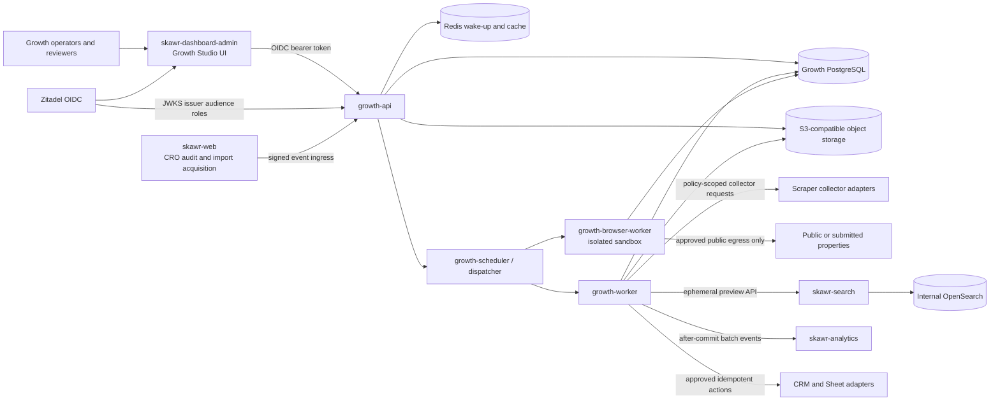
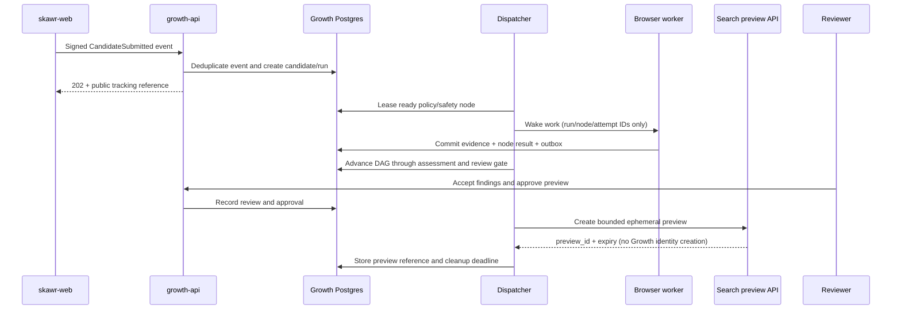
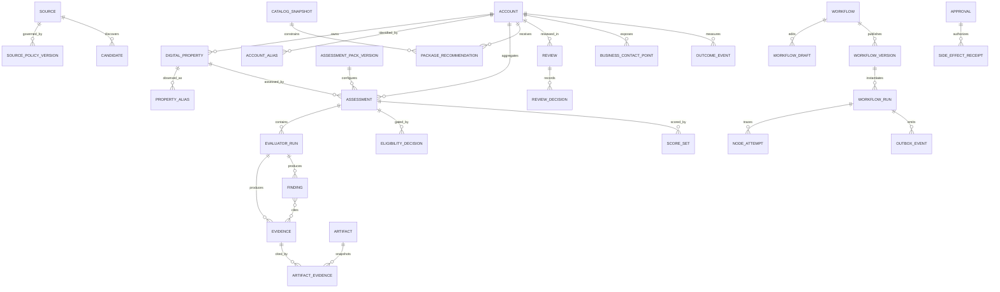

# Skawr Growth Studio — Alternative Design (Kiro)

**Status:** Proposed  
**Related specification:** [`requirements.md`](./requirements.md)  
**Document role:** Independent Kiro design alternative for later comparison and consolidation with `design.md`. This document describes proposed architecture; it does not claim the Growth service or UI already exists.

Growth Studio is an internal account-intelligence and acquisition-orchestration control plane. The customer-facing Engagement & Onboarding editor, SDKs, renderers, audience engine, push delivery, and campaign runtime are out of scope and require a separate product specification.

## 1. Goals, non-goals, and principles

### Goals

- Establish `skawr-growth` as the bounded context that durably owns Accounts, DigitalProperties, policy, evidence, assessments, scoring, review, catalog snapshots, packages, workflow definitions/runs, approvals, outcomes, and audit history.
- Launch one safe Saudi/MENA Commerce and Marketplace/Directory path from approved URL/CSV submission to evidence-backed review, bilingual artifact, optional Search preview, and approved manual export.
- Preserve horizontal extension points—collectors, evaluators, packs, catalog rules, node types, templates, and adapters—without making post-MVP sources or archetypes launch dependencies.
- Make every claim reproducible, every external action reviewable and idempotent, and every durable transition explainable after restarts or deploys.

### Non-goals

- Named-person enrichment, guessed contact details, personal mobile extraction, broad internet scraping, automated bulk sending, or unattended follow-up sequences.
- Owning Search tenant/index tables, OpenSearch, Analytics event storage, CRM records, or scraper marketplace databases.
- Replacing `/cro/audit` or `/saas/import` as public acquisition experiences.
- Implementing customer-facing Search, Analytics, CRO delivery, or Engagement & Onboarding runtimes.
- General-purpose low-code automation or cyclic, arbitrary code execution.

### Design principles

1. **Build horizontally, launch vertically.** Stable registries and contracts support future packs while the MVP enables only two packs and a narrow source set.
2. **Company/property, not people.** Identity centers on organizations and their properties; contact routes remain organization-level and purpose-bound.
3. **Evidence before claims.** Findings are typed interpretations over immutable evidence; prose and artifacts cite accepted evidence or approved catalog claims.
4. **Human before action.** Publication, CRM/sheet writes, and any recipient-level action are explicit approvals, with dual control where configured.
5. **Postgres is authoritative.** Redis accelerates wake-up, dispatch, rate limits, and caches; losing Redis cannot lose run truth or committed decisions.
6. **External products are contracts.** Growth calls Search, Analytics, collectors, CRM, sheets, Zitadel, and object storage through versioned APIs/adapters, never shared tables.
7. **Safety gates precede cost.** Policy, URL safety, cheap validation, applicability, and Eligibility execute before browser or paid work.
8. **Immutable execution context.** Published versions, run snapshots, evidence, catalog snapshots, and side-effect receipts are append-only or superseded, not rewritten.

## 2. System context and ownership





### Bounded contexts and ownership

| Context | Authoritative owner | Owned state | Contract with Growth |
|---|---|---|---|
| Growth control plane | `skawr-growth` | Account/property graph, policies, candidates, evidence, packs, assessments, findings, Eligibility/scores, catalog snapshots, packages, workflows/runs, reviews, approvals, receipts, outcomes, costs, audit | `/api/v1/growth`, signed internal ingress, outbox adapters |
| Operator experience | `skawr-dashboard-admin` | No business truth; route/editor transient state and cached API projections | Zitadel OIDC plus Growth REST API |
| Public acquisition | `skawr-web` | Guest-facing form/session UX and existing lead compatibility during migration | Signed submission/status events; no direct Growth DB access |
| Search | `skawr-search` | Catalog import/index/search behavior, Search SaaS tenants, OpenSearch indexes, hybrid Arabic BM25/vector retrieval | Internal ephemeral preview API and deterministic query endpoint |
| Collection implementation | Policy-approved collector adapters, reusing safe `skawr-scraper` patterns | No Growth domain state; short-lived execution state only | Typed `CollectorRequest`/`CollectorResult` |
| Product analytics | `skawr-analytics` | Product-usage telemetry and analytical projections | Batch ingestion after authoritative Growth commits |
| Identity | Zitadel | Users, sessions, MFA, project roles | OIDC/JWKS; dedicated Growth audience and roles |
| External systems | CRM/Sheet providers | Their own records | Approved, idempotent action adapters |
| Binary storage | S3-compatible store (Cloudflare R2 is compatible with existing patterns) | Encrypted evidence bodies, screenshots, artifacts, exports | Opaque object keys and short-lived signed reads |

Search guest `APIClient`, audit email-keyed lead records, imported store IDs, and Growth Account IDs are distinct identities. Cross-system references are explicit aliases with provenance; none is silently promoted to Account identity.

## 3. Runtime topology and deployment

### Containers and processes

| Process | Responsibility | Network/privilege profile |
|---|---|---|
| `growth-api` | REST, signed ingress, validation, queries, commands, Zitadel authorization, presigned artifact access | Traefik-facing; no browser runtime; outbound only to JWKS/object store and approved internal APIs |
| `growth-scheduler` | Poll due schedules, expire policies/previews/leases, materialize ready node work, publish wake-ups | Internal only; leader lease in Postgres; may be combined with dispatcher initially but not with API |
| `growth-worker` | Deterministic evaluators, package composition, artifact assembly, outbox delivery, integrations | Internal only; no arbitrary public browsing; constrained connector allowlist |
| `growth-browser-worker` | Browser-required collection and screenshots | Separate image/user/network; read-only root FS, dropped capabilities, seccomp, per-job temp volume, strict egress/DNS proxy, CPU/RAM/time quotas, no production secrets |
| PostgreSQL 15 | Authoritative transactional state | Separate `growth` database/schema and least-privilege role; included in backups |
| Redis 7 | Streams/wake-up, rate/fanout semaphores, caches | Rebuildable; AOF useful but never required for recovery correctness |
| S3-compatible object store | Evidence/artifact blobs and exports | Private bucket, encryption, lifecycle policies, signed URL access |

The MVP uses a **Postgres scheduler plus dispatcher**: due rows and ready nodes are selected under row locks, and Redis Streams carries small wake-up messages. This avoids another orchestration dependency on the shared VPS while retaining a clean `WorkDispatcher` interface for later queue replacement.

### Health, deployment, and capacity

- `/health/live` reports process liveness only. `/health/ready` checks database connectivity, migration compatibility, required configuration, and—for workers—registry load; Redis or optional adapters surface as degraded without pretending Postgres is unavailable.
- The shared VPS receives explicit container reservations/limits. Browser concurrency defaults low (for example 1–2 slots), with global memory, CPU, egress-byte, page-count, and wall-time budgets. General workers use separate queues for `cheap`, `browser`, `paid`, `integration`, and `artifact` cost classes.
- OpenSearch remains internal to Search and is not a Growth dependency for API readiness. Object storage or Search preview outages pause only dependent nodes.
- Alembic-style migrations run as a one-shot release job under an advisory lock, not concurrently in every replica. Migrations are expand/contract: additive schema first, dual-compatible code, backfill, then later constraint/removal.
- Unlike the indexer, Growth does not initially require blue/green. `growth-api` uses rolling/recreate deployment behind Traefik with readiness and graceful drain. Workers stop leasing, finish or relinquish leases, then restart. API and worker releases declare a shared protocol/schema compatibility range.
- A deployment cannot activate a worker that cannot deserialize all currently runnable snapshot/node schema versions. Old workers may finish leased attempts; new scheduling targets compatible worker capabilities.
- Scheduler singleton behavior uses a renewable Postgres advisory/lease row; losing leadership is safe. Cron invokes only a durable schedule tick endpoint/command, never an inline pipeline.

## 4. Frontend design in `skawr-dashboard-admin`

Growth is a route group inside the existing React 19/Vite/react-router/TanStack Query/`@skawr/core` application, reusing its `Layout`, Axios bearer-token seam, Tailwind app styles, dialogs, tables, Recharts, Sentry, and Zitadel PKCE flow.

### Routes

| Route | Purpose |
|---|---|
| `/growth` | Growth Radar overview |
| `/growth/review` | Review queues, saved views, assignments, bulk-safe operations |
| `/growth/accounts` and `/growth/accounts/:accountId` | Account list and dossier; nested properties, identity history, evidence, findings, packages, activity |
| `/growth/flows` | Workflow and Funnel Template library |
| `/growth/flows/:workflowId/edit` | Visual draft editor |
| `/growth/flows/:workflowId/versions/:versionId` | Immutable version inspection/diff/rollback target |
| `/growth/runs` and `/growth/runs/:runId` | Run list and node-attempt trace |
| `/growth/policies` and `/growth/sources` | Source policy versions, expiry, kill switches, yield |
| `/growth/catalog`, `/growth/packages`, `/growth/recommendations` | Offers, catalog snapshots, packages, composer review |
| `/growth/settings` | Packs/evaluators, budgets, roles, integrations, retention |

### Flow Studio

Use `@xyflow/react`, pinned to an exact version during implementation after compatibility validation. The canvas is a presentation/editor layer; server schemas remain platform-neutral. A node registry maps server `type`/`schema_version` to React renderers and typed configuration forms. Unknown node versions render read-only with an upgrade warning rather than losing data.

- TanStack Query owns server state, invalidation, paginated lists, and mutations. The open graph uses scoped editor state (component reducer/context or a small feature-local store), not app-global Redux.
- The editor keeps `baseETag`, normalized nodes/edges, selection, viewport, validation diagnostics, dirty state, and an undo/redo command stack. Autosave is debounced but explicit publish remains separate.
- API types are generated from Growth OpenAPI or maintained in a `growth` API module; every mutation sends `If-Match` and structured idempotency where applicable.
- Client validation gives immediate port/config feedback; authoritative validation and cost estimation come from the server. Test/dry-run results overlay nodes without mutating the draft.
- Role-aware controls hide or disable actions for usability, but the API always enforces Viewer, Operator, Reviewer, Publisher, Administrator, and Outreach Approver permissions. Publish and external-action approvals are distinct.
- Follow Skawr app conventions: compact 13–14px typography, 34px rectangular desktop controls, 12px cards, 4px spacing grid, no marketing motion/glow, keyboard navigation, focus visibility, logical CSS properties, Arabic/RTL artifact preview, and accessible graph alternatives (ordered node/edge list plus validation summary).

## 5. Domain and relational data model

UUID primary keys, `timestamptz`, actor IDs, and monotonically incremented `row_version` are standard. Business state is normalized; JSONB is limited to registry-configured, schema-versioned payloads, node inputs/outputs, immutable snapshots, and provider metadata. Large bodies live in object storage and are addressed by hash/key.



### Identity, source, and classification

- `accounts(id, legal_or_trade_name, primary_archetype_id, status, geography, row_version, created_at, merged_into_id?)`; status is `candidate|active|monitor|blocked|suppressed|merged|deleted`.
- `digital_properties(id, account_id, type, canonical_location, normalized_host?, geography, languages[], control_status, isolation_status, row_version)`. A partial unique index covers active `(type, normalized canonical location)` while allowing historical aliases.
- `account_aliases` and `property_aliases` carry `(alias_type, normalized_value, source_id, observed_at, valid_to, evidence_id)`. Domain redirects are observations, not identity keys.
- `identity_change_sets(id, operation merge|split, reason, actor_id, created_at)` plus `identity_change_members(before_id, after_id, role)` preserve lineage. Merge never deletes source IDs; split copies only explicitly selected property/evidence links and records lineage. Open runs are paused for reviewed reassignment.
- `sources(id, type, canonical_name, status, kill_switch_at, owner_id)`; `source_policy_versions(id, source_id, version, decision, allowed_fields, allowed_purposes, allowed_actions, legal_basis, robots_decision, retention_policy_id, reviewed_at, expires_at, approved_by)`. Policy arrays are typed child rows where querying/enforcement matters; a canonical signed snapshot JSONB supports run capture.
- `candidates(id, source_id, external_ref, submitted_location, submitted_payload_ref, policy_version_id, state, dedupe_key, received_at)`. Unique `(source_id, external_ref)` and event dedupe keys prevent replay duplicates.
- `archetypes`, `capabilities`, `account_archetype_assertions`, and `property_capability_assertions` retain classifier/evaluator version, confidence, evidence links, reviewer correction, and effective interval.

### Assessment and evidence

- `collector_versions`, `evaluator_versions`, `assessment_packs`, and immutable `assessment_pack_versions` describe input/output schema IDs, locale support, cost class, dependencies, applicability, lifecycle, and freshness. `pack_evaluators` orders evaluator versions and dependencies.
- `assessments(id, account_id, digital_property_id, pack_version_id, run_id, state, started_at, completed_at, actual_cost)`. An assessment targets exactly one property; account rollups are projections over property findings.
- `evaluator_runs(id, assessment_id, evaluator_version_id, input_schema, input_payload, output_schema, output_payload, state, cost, started_at, completed_at)`. Payloads are schema-versioned JSONB but evidence/findings remain relational.
- `evidence(id, property_id, source_id, policy_version_id, kind, observed_at, valid_until, method_id, method_version, content_hash, object_key?, sanitized_snippet?, confidence_basis, collection_purpose, status)`. Evidence is append-only; corrections supersede it.
- `findings(id, assessment_id, evaluator_run_id, category, code, severity, statement_key, state, confidence, freshness_state, finding_schema_version, structured_payload)` and `finding_evidence(finding_id, evidence_id, role, derivation)`. Database constraints require at least one accepted evidence relation before a finding can become `accepted`, except an explicit approved submitted-fact evidence type.
- `finding_reviews`, `finding_corrections`, and `refresh_requests` preserve automated output, reviewer decision, reason, actor, and time.

### Eligibility, scoring, catalog, and packages

- `rule_sets` and immutable `rule_set_versions(type eligibility|fit|confidence|timing_value|risk|routing, config, schema_version, effective_at, retired_at)`.
- `eligibility_decisions(id, subject_type, subject_id, assessment_id, rule_version_id, result, reason_codes[], evidence_snapshot_hash, resolved_by?, resolution_reason?)`. `Blocked` cannot be overridden to Pass without an authorized resolution record tied to the applicable policy/suppression change.
- `score_sets(id, assessment_id, eligibility_id, fit, confidence, timing_value, risk, rule_versions, component_snapshot)` stores separate bounded values and components; no combined score can bypass Eligibility.
- `catalog_items`, immutable `catalog_item_versions`, `offers`, `offer_versions`, `entitlements`, `offer_entitlements`, `commercial_constraints`, and `catalog_snapshots`. Lifecycle/effective-region/currency/approval fields are relational; approved claims are versioned rows.
- `growth_packages` and immutable `growth_package_versions` define offer phases, prerequisites, incompatibilities, implementation requirements, and template compatibility.
- `package_recommendations(id, account_id, assessment_id, catalog_snapshot_id, original_package_version_id?, current_package_version_id?, route, rationale_snapshot, state)` plus `recommendation_findings` and `package_overrides`. Overrides keep the original, require a reason, and create a new validated revision.

### Workflows, review, action, and learning

- `funnel_templates`/`funnel_template_versions`; `workflows`; single mutable `workflow_drafts(graph_payload, row_version, validation_hash)`; immutable `workflow_versions(graph_payload, registry_snapshot, policy_refs, pack_refs, catalog_refs, published_by, published_at)`.
- `workflow_runs(id, workflow_version_id, account_id?, property_id?, mode live|test|dry_run, immutable_snapshot, state, checkpoint_seq, budget_snapshot, created_at)`; `run_nodes` materialize graph node state; `node_attempts` hold lease, typed input/output, error class, cost, and timestamps.
- `outbox_events(id, aggregate_type, aggregate_id, event_type, payload, occurred_at, available_at, published_at, attempts)` and `inbox_events(source, external_event_id, payload_hash, received_at)` provide atomic delivery and ingress deduplication.
- `reviews`, `assignments`, `review_decisions`, `comments`, and `saved_views`; decisions use optimistic row versions. MVP comments are plain text with audit metadata; mentions/notifications/activity feed remain deferred.
- `business_contact_points(id, account_id, classification, normalized_route_ciphertext, source_id, purpose, basis_or_consent_id, allowed_channels, evidence_id, expires_at, suppression_state)`. Only generic company or explicitly consented routes are valid; no person entity exists.
- `consent_records` and append-only `suppression_entries(subject_type, subject_hash, scopes, reason, effective_at, lifted_at?)`. Suppression checks use keyed hashes for deleted routes and propagate through jobs/adapters.
- `artifacts(id, account_id, type, locale, object_key, content_hash, evidence_snapshot_id, catalog_snapshot_id, template_version, model_version?, status, expires_at)`; `previews(id, property_id, search_preview_id, access_token_hash, state, expires_at, deleted_at)`.
- `approvals(id, subject_type, subject_id, action, requested_by, state, policy_snapshot, expires_at)` and `approval_votes(approval_id, actor_id, decision, reason)`. A unique actor constraint enforces two-person approval.
- `side_effect_receipts(id, adapter, operation, idempotency_key, request_hash, external_ref?, state, response_ref?, committed_at)` has unique `(adapter, idempotency_key)`.
- `outcome_events`, `experiment_assignments` (post-MVP), `cost_entries`, and append-only `audit_log`. Growth outcomes are authoritative; Analytics receives a projection.

### Important constraints and indexes

- Unique active canonical property location; unique source event/dedupe keys; unique pack/evaluator/workflow/catalog `(stable_id, version)`; one active workflow draft per workflow.
- Partial indexes for review queues `(state, due_at, owner_id)`, runnable nodes `(state, ready_at, priority) WHERE state='ready'`, stale leases `(lease_expires_at) WHERE state='running'`, unsent outbox `(available_at, id) WHERE published_at IS NULL`, policy expiry, evidence freshness, preview expiry, and suppression hash/scope.
- `CHECK` constraints cover score ranges, effective-date ordering, terminal timestamps, allowed state transitions where practical, live-run side-effect prohibition in test/dry mode, and property ownership.
- Partition high-volume `audit_log`, `outcome_events`, `cost_entries`, and optionally `node_attempts` by month only after measured need; indexes begin minimal for VPS write cost.
- Database triggers are limited to append-only protection and audit metadata. Domain transitions occur in transactional services so invariants are testable and errors are explicit.

## 6. Versioned contracts and schemas

All contracts use stable `schema` URIs, semantic schema versions, RFC 3339 timestamps, UUIDs, and explicit locale/currency. Unknown required schema versions fail closed; additive optional fields are tolerated within a compatible version range.

### Evidence

```json
{
  "schema": "growth/evidence@1",
  "id": "ev_01J...",
  "property_id": "dp_01J...",
  "kind": "search_result_observation",
  "source": {"id": "submitted-site", "policy_version": "7"},
  "observed_at": "2026-07-18T09:15:00Z",
  "valid_until": "2026-08-17T09:15:00Z",
  "method": {"id": "known-item-search", "version": "1.2.0"},
  "subject": {"query": "ايفون ١٥", "expected_item_ref": "inv_42"},
  "observation": {"rank_bucket": "none", "latency_ms": 418},
  "artifact_ref": {"object_key": "evidence/.../shot.webp", "sha256": "..."},
  "confidence_basis": ["inventory_exact_title", "same-session_result"]
}
```

### Finding and evaluator result

```json
{
  "schema": "growth/finding@1",
  "code": "search.known_item.not_top10",
  "category": "search",
  "statement_key": "finding.search_known_item_missed",
  "severity": "high",
  "evidence_refs": [{"id": "ev_01J...", "role": "primary"}],
  "structured": {"query": "ايفون ١٥", "expected_item_ref": "inv_42", "rank_bucket": "none"},
  "limitations": ["synthetic timestamped sample; not production traffic"]
}
```

```json
{
  "schema": "growth/evaluator-result@1",
  "evaluator": {"id": "search-known-item", "version": "1.2.0"},
  "status": "completed",
  "evidence": ["ev_01J..."],
  "findings": ["fd_01J..."],
  "metrics": {"queries_attempted": 12, "queries_skipped": 1},
  "cost": {"currency": "USD", "amount": "0.0142", "units": {"browser_s": 24}},
  "warnings": []
}
```

### Node definition and workflow graph

```json
{
  "schema": "growth/node-definition@1",
  "type": "assessment.run_pack",
  "version": "1.0.0",
  "category": "assessment",
  "input_ports": {"property": "growth/digital-property-ref@1"},
  "output_ports": {"assessment": "growth/assessment-ref@1"},
  "config_schema": "growth/nodes/assessment-run-pack-config@1",
  "capabilities": ["paid_work"],
  "allowed_modes": ["live", "test", "dry_run"]
}
```

```json
{
  "schema": "growth/workflow-graph@1",
  "nodes": [
    {"id": "source", "type": "source.submission", "version": "1.0.0", "config": {}},
    {"id": "policy", "type": "policy.gate", "version": "1.0.0", "config": {"purpose": "assessment"}},
    {"id": "review", "type": "human.review", "version": "1.0.0", "config": {"queue": "qualified"}}
  ],
  "edges": [
    {"from": "source.candidate", "to": "policy.candidate"},
    {"from": "policy.passed", "to": "review.subject"}
  ],
  "parameters": {"source_policy_id": {"type": "string", "required": true}}
}
```

### Event envelope

```json
{
  "specversion": "1.0",
  "id": "01J...",
  "source": "skawr-web/cro-audit",
  "type": "growth.candidate.submitted.v1",
  "subject": "submission/scan_abc",
  "time": "2026-07-18T09:00:00Z",
  "datacontenttype": "application/json",
  "traceparent": "00-...",
  "data": {"submission_type": "url", "location": "https://example.sa", "locale": "ar-SA"}
}
```

Transport adds `X-Skawr-Key-Id`, timestamp, nonce, and an HMAC signature over method, path, timestamp, nonce, and raw body. Growth rejects stale timestamps, reused nonces, unknown keys, body-hash mismatch, and duplicate `(source,id)` while returning the original acknowledgement for safe retries.

## 7. Assessment architecture

### Stable plugin contracts

`Collector.collect(request) -> CollectorResult` accepts property, approved source-policy snapshot, allowed fields/purpose, URL-safety token, limits, locale, and trace IDs. It returns fetched-resource metadata, typed observations, object references, denials, and exact cost. A collector cannot create Accounts/findings, alter policy, or call arbitrary destinations.

`Evaluator.evaluate(context, evidence_refs) -> EvaluatorResult` is deterministic for the same versioned inputs unless its contract declares a timestamped external observation. It emits schema-valid evidence references, findings, metrics, limitations, and cost. Evaluators do not route, compose packages, or publish prose.

Pack versions compose evaluator versions as a dependency DAG with applicability, required inputs, locales, lifecycle, cost class, and evidence freshness. Retiring a version blocks new assessments and marks dependent recommendations stale; prior results remain reproducible.

### MVP packs

| Pack | Applicability | Core evaluator groups |
|---|---|---|
| Commerce | Public/submitted catalog and conversion journey; searchable inventory or credible search need | identity/platform, catalog sample, Search known-item, observable Analytics readiness, public CRO, safe Engagement need, package signals |
| Marketplace/Directory | Searchable listing corpus/directory and public discovery/detail journey | taxonomy/inventory, Search known-item and filters, observable measurement, marketplace CRO, safe Engagement need, package signals |

Salla, Shopify, and Zid adapters improve collection but are capabilities, not eligibility requirements. Registry schemas can describe future B2B Catalog, SaaS/Product, Content/Documentation, and Lead-Generation packs without enabling their evaluators.

### Evidence rules by opportunity

- **Search:** ground truth comes only from exact permitted inventory, deterministic documented transformations, or a reviewed locale lexicon. Variant provenance records Arabic orthography, transliteration, mixed script, numerals, typo, SKU/model, or category/attribute rule. Each test stores query, expected item derivation, rank bucket, latency, autocomplete/zero-result recovery, time, version, and screenshot/snippet. Synthetic rates are labeled with sample/method and never treated as internal traffic or revenue.
- **Analytics:** public tags and merchant submissions support only observable readiness. Absence is phrased `not publicly observed`; presence never proves event quality, governance, identity, reporting, or use.
- **CRO:** findings cover reproducible pricing/trust clarity, journey friction, intent-to-landing alignment, accessibility, mobile usability, and observable measurement readiness. Journeys stop before authentication, account creation, transaction, or form submission unless an approved sandbox authorizes it. Impact estimates require merchant inputs and remain labeled scenarios.
- **Engagement & Onboarding:** absence of popup/banner/guidance/survey/push is never evidence of need. A finding requires a demonstrated unmet journey need or harmful existing implementation. Concepts include frequency, accessibility, mobile/RTL/localization, performance, consent/opt-out, and anti-dark-pattern constraints and clearly state that a separate product would deliver them.

LLMs may run only after the reviewer/evaluator selects structured evidence and approved catalog claims. The phrasing service receives redacted inputs, must return citations to supplied IDs, and passes schema, citation, forbidden-claim, commercial-copy, and locale validation. Failure produces no publishable prose, never a fallback invention.

## 8. Eligibility, scoring, and routing

Routing is a two-stage rules engine with immutable configurations:

1. **Eligibility gate:** evaluate policy expiry/authorization, source denial, URL safety, suppression, consent/basis, personal-data dependency, evidence integrity, and external-action basis. Result is `Pass`, `Review Required`, or `Blocked` with reason codes and subject scope (account/property/finding/action).
2. **Commercial dimensions:** only for `Pass`, compute separate Fit, Confidence, Timing/Value, and Risk components. Store every input, weight/threshold, rule version, and component result. No single additive score can cancel a blocker.

Rules are declarative typed expressions over approved fields; a reviewed plugin is needed for new operators. LLM output is not a rule input. Conflicting/stale evidence lowers Confidence or requires review; it does not silently choose a fact. Ambiguity creates a resolution work item. An authorized reviewer may resolve `Review Required` with reason and evidence; hard blockers require the underlying policy/suppression/safety condition to change.

Routes are `qualified_review`, `generate_then_review`, `monitor`, `opportunity_no_current_offer`, and `disqualified`. The `Opportunity detected; no current Skawr offer` route persists accepted demand for learning, omits purchase CTA, and does not force Analytics into Search or unavailable products.

## 9. Product catalog and Package Composer

A catalog publication creates an immutable snapshot of product/service/tier/entitlement/offer versions, lifecycle, effective dates, locales, regions, currencies, billing cadence, prerequisites, incompatibilities, implementation requirements, platform support, approvals, pricing policy, allowed claims, and CTA. Recommendations reference one snapshot and are revalidated before artifact publication/export/action.

The composer is a deterministic constrained solver:

1. Select reviewer-accepted findings and applicable opportunities.
2. Filter offers by lifecycle (`available`, or explicitly account/region/channel/date-approved `pilot`), effective date, region/currency/locale, archetype/capability, and commercial approval.
3. Expand prerequisites and entitlements; reject incompatibilities and unmet implementation constraints.
4. Enforce: Basic Analytics is bundled with the lowest Search tier; Advanced Analytics with the second and higher tiers; Analytics is never standalone; the free import/personalized preview is not a free subscription tier or subscription trial; Search has no free tier or subscription trial.
5. Minimize package cost/scope against all accepted needs, then prefer fewer phases and lower implementation effort under explicit tie-break rules.
6. If no valid offer exists, emit `opportunity_no_current_offer`. If immediate scope is unsuitable, create ordered phases with prerequisites and reassessment points.

Annual copy is exactly `Save 17% with an annual subscription` or an approved localized equivalent; copy describing free months is blocked. Reviewer add/remove/phase/override creates a new revision, records the original recommendation and reason, and reruns all constraints before save or publication.

## 10. Visual workflows and Funnel Templates

The platform-neutral node registry groups nodes as source, policy, collection, classification, assessment, eligibility/scoring, decision, human gate, artifact, action, outcome, and control. Connector-specific configuration stays within a typed node config and secret reference; exports omit secret values and environment bindings.

Publication validates: registered node/schema versions; typed port compatibility; required config; at least one source and permitted terminal; DAG acyclicity; reachability; no orphan outputs; cost/fanout/browser limits; mode support; policy/action gates; pack/package/template/archetype/capability/locale/catalog compatibility; and approval before any side-effect node. Recurrence is a schedule creating new runs, never a graph cycle.

Drafts are mutable with ETags. Publish produces an immutable version and estimated cost. Test runs target one property; bounded dry runs target a capped sample and substitute sandbox adapters for CRM, sheet, notification, publication, and communication. The UI labels all simulated effects and outcomes. Rollback marks a prior version current for new runs; in-flight runs keep their snapshot.

Initial MVP templates are limited to the launch path: **Inbound Growth Audit**, **Approved URL/CSV Discovery**, **Search Opportunity**, **Measurement Readiness**, **CRO Opportunity**, **Engagement Opportunity**, and a composed **Growth Blueprint**. Partner Portfolio is enabled only if an approved partner source exists. Migration Watcher, Reactivation, broad discovery, and other templates remain post-MVP.

## 11. Durable Postgres DAG execution

### State model

Workflow run states: `pending -> running <-> paused -> completed|failed|cancelled|blocked|dead_lettered`; `cancelling` is intermediate. Node states: `pending -> ready -> leased -> running -> succeeded|skipped|blocked|failed|dead_lettered|cancelled`. Only declared transitions are accepted, each appending a run event.

### Algorithm

1. Starting a run transactionally captures the immutable workflow graph, node/config schemas, source-policy versions, pack/evaluator versions, rule versions, catalog references, template relationship, parameters, mode, and cost/concurrency budgets. It materializes `run_nodes`; source nodes become `ready`.
2. The scheduler selects due `ready` nodes using `FOR UPDATE SKIP LOCKED`, verifies run/account/source/global budgets and kill switches, inserts a `node_attempt` with a renewable lease, sets `leased`, commits, then emits a Redis Stream wake-up. A missed wake-up is repaired by the next database scan.
3. A worker consumes only identifiers, claims the matching unexpired attempt in Postgres, checks worker capability/schema compatibility, changes it to `running`, and heartbeats the lease. Work uses the immutable snapshot, never the current draft/policy/catalog as a substitute.
4. The worker writes typed output, evidence/findings/cost, terminal attempt state, node state, downstream readiness decisions, audit row, and outbox events in one transaction. Large objects are uploaded first under a temporary key and finalized/referenced transactionally; an orphan sweeper removes unreferenced temporary objects.
5. Downstream nodes become ready only when all required predecessors have accepted terminal outputs and edge predicates evaluate deterministically. Join inputs are ordered by edge/node ID.
6. Transient errors use bounded, error-class-specific attempts with jittered backoff and `Retry-After` bounded by policy. `401/403`, robots denial, explicit denial, prohibited policy, suppression, unsafe URL, and contract violations are terminal/no automatic retry. Bounded `429`, `503`, and timeout handling follows source policy; exhaustion enters review or dead letter.
7. Every external effect obtains `idempotency_key = hash(run_id, node_id, logical_operation, target_scope, payload_version)`. The adapter inserts/locks a receipt before calling, sends the key where supported, and reconciles unknown outcomes before retry. A committed receipt returns the prior result.
8. Pause stops new leases; running safe points checkpoint and relinquish. Cancel marks pending work cancelled and requests cooperative stop without undoing receipts. Resume recomputes readiness from committed checkpoints. Dead-letter replay requires authorization, current safety revalidation, and a new attempt linked to the original.
9. Account advisory/concurrency keys limit concurrent workflows; conflicting identity/package/review mutations serialize by account. Per-source/property/account/global semaphores and monetary/unit budgets are rechecked at lease and before paid calls.
10. The outbox dispatcher claims unpublished events with `SKIP LOCKED`, delivers them, and records acknowledgement. Consumers use inbox dedupe. Outcome/telemetry adapters never mutate run truth.

Current Next.js fire-and-forget Promises, FastAPI `BackgroundTasks`, process-local Maps, and Redis-only import status cannot guarantee recovery, leases, idempotent effects, or immutable traces, so they are migration sources—not the runtime. Temporal would be reasonable at larger scale but adds an operational control plane on the shared VPS. Celery still needs carefully designed durable domain state and dynamic DAG semantics. Activepieces/n8n can later be action adapters; neither is authoritative workflow state.

## 12. Integration designs

### `skawr-web` audit and import

`/cro/audit` and `/saas/import` remain public, rate-limited acquisition surfaces. They post signed `CandidateSubmitted`, `SubmissionUpdated`, `PreviewEngaged`, and `SubmissionClaimed` events to an internal Growth ingress. Growth returns a stable public tracking token that reveals only coarse status.

Migration is incremental:

1. Dual-write events from existing flows while the current audit/import execution remains primary; reconcile event IDs and compare outcomes.
2. Make Growth create the durable run and return status; `skawr-web` polls a narrow public status proxy. Existing DynamoDB lead/scan records become compatibility/read projections, not Growth truth.
3. Move audit collection/evaluation into Growth workers. Remove the process-local `Map`, fire-and-forget execution, and 24-hour process cache only after parity and recovery tests.
4. Move import orchestration durability to Growth while Search continues catalog ingest/index/search. Growth stores Search operation references and deadlines; it does not copy Search guest tenant rows.

Email-keyed audit leads and Search guest clients are source aliases only. An Account is created/linked through Growth identity resolution, with provenance and dedupe evidence; claiming an import does not automatically prove organization identity or property control.

### Search ephemeral preview

A private, authenticated contract is added to Search:

- `POST /internal/v1/growth/previews` with Growth request ID, permitted normalized sample (or a Search-owned import reference), locale, retrieval profile, max documents, purpose, and expiry. Search returns opaque `preview_id`, restricted query token, indexed count, and expiry.
- `POST /internal/v1/growth/previews/{id}/query` executes bounded hybrid Arabic BM25/vector search and returns deterministic result/rank data. Growth supplies expected-item derivations; Search does not declare relevance truth.
- `DELETE /internal/v1/growth/previews/{id}` is idempotent. Search also TTL-deletes indexes/tokens; Growth expiry jobs call delete and reconcile deletion receipts.

Preview indexes use a dedicated prefix/alias and hard document, query, token, and TTL quotas. Tokens cannot access SaaS tenant APIs. Preview creation never creates a Growth Account or reuses Search guest identity as one. Growth stores no OpenSearch credentials and never queries OpenSearch directly.

### Policy-scoped collection

Growth reuses Scrapy request throttling, retry classification, adapters, field normalization, and deterministic parsing patterns behind the collector contract. Every request carries approved hosts, fields, purpose, maximum pages/bytes/time, robots decision, user agent, redirect policy, and evidence retention. Collector output is schema-validated and field-filtered before persistence.

Explicitly excluded are marketplace-specific databases as Growth state, personal phone extraction/upload paths, authenticated crawlers, hardcoded or captured credentials, proxy/CA interception tooling, session-cookie automation, CAPTCHA/bot-defense bypass, and marketplace scripts whose terms/policy are not approved. The current `phone` paths and credential-bearing Dubizzle/Aqar behavior are not imported into Growth.

### Analytics telemetry adapter

An outbox consumer batches up to 100 sanitized events to Skawr Analytics' server-to-server batch endpoint using a dedicated project/API key. Taxonomy includes `growth_run_started/completed`, `growth_node_completed/failed`, `growth_review_decided`, `growth_artifact_approved`, `growth_preview_opened`, and operator UI events. Properties use opaque account/run/version IDs, source/workflow/pack/package/variant dimensions, cost bands, and durations; no raw evidence, secrets, direct contact routes, or prohibited personal data.

Delivery occurs only after the authoritative Growth transaction commits. Analytics loss/delay never rolls back or advances a run, and Analytics data is never used as workflow truth.

### CRM and Sheet export

Action nodes require current approval, Eligibility Pass, policy/action purpose, consent/basis where applicable, suppression-clear status, catalog revalidation, and recipient/target validation. Adapters map only approved organization fields, evidence summary, artifact link, reviewer, and provenance. `side_effect_receipts` and provider external IDs prevent duplicates; unknown call outcomes are reconciled before retry. Dry runs write only simulated receipts. MVP exports are manual approved operations; no bulk sending is available.

### Object storage lifecycle

Private buckets/prefixes separate raw evidence, sanitized evidence, screenshots, artifacts, exports, and temporary uploads. Database rows carry content hash, media type, size, classification, retention class, encryption key reference, and deletion state. Upload uses bounded content type/size and malware scanning where applicable; HTML is never served active. Downloads use short-lived audience-bound signed URLs through Growth authorization. Lifecycle jobs delete temporary/raw objects first, then expired previews/artifacts; deletion/suppression propagation records tombstones and retries processor/index cleanup until acknowledged.

## 13. Representative API surface

All operator endpoints are under `/api/v1/growth`; internal events are under `/internal/v1/growth`. List endpoints use cursor pagination (`limit`, `after`), stable sort keys, and structured filters. Mutable resources return `ETag`; updates require `If-Match`. Create/action endpoints accept `Idempotency-Key` and return the original result on safe replay.

### Radar, identity, and review

- `GET /api/v1/growth/radar?window=&source=&workflow_version=&pack_version=`
- `GET /api/v1/growth/accounts`; `POST /api/v1/growth/accounts`
- `GET|PATCH /api/v1/growth/accounts/{accountId}`
- `POST /api/v1/growth/accounts/{accountId}/properties`
- `POST /api/v1/growth/accounts:merge`; `POST /api/v1/growth/accounts/{accountId}:split`
- `GET /api/v1/growth/accounts/{accountId}/dossier`
- `GET /api/v1/growth/reviews`; `POST /api/v1/growth/reviews/{reviewId}/assign`
- `POST /api/v1/growth/findings/{findingId}/decisions`
- `POST /api/v1/growth/reviews/{reviewId}/comments`
- `GET|POST /api/v1/growth/saved-views`

### Workflows and runtime

- `GET|POST /api/v1/growth/workflows`; `GET|PATCH /api/v1/growth/workflows/{id}/draft`
- `POST /api/v1/growth/workflows/{id}/validate`; `POST /api/v1/growth/workflows/{id}/estimate`
- `POST /api/v1/growth/workflows/{id}/test-runs`; `POST /api/v1/growth/workflows/{id}/dry-runs`
- `POST /api/v1/growth/workflows/{id}/publish`; `GET /api/v1/growth/workflows/{id}/versions`
- `POST /api/v1/growth/workflows/{id}/versions/{versionId}:make-current`
- `GET|POST /api/v1/growth/funnel-templates`; `POST /api/v1/growth/funnel-templates/{id}:clone`
- `GET /api/v1/growth/runs`; `GET /api/v1/growth/runs/{runId}`; `GET /api/v1/growth/runs/{runId}/attempts`
- `POST /api/v1/growth/runs/{runId}:pause|:resume|:cancel`
- `POST /api/v1/growth/dead-letters/{attemptId}:replay`

### Policy, assessment, catalog, artifacts, and actions

- `GET|POST /api/v1/growth/sources`; `POST /api/v1/growth/sources/{id}:kill|:resume`
- `GET|POST /api/v1/growth/source-policies`; `POST /api/v1/growth/source-policies/{id}/versions`
- `GET /api/v1/growth/packs`; `GET /api/v1/growth/evaluators`; `POST /api/v1/growth/assessments`
- `GET|POST /api/v1/growth/catalog/publications`; `GET /api/v1/growth/catalog/snapshots/{id}`
- `GET|POST /api/v1/growth/growth-packages`
- `POST /api/v1/growth/accounts/{id}/package-recommendations:compose`
- `POST /api/v1/growth/package-recommendations/{id}:override`
- `POST /api/v1/growth/artifacts:generate`; `GET /api/v1/growth/artifacts/{id}`
- `POST /api/v1/growth/previews`; `DELETE /api/v1/growth/previews/{id}`
- `POST /api/v1/growth/approvals`; `POST /api/v1/growth/approvals/{id}/votes`
- `POST /api/v1/growth/actions/crm-export`; `POST /api/v1/growth/actions/sheet-export`
- `POST /api/v1/growth/outcomes`; `GET /api/v1/growth/outcomes`
- `POST /api/v1/growth/suppressions`; `DELETE /api/v1/growth/suppressions/{id}` (lift, not history deletion)
- `GET /health/live`; `GET /health/ready`

### Internal and public compatibility endpoints

- `POST /internal/v1/growth/events/skawr-web` — signed envelope, inbox dedupe
- `POST /internal/v1/growth/events/search` — signed operation callbacks
- `GET /internal/v1/growth/submissions/{publicToken}/status` — coarse status for a trusted `skawr-web` proxy
- `POST /internal/v1/growth/dispatch/tick` — optional cron-authenticated wake-up; schedules durable rows only

Errors follow Problem Details with stable `code`, `trace_id`, validation pointers, current ETag where relevant, and retryability classification.

## 14. Security and compliance threat model

### Authentication and authorization

Zitadel is mandatory. The dashboard requests the dedicated Growth project audience; `growth-api` validates signature against cached/rotated JWKS, exact issuer, audience, expiry/not-before, token type, and project-role claims. Roles map to Viewer, Operator, Reviewer, Publisher, Administrator, and Outreach Approver. No new legacy password/JWT path is introduced. Service calls use separately rotated service identities or signed envelopes, not operator tokens.

Authorization is resource/action based: source/policy administration, evidence access, workflow edit/publish, package override, suppression, export, and outreach approval are separate permissions. Dual approval uses distinct subjects and rejects self-second-approval. Tenant/source restrictions, field redaction, and signed object access are enforced server-side.

| Threat | Primary controls |
|---|---|
| SSRF, DNS rebinding, redirect pivot | Only HTTP/S; reject credentials and non-public/metadata ranges; normalize host; resolve and pin approved IP; re-resolve/revalidate every redirect and connection; cap redirects/time/bytes/content type; no proxy fallback |
| Browser escape or internal reachability | Isolated worker/container/user/network; deny-by-default egress proxy; no Docker socket/cloud metadata/secrets; read-only FS; dropped capabilities/seccomp; CPU/RAM/PID/time limits; per-job context destruction |
| Robots/terms/explicit denial bypass | Versioned policy gate before fetch; robots decision in request; terminal denial; `401/403` no retry/alternate credentials; source kill switch checked at lease and connect |
| Active/malicious HTML | Parse as untrusted; disable downloads/extensions; sanitize snippets; screenshots as inert images; CSP and download disposition; never render raw HTML in dashboard |
| Malicious CSV/feed/file | Byte/row/column limits; MIME and magic-byte checks; formula neutralization; archive rejection/decompression limits; malware scan as configured; no execution; quarantine on mismatch |
| Secret leakage | External secret manager or encrypted environment/file refs; least-privilege per adapter; values excluded from DB graph exports/logs/prompts/screenshots; rotation and access audit |
| Broken access control | Zitadel issuer/audience/role validation; server authorization; object-level checks; ETags; short signed URLs; deny by default; role/action integration tests |
| Replay/duplicate external effect | Signed timestamp/nonce/body; inbox dedupe; action idempotency key; durable receipt; provider reconciliation; immutable approval snapshot |
| Policy drift/expiry | Exact policy version in run; expiry blocks new collection/action; current-policy revalidation before external effect; expiry alerts and source kill switch |
| Suppressed/deleted data resurrection | Keyed suppression tombstone checked at import and action; propagation ledger to DB/cache/queue/previews/artifacts/processors; reconciliation until acknowledged |
| LLM data or claim leakage | Approved processor/region/purpose; field allowlist and redaction; no secret/contact/raw page by default; selected evidence only; citation/claim validation; fail closed |
| Cost/resource exhaustion | Source/IP rate limits, graph estimates, fanout/concurrency/byte/token/browser budgets, queue classes, circuit breakers, kill switches and hard global spend cap |

### Retry and collection matrix

- Robots denial, unsafe destination, prohibited/expired policy, suppression, explicit denial, `401`, and `403`: terminal; no automatic retry.
- `429`: honor valid `Retry-After` within source maximum, then pause source/property and require review when exhausted.
- `503`, connection reset, and timeout: bounded exponential delay with jitter within policy; then review/dead letter.
- Contract/schema violations and sanitization failures: terminal implementation/data error; quarantine payload.
- `404/410`: record observation; retry only if the source policy explicitly treats it as transient.

Raw HTML/traces/screenshots receive short purpose-specific retention. Accepted extracted evidence uses pack freshness/retention. Correction/deletion/suppression propagates to database projections, Search previews, objects, caches, queues, exports, and processors; only content-free tombstones and mandated audit facts remain. Saudi properties/recipients invoke PDPL purpose, basis/consent, correction, retention, opt-out, and suppression controls. Legal policy content remains configuration approved outside code.

## 15. Growth Radar, telemetry, and outcome learning

Growth owns authoritative `OutcomeEvent` records because commercial and workflow outcomes must survive Analytics outages and remain tied to immutable versions. Events link source/policy, workflow/template, pack/evaluator, archetype/capability, opportunity, package/catalog snapshot, artifact/channel, Account/property, and—later—variant/exposure context.

Radar reads Postgres projections/materialized views for:

- opportunity and package distribution; review backlog/age/owner; source and workflow-stage yield;
- discovered, policy-accepted, safe, live, classified, eligible, evaluated, qualified, in-review, monitored, blocked, dead-lettered, and errored counts;
- reviewer acceptance/overturn, evidence freshness, unsupported-claim and duplicate rates, policy pass/expiry, cost/latency percentiles;
- meetings, imports, catalog index completion, Analytics first event, Engagement & Onboarding start, CRO start, proposal, paid, rejection, and suppression.

Dimensions always include source, policy version, workflow/template version, pack/evaluator version, package/catalog snapshot, locale, and applicable variant. Conversion optimization prioritizes accepted evidence, qualified conversations, activation, proposal, paid, rejection, and suppression. Opens alone never alter routing/scoring/experiments.

Skawr Analytics receives after-commit product-usage and outcome projections for UI behavior and cross-product analysis. Recharts renders Radar from Growth aggregates; Analytics is neither queried to decide node completion nor used to reconstruct missing run state.

## 16. Failure handling and operability

- **Retries and circuits:** classified retry policies are versioned by adapter/source. Circuit breakers pause new calls after rate/error thresholds, retain ready work in Postgres, and probe cautiously. Operators can kill a source, evaluator, adapter, template, or all browser work.
- **Leases:** scheduler reclaims expired attempts only after checking heartbeat and receipt state. Repeated stale leases indicate worker failure and trigger alerts. No attempt can commit after its lease fencing token is superseded.
- **Queues:** alert on oldest-ready age, no-consumer condition, Redis stream lag, database scheduler lag, dead-letter growth, and outbox age. Redis loss triggers database polling mode at reduced rate.
- **Quality/yield:** monitor source policy pass, candidate-to-account yield, duplicate rate, evaluator completion, accepted finding yield, reviewer overturn, unsupported claims, stale evidence, preview cleanup, and source-yield drift against rolling baselines.
- **Cost:** compare estimated/actual per source/evaluator/pack/property/account; hard-stop global and account budgets; alert at warning/critical thresholds and on unpriced cost units.
- **Observability:** structured logs with trace/run/node/attempt IDs and no sensitive payloads; metrics for state transitions, lease/retry/error classes, latency/cost; distributed traces across signed internal calls; Sentry/GlitchTip for exceptions with scrubbing. Operator dashboards separate platform health from commercial Radar.
- **Dead letters:** immutable failure classification, sanitized context, attempt history, policy snapshot, and replay eligibility. Replay is single/bounded, reasoned, authorized, and creates a linked attempt.
- **Disaster recovery:** daily encrypted Postgres backups plus WAL/point-in-time capability when available, object versioning/lifecycle, configuration/registry export, and periodic restore drills. Redis is recreated; scheduler rebuilds wake-ups from Postgres. Recovery point/time objectives are declared before launch.

## 17. MVP sequence and rollout

This is a release sequence and risk boundary, not an implementation task list.

1. **Foundation:** Growth service boundary, Postgres schema/migrations, Zitadel Growth audience/roles, object store, policy/suppression, durable scheduler/worker, audit/outbox, health and backups.
2. **Vertical source slice:** approved CSV and submitted URL; signed `skawr-web` ingress; Account/property resolution; secure collection; one end-to-end run to human review. Existing audit/import paths remain available during shadow migration.
3. **Assessment packs:** enable Commerce and Marketplace/Directory only; catalog sampling and deterministic Search plus constrained Analytics/CRO/Engagement evaluations.
4. **Eligibility and review:** hard gate, four separate scores, routing, account dossier, queues/assignments/comments/saved views, evidence decisions and corrections.
5. **Catalog and package:** authoritative snapshots, commercial constraints, smallest-valid/phased package composition and reasoned override.
6. **Artifacts and preview:** bilingual audits/summary/readiness/Growth Blueprint, citation validation, optional Search ephemeral preview and expiry reconciliation.
7. **Approved export:** manual CRM/Sheet adapters with approval, suppression recheck, receipts, and no automated sending.
8. **Radar and launch sample:** source/workflow/pack/package yields, outcomes, cost and latency; predeclare 30–50 account sample, selection period/method, top band, cost and latency thresholds.
9. **Launch gates:** at least 80% top-band precision using the fixed denominator, zero unsupported claims in sampled published artifacts, below 2% duplicate active Accounts, 100% applicable policy/safety/suppression checks, and predeclared cost/latency thresholds met.

Explicitly deferred: broad internet/Common Crawl/HTTP Archive/directory connectors; B2B/SaaS/Content/Lead packs; migration/reactivation templates; automated sending or unattended follow-up; customer-facing Engagement runtime; and full experimentation/attribution. Salla/Shopify/Zid convenience adapters may ship but cannot become architectural eligibility requirements.

## 18. Testing strategy

### Test layers

- **Domain/unit:** identity merge/split lineage, policy field/purpose/action decisions, eligibility precedence, score components, pack applicability/freshness, package constraints, graph validation, transition tables, retry classification, retention, and RBAC.
- **Schema/contract:** JSON Schema compatibility for collector/evaluator/node/graph/event versions; OpenAPI consumer tests for dashboard; signed-event canonicalization/replay tests; Search/Analytics/CRM/Sheet adapter contract suites.
- **Property-based:** generated DAGs never schedule unreachable or dependency-incomplete nodes; retries never create a second receipt for one idempotency key; a blocker always dominates scores; composer output always satisfies entitlements/lifecycle and is minimal under declared ordering; merge/split preserves evidence lineage; pause/resume preserves committed node outputs.
- **Database/concurrency:** competing schedulers with `SKIP LOCKED`, lease fencing, stale lease recovery, account serialization, ETag conflicts, outbox/inbox atomicity, duplicate event races, and dual-approval distinct-actor constraints against PostgreSQL.
- **Integration:** Postgres/Redis/object-store containers; Redis unavailable/recovery; object upload finalization; Search preview create/query/delete/TTL; Analytics partial-batch failure; provider reconciliation after an ambiguous CRM response.
- **Security:** SSRF with IPv4/IPv6/private/metadata/DNS-rebinding/redirect fixtures; browser egress denial; malicious HTML/CSV/formula/archive; secret/log/prompt leakage; Zitadel wrong issuer/audience/role/expired tokens; signed-event replay; suppression resurrection.
- **Evaluator golden sets:** Arabic/English inventory transformations and known-item ranking fixtures; observable Analytics language; CRO journey stop boundaries; Engagement examples proving absence alone yields no finding; citation and unsupported-claim corpus.
- **End-to-end/recovery:** submitted URL/CSV through review/artifact/preview/export; kill worker/API/Redis during each stage; deploy with in-flight runs; pause/cancel/resume/dead-letter/replay; dry-run confirms zero real effects.
- **Performance/capacity:** shared-VPS API and scheduler latency, queue throughput, browser memory/concurrency, artifact size, DB index plans, per-accepted-account cost, and end-to-review latency under predeclared launch load.
- **Accessibility/UI:** keyboard and screen-reader review flows, list alternative for graph, focus/error behavior, RTL artifact preview, responsive tables/dialogs, and role-aware action states.

Tests use local fixtures and mocked processors by default; no test requires scraping live third-party sites or sending real external actions. Production-like smoke tests use approved controlled domains/sandboxes.

## 19. Requirement traceability

| Requirement | Design coverage | Primary verification |
|---|---|---|
| 1. Account and DigitalProperty | Sections 2, 5, 13 | Identity invariants, dedupe races, merge/split lineage and property isolation tests |
| 2. Archetypes and capabilities | Sections 5, 7 | Classification evidence/version tests, correction feedback, pack applicability |
| 3. Assessment Pack registry | Sections 5, 7 | Registry/schema compatibility, lifecycle/freshness and composition tests |
| 4. Pack/package/template separation | Sections 2, 5, 9, 10 | Stable-ID compatibility and non-interchangeability validation |
| 5. Discovery/source policy | Sections 5, 12, 14 | Field/purpose/action matrix, expiry/kill switch, candidate-only discovery |
| 6. Secure collection/cost | Sections 3, 7, 11, 14 | SSRF/redirect/browser isolation, broad-to-narrow and budget tests |
| 7. Eligibility/scoring/routing | Section 8 | Blocker dominance, separate score/version and human-resolution tests |
| 8. Search evaluation | Sections 7, 12 | Arabic deterministic golden set, rank evidence, stale/skip behavior |
| 9. Analytics and CRO quality | Section 7 | Claim-language corpus, journey stop and scenario-label tests |
| 10. Engagement safety | Sections 1, 7 | Absence-never-finding property, harmful-implementation/concept constraints |
| 11. Opportunities/Package Composer | Sections 8–9 | Four-signal omission rules, bundle/minimality/phasing/no-offer tests |
| 12. Product catalog | Sections 5, 9 | Snapshot/lifecycle/effective-date/approved-copy commercial tests |
| 13. Templates/visual builder | Sections 4, 10 | Clone/import/export/no-secret and draft/version UI contract tests |
| 14. Graph validation/test | Sections 6, 10–11 | Generated graph validation, cost limits, dry-run zero-side-effect tests |
| 15. Runtime guarantees | Sections 5, 11, 16 | Crash/concurrency/lease/idempotency/outbox/pause/rollback tests |
| 16. Review/access/collaboration | Sections 4–5, 13–14 | Queue filters, ETag conflicts, RBAC, dual approval, bulk-action restrictions |
| 17. Contact/actions | Sections 5, 12, 14 | Allowed contact classifications, suppression and recipient approval/receipt tests |
| 18. Evidence/account/artifacts | Sections 5–7, 12 | Evidence lineage, citation gate, bilingual artifact and preview expiry tests |
| 19. Radar/outcome learning | Sections 12, 15–16 | Stage aggregation, dimensions, alerting, after-commit Analytics delivery |
| 20. Governance/secrets | Sections 5, 12, 14 | Retention/deletion propagation, processor policy, secret redaction/audit |
| 21. Existing infrastructure reuse | Sections 2–4, 12 | Consumer contracts with web/Search/Analytics/dashboard/scraper adapters |
| 22. MVP flow/quality gates | Sections 7, 17–18 | Full E2E and fixed-sample precision/claim/duplicate/policy/cost gates |

## 20. Alternatives, tradeoffs, and decisions

### ADR-001: New `skawr-growth` service

**Decision:** Create a bounded-context control plane rather than extending Search, Analytics, Web, or Scraper.  
**Rationale:** none owns durable Account/DigitalProperty, evidence, policy, review, catalog, package, workflow, or run state. Extension would couple Growth lifecycle and authorization to unrelated tenant/search or telemetry models.  
**Tradeoff:** one more deployable and database boundary; offset by clear ownership and API contracts.

### ADR-002: Custom Postgres-backed DAG runtime

**Decision:** Implement a constrained DAG state machine around Postgres leases/outbox and Redis wake-ups.  
**Rationale:** user-authored typed DAGs, immutable snapshots, human gates, account serialization, receipts, and dynamic policy/cost checks are domain concepts. PostgreSQL is already operated and authoritative.  
**Tradeoff:** scheduling/runtime code must be tested rigorously. Temporal offers stronger built-in orchestration but adds service/operational weight; reconsider after sustained scale or workflow complexity. Celery provides task transport but not these domain guarantees by itself. Activepieces/n8n are unsuitable as truth and add licensing/embedding/semantic concerns; later they may be action adapters only.

### ADR-003: Private S3-compatible object storage

**Decision:** Keep large evidence/artifacts outside Postgres with hashes and lifecycle metadata in Growth; use an S3-compatible provider such as existing-pattern Cloudflare R2.  
**Rationale:** bounded database growth, private objects, lifecycle deletion, and signed access.  
**Tradeoff:** cross-system finalization/deletion reconciliation; addressed by temporary keys, hashes, and sweepers.

### ADR-004: `@xyflow/react` for Flow Studio

**Decision:** Add `@xyflow/react`, pinned during implementation, as the graph UI only.  
**Rationale:** mature React graph editing without inventing canvas behavior; server registry/graph remains portable.  
**Tradeoff:** new frontend dependency and accessibility work; provide list alternative and do not persist library-specific state.

### ADR-005: APIs/events, never shared databases

**Decision:** Integrate Web, Search, Analytics, collectors, and sinks using versioned APIs, signed events, and adapters.  
**Rationale:** preserves ownership, independent migrations, authorization, auditing, and future deployment movement.  
**Tradeoff:** eventual consistency and reconciliation logic; handled with outbox/inbox, status resources, and idempotency.

### ADR-006: Search-owned ephemeral preview

**Decision:** Search owns preview indexes and query behavior; Growth owns purpose, approval, references, expiry intent, and cleanup reconciliation.  
**Rationale:** avoids duplicate OpenSearch/search implementations and tenant-table coupling.  
**Tradeoff:** a new bounded internal Search API and cross-service cleanup receipt.

### ADR-007: Separate browser workers

**Decision:** Browser collection cannot run in API/general worker containers.  
**Rationale:** untrusted pages and resource spikes need a stronger secret/network/resource boundary.  
**Tradeoff:** another image/queue and reduced throughput on the shared VPS; intentional for safety.

### ADR-008: Separate Engagement & Onboarding runtime specification

**Decision:** Growth evaluates and drafts evidence-backed concepts but does not render/deliver customer campaigns.  
**Rationale:** campaign audiences, SDKs, rendering, consent at delivery, push, frequency, and experimentation are a separate product/security domain.  
**Tradeoff:** concepts cannot be activated directly from Growth until a separately specified product exposes an approved adapter.

## 21. Open questions for design consolidation

These questions do not reopen the decided ownership, Postgres authority, safety gates, or no-automated-sending boundaries.

1. What exact language/runtime should `skawr-growth` use? FastAPI/async SQLAlchemy/Alembic aligns with existing backend skills; the decision should include worker/browser library fit and team ownership.
2. Should the first deployment use a dedicated Growth Postgres database on the existing Postgres 15 instance or a strongly isolated schema/database role in the shared cluster? The logical boundary is fixed; capacity and backup operations decide physical placement.
3. Is Cloudflare R2 the launch object store, and what region/transfer/retention policy is approved for Saudi evidence? The API remains S3-compatible either way.
4. What are the exact Zitadel Growth project ID, audience, role claim names, and dual-approval role combinations? Server-side audience/role validation is mandatory regardless.
5. Which CRM and sheet provider are the single MVP adapters, and do they support native idempotency keys or require read-before-write reconciliation?
6. Which source-policy authority approves submitted URLs, partner URLs, CSV fields, robots interpretation, retention classes, LLM processors, and expiry intervals?
7. What launch thresholds are predeclared for per-accepted-account cost, end-to-review latency, browser concurrency, evidence freshness, and maximum preview TTL/sample size?
8. Which initial templates are enabled beyond the mandatory URL/CSV-to-review flow, and does Partner Portfolio have an approved source at launch?
9. Should catalog publication be managed entirely in Growth, or imported from an existing commercial source through a signed adapter? Growth still owns the immutable snapshot used for recommendations.
10. What public status compatibility must `/cro/audit` and `/saas/import` preserve during migration (response fields, polling cadence, old scan/import retention), and for how long?
11. Does Search implement preview creation from normalized sample documents, an existing guest import reference, or both? In either case, guest/Search identity remains separate from Growth Account identity.
12. Which LLM processor, region, redaction profile, bilingual quality gate, and fail-closed availability policy are approved for phrasing?
13. What recovery point/time objectives and restore-test cadence are required before launch, given the shared VPS constraint?
14. Which decisions from the other agent's `design.md` should be adopted during consolidation where both designs are compatible, and which differing ADRs require an explicit owner decision?