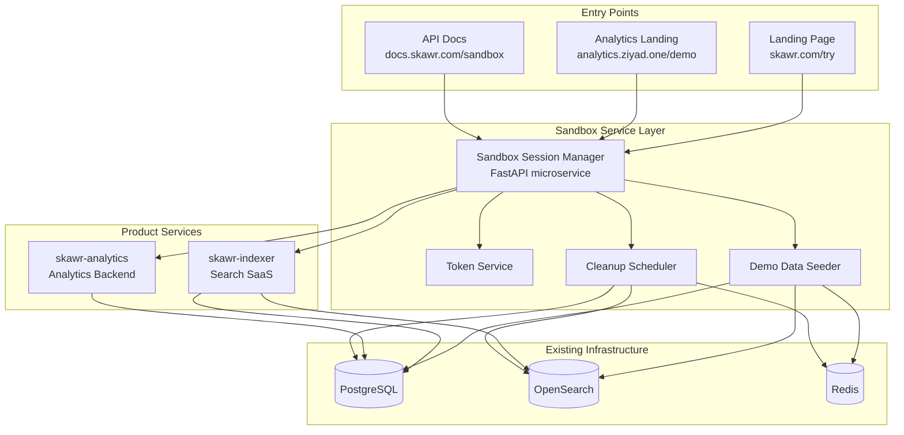
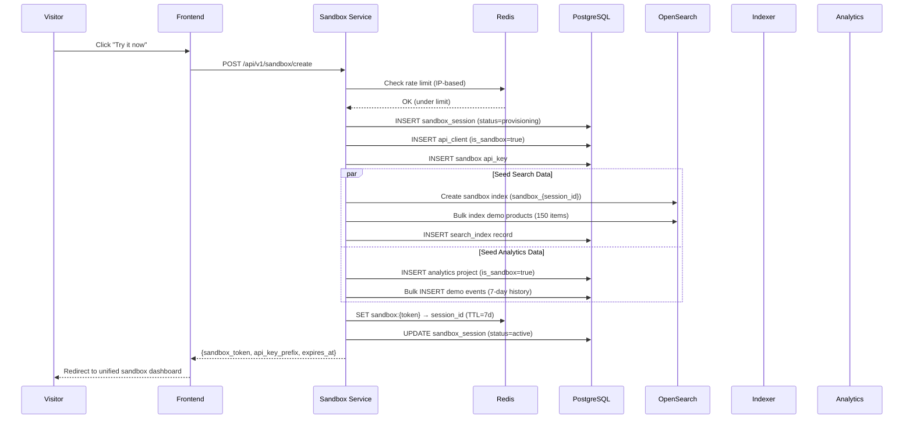
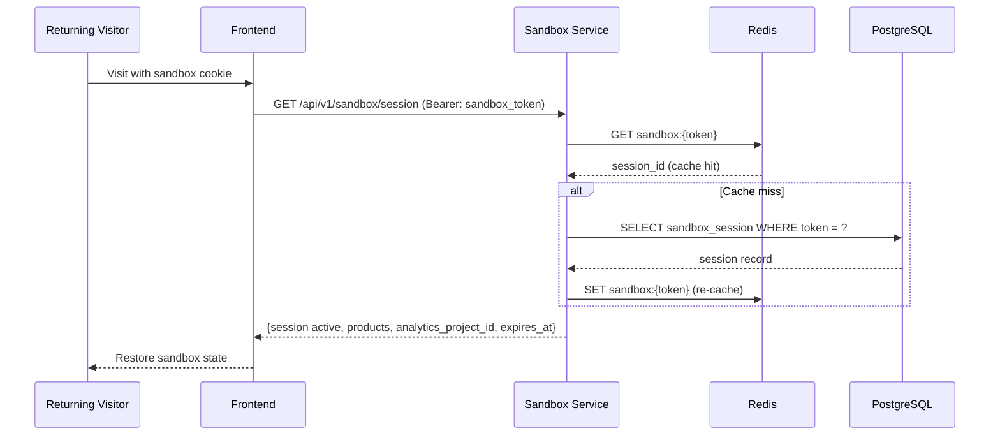
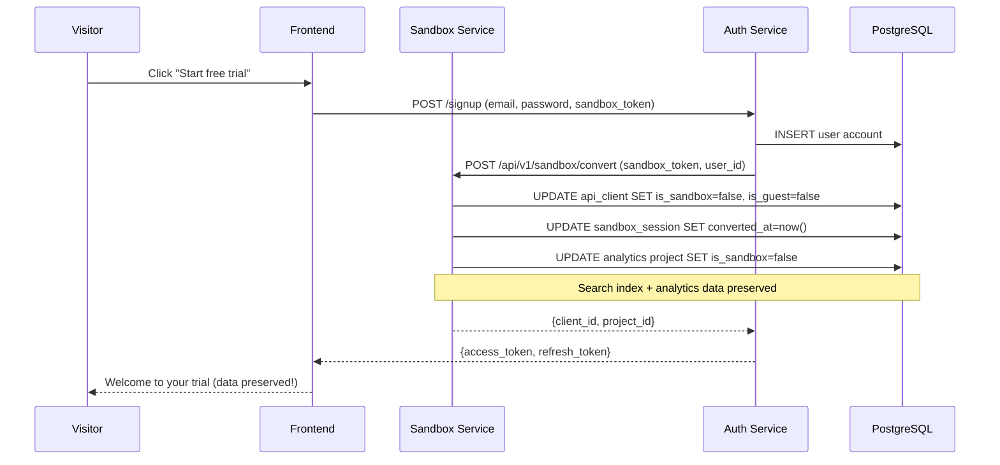

# Design Document: Unified Sandbox Service

## Overview

The Unified Sandbox Service provides a single, re-entrant sandbox environment that spans both Skawr Search SaaS and Skawr Analytics. It replaces the current one-shot guest onboarding flow with a persistent, cross-product demo experience that lets prospects explore both products within 30 seconds of landing — without signup, without hitting production infrastructure limits, and without losing their progress.

The service introduces a "sandbox session" abstraction that orchestrates demo data seeding across both products, maintains logical isolation from production data within the existing shared PostgreSQL/OpenSearch infrastructure, and auto-expires with cleanup. A single sandbox token grants access to pre-seeded search indices (with realistic product data) and analytics dashboards (with synthetic but realistic event histories), creating a unified "try before you buy" experience that naturally funnels toward paid conversion.

## Architecture




## Sequence Diagrams

### Sandbox Creation Flow



### Sandbox Re-entry Flow



### Sandbox → Conversion Flow




## Components and Interfaces

### Component 1: Sandbox Session Manager

**Purpose**: Central orchestrator for sandbox lifecycle — creation, access, conversion, and cleanup.

**Interface**:
```python
class SandboxSessionManager:
    async def create_session(self, request: SandboxCreateRequest) -> SandboxSession:
        """Provision a new sandbox with demo data for both products."""
        ...

    async def get_session(self, token: str) -> Optional[SandboxSession]:
        """Retrieve active sandbox session by token (Redis-cached)."""
        ...

    async def extend_session(self, token: str, days: int = 7) -> SandboxSession:
        """Extend sandbox TTL (max 30 days total)."""
        ...

    async def convert_session(self, token: str, user_id: str) -> ConversionResult:
        """Convert sandbox to real account, preserving data."""
        ...

    async def destroy_session(self, token: str) -> None:
        """Explicitly destroy a sandbox and clean up all resources."""
        ...
```

**Responsibilities**:
- Orchestrate cross-product sandbox provisioning
- Manage sandbox tokens and session state
- Enforce per-IP rate limits on sandbox creation
- Coordinate conversion from sandbox → trial account
- Track sandbox usage metrics for conversion funnel analysis

### Component 2: Demo Data Seeder

**Purpose**: Generate and inject realistic demo data into both products for immediate "wow" moment.

**Interface**:
```python
class DemoDataSeeder:
    async def seed_search_data(
        self, client_id: str, index_name: str
    ) -> SeedResult:
        """Seed a search index with demo products from template catalog."""
        ...

    async def seed_analytics_data(
        self, project_id: str, days_back: int = 7
    ) -> SeedResult:
        """Generate realistic analytics event history for demo project."""
        ...

    async def get_available_templates(self) -> list[DemoTemplate]:
        """List available demo data templates (e-commerce, SaaS, media)."""
        ...
```

**Responsibilities**:
- Maintain curated demo product catalogs (electronics, fashion, food)
- Generate statistically realistic analytics events (with proper session/funnel patterns)
- Ensure demo data creates compelling visualizations (not random noise)
- Support multiple industry templates for targeted demos

### Component 3: Sandbox Cleanup Scheduler

**Purpose**: Garbage-collect expired sandbox resources without impacting production.

**Interface**:
```python
class SandboxCleanupScheduler:
    async def run_cleanup_cycle(self) -> CleanupReport:
        """Find and destroy all expired sandbox sessions."""
        ...

    async def get_resource_usage(self) -> ResourceUsageReport:
        """Report current sandbox resource consumption."""
        ...
```

**Responsibilities**:
- Run periodically (cron, every 6 hours)
- Delete expired OpenSearch indices
- Purge expired sandbox events from PostgreSQL
- Clear Redis session keys
- Log cleanup metrics for resource monitoring

### Component 4: Sandbox Auth Middleware

**Purpose**: Extend existing auth to recognize sandbox tokens and enforce sandbox-specific limits.

**Interface**:
```python
class SandboxAuthMiddleware:
    async def authenticate_sandbox(
        self, token: str
    ) -> Optional[SandboxContext]:
        """Validate sandbox token and return context with limits."""
        ...

    def enforce_sandbox_limits(
        self, context: SandboxContext, action: str
    ) -> None:
        """Raise 429 if sandbox limits exceeded."""
        ...
```

**Responsibilities**:
- Validate sandbox tokens (separate from JWT and API key auth)
- Inject sandbox context into request state
- Enforce sandbox-specific rate limits and quotas
- Block operations not allowed in sandbox mode (e.g., webhook config)


## Data Models

### SandboxSession

```python
class SandboxSession(Base):
    __tablename__ = "sandbox_sessions"

    id = Column(UUID(as_uuid=True), primary_key=True, default=uuid.uuid4)
    token = Column(String(64), unique=True, nullable=False, index=True)
    
    # Ownership
    ip_address = Column(String(45), nullable=False, index=True)  # IPv4/IPv6
    fingerprint = Column(String(64), nullable=True)  # Browser fingerprint hash
    email = Column(String(255), nullable=True, index=True)  # Optional, for re-entry
    
    # Linked resources
    client_id = Column(UUID(as_uuid=True), ForeignKey("api_clients.id"), nullable=False)
    analytics_project_id = Column(String(255), nullable=True)  # FK to analytics DB
    search_index_id = Column(UUID(as_uuid=True), ForeignKey("search_indices.id"), nullable=True)
    
    # Template used
    demo_template = Column(String(50), nullable=False, default="ecommerce")
    
    # Lifecycle
    status = Column(String(20), nullable=False, default="provisioning")
    # status: provisioning | active | expired | converted | destroyed
    created_at = Column(DateTime, default=datetime.utcnow, nullable=False)
    expires_at = Column(DateTime, nullable=False)
    last_accessed_at = Column(DateTime, nullable=True)
    converted_at = Column(DateTime, nullable=True)
    converted_user_id = Column(String(255), nullable=True)
    
    # Usage metrics (for conversion analysis)
    search_count = Column(Integer, default=0)
    analytics_views = Column(Integer, default=0)
    api_calls = Column(Integer, default=0)

    __table_args__ = (
        Index("idx_sandbox_expires", "expires_at"),
        Index("idx_sandbox_status_expires", "status", "expires_at"),
        Index("idx_sandbox_ip", "ip_address", "created_at"),
    )
```

### SandboxAPIKey (extends existing APIKey model)

```python
# Added fields to existing APIKey model:
is_sandbox = Column(Boolean, default=False, nullable=False, server_default="false")
sandbox_session_id = Column(UUID(as_uuid=True), ForeignKey("sandbox_sessions.id"), nullable=True)
```

### Analytics Sandbox Project Marker

```python
# Added field to analytics Project model:
is_sandbox = Column(Boolean, default=False, nullable=False, server_default="false")
sandbox_session_token = Column(String(64), nullable=True, index=True)
```

### Demo Template Configuration

```python
class DemoTemplate(Base):
    __tablename__ = "demo_templates"

    id = Column(String(50), primary_key=True)  # "ecommerce", "saas", "media"
    name = Column(String(100), nullable=False)
    description = Column(Text, nullable=True)
    
    # Search demo config
    product_catalog = Column(JSONB, nullable=False)  # Array of demo products
    product_count = Column(Integer, nullable=False)
    
    # Analytics demo config
    event_schema = Column(JSONB, nullable=False)  # Event names + properties distribution
    daily_event_count = Column(Integer, default=500)
    user_count = Column(Integer, default=50)
    session_pattern = Column(JSONB, nullable=False)  # Funnel conversion rates, session duration distributions
    
    is_active = Column(Boolean, default=True, nullable=False)
    created_at = Column(DateTime, default=datetime.utcnow, nullable=False)
```

**Validation Rules**:
- `token` must be 64 chars (generated via `secrets.token_urlsafe(48)`)
- `expires_at` must be > `created_at` and <= `created_at + 30 days`
- `demo_template` must reference an active template
- Maximum 3 active sandboxes per IP address
- `product_catalog` size capped at 200 items per template
- `daily_event_count` capped at 1000 to prevent DB bloat


## Key Functions with Formal Specifications

### Function 1: create_sandbox_session()

```python
async def create_sandbox_session(
    ip_address: str,
    fingerprint: Optional[str] = None,
    template: str = "ecommerce",
    email: Optional[str] = None,
) -> SandboxSession:
```

**Preconditions:**
- `ip_address` is a valid IPv4 or IPv6 address
- Active sandbox count for this IP < `MAX_SANDBOXES_PER_IP` (3)
- `template` references an active DemoTemplate
- Rate limit: max 5 sandbox creations per IP per hour

**Postconditions:**
- Returns a `SandboxSession` with `status == "active"`
- A corresponding `APIClient` exists with `is_sandbox=True`
- A search index `sandbox_{session_id}` exists in OpenSearch with demo products
- An analytics project exists with `is_sandbox=True` and 7 days of demo events
- A Redis key `sandbox:{token}` exists with TTL matching `expires_at`
- The sandbox API key has permissions: `["search", "autocomplete"]` only

**Loop Invariants:** N/A (no loops — orchestration is parallel async)

### Function 2: seed_analytics_events()

```python
async def seed_analytics_events(
    project_id: str,
    template: DemoTemplate,
    days_back: int = 7,
) -> int:
```

**Preconditions:**
- `project_id` references a valid analytics project with `is_sandbox=True`
- `template.event_schema` is a valid schema with at least 3 event types
- `days_back` is between 1 and 30

**Postconditions:**
- Returns count of inserted events (> 0)
- Events span from `now - days_back` to `now` with realistic time distribution
- Event distribution follows template's `session_pattern` (funnel drop-offs, retention curve)
- At least 3 distinct `event_name` values present
- At least `template.user_count` distinct `user_id` values
- Sessions follow 30-minute inactivity timeout rule
- No events have `is_test=True` or `is_bot=True`
- Geographic distribution includes SA, AE, EG (MENA-weighted)

**Loop Invariants:**
- For each simulated day: cumulative event count monotonically increases
- For each simulated user: events are temporally ordered within sessions

### Function 3: convert_sandbox_to_trial()

```python
async def convert_sandbox_to_trial(
    sandbox_token: str,
    user_id: str,
    email: str,
) -> ConversionResult:
```

**Preconditions:**
- `sandbox_token` references an active session (`status == "active"`)
- `user_id` references a valid, newly-created user account
- Session has not already been converted (`converted_at is None`)

**Postconditions:**
- `SandboxSession.status == "converted"` and `converted_at` is set
- `APIClient.is_sandbox == False`, `is_guest == False`
- `APIClient.email == email` and linked to the user account
- Analytics project `is_sandbox == False`, ownership transferred to user
- Search index preserved (not renamed — `sandbox_` prefix is internal)
- Trial expiry set: `APIClient.guest_expires_at = now + 14 days`
- Redis sandbox key deleted (no longer needed — real auth takes over)
- All demo data preserved (user keeps the visualizations they explored)

**Loop Invariants:** N/A (single transaction)

### Function 4: cleanup_expired_sandboxes()

```python
async def cleanup_expired_sandboxes(
    batch_size: int = 50,
) -> CleanupReport:
```

**Preconditions:**
- Called by cron scheduler (not user-facing)
- Database connection is healthy

**Postconditions:**
- All sessions where `status == "active"` AND `expires_at < now()` are marked `status = "expired"`
- For each expired session:
  - OpenSearch index `sandbox_{session_id}` is deleted
  - Analytics events with matching `project_id` are deleted
  - Analytics project is deleted
  - `APIClient` record is soft-deleted (`is_active = False`)
  - Redis key `sandbox:{token}` is deleted (if still exists)
- Returns report with counts: expired, cleaned_search, cleaned_analytics, errors
- Processing is batched to avoid long-running transactions

**Loop Invariants:**
- For each batch: no more than `batch_size` sessions processed
- Total resource usage (OpenSearch indices + analytics events) decreases monotonically


## Algorithmic Pseudocode

### Sandbox Creation Algorithm

```python
async def create_sandbox_session(request: SandboxCreateRequest) -> SandboxSession:
    """
    ALGORITHM: Provision cross-product sandbox
    INPUT: request containing ip_address, fingerprint, template, email
    OUTPUT: active SandboxSession with seeded data
    
    INVARIANT: At no point does sandbox data pollute production queries
    """
    # Step 1: Rate limiting and quota check
    active_count = await db.count(
        SandboxSession,
        where=(ip_address == request.ip_address) & (status == "active")
    )
    if active_count >= MAX_SANDBOXES_PER_IP:
        raise SandboxQuotaExceeded(f"Max {MAX_SANDBOXES_PER_IP} active sandboxes per IP")
    
    if not await redis.check_rate_limit(f"sandbox:create:{request.ip_address}", 5, 3600):
        raise RateLimitExceeded("Max 5 sandbox creations per hour")

    # Step 2: Generate sandbox identifiers
    session_id = uuid.uuid4()
    token = secrets.token_urlsafe(48)  # 64 chars
    api_key_prefix = secrets.token_hex(4)  # 8 chars
    api_key_suffix = secrets.token_urlsafe(32)

    # Step 3: Create sandbox client (extending existing APIClient model)
    client = APIClient(
        name=f"Sandbox ({request.template})",
        is_active=True,
        is_guest=False,       # NOT a guest — sandboxes are a new concept
        is_sandbox=True,      # NEW field
        client_type="sandbox",
        tier_id=SANDBOX_TIER_ID,  # Pre-created tier with sandbox limits
    )
    await db.insert(client)

    # Step 4: Create sandbox session record
    session = SandboxSession(
        id=session_id,
        token=token,
        ip_address=request.ip_address,
        fingerprint=request.fingerprint,
        email=request.email,
        client_id=client.id,
        demo_template=request.template,
        status="provisioning",
        expires_at=datetime.utcnow() + timedelta(days=SANDBOX_TTL_DAYS),
    )
    await db.insert(session)

    # Step 5: Seed data in parallel
    template = await db.get(DemoTemplate, id=request.template)
    
    search_result, analytics_result = await asyncio.gather(
        seed_search_data(client.id, session_id, template),
        seed_analytics_data(session_id, template),
    )

    # Step 6: Create API key for sandbox search access
    api_key = APIKey(
        client_id=client.id,
        key_prefix=api_key_prefix,
        key_hash=hash_key(f"{api_key_prefix}.{api_key_suffix}"),
        search_index_id=search_result.index_id,
        permissions=["search", "autocomplete"],
        is_sandbox=True,
        sandbox_session_id=session_id,
    )
    await db.insert(api_key)

    # Step 7: Activate session
    session.status = "active"
    session.search_index_id = search_result.index_id
    session.analytics_project_id = analytics_result.project_id
    await db.commit()

    # Step 8: Cache in Redis for fast re-entry
    await redis.setex(
        f"sandbox:{token}",
        SANDBOX_TTL_DAYS * 86400,
        json.dumps({"session_id": str(session_id), "client_id": str(client.id)})
    )

    return session
```

### Analytics Event Generation Algorithm

```python
async def seed_analytics_events(
    project_id: str,
    template: DemoTemplate,
    days_back: int = 7,
) -> int:
    """
    ALGORITHM: Generate statistically realistic analytics events
    INPUT: project_id, template with event schema and patterns
    OUTPUT: count of generated events
    
    INVARIANT: Generated events produce compelling dashboard visualizations
              (funnels with realistic drop-off, retention curves that decay)
    """
    events = []
    now = datetime.utcnow()
    
    # Generate user pool with varying activity levels
    users = []
    for i in range(template.user_count):
        activity_level = random.choices(
            ["power", "regular", "casual"],
            weights=[0.1, 0.3, 0.6]
        )[0]
        users.append(UserProfile(
            user_id=f"demo_user_{i:04d}",
            anonymous_id=f"anon_{uuid.uuid4().hex[:12]}",
            activity_level=activity_level,
            country=random.choices(["SA", "AE", "EG", "KW", "BH"], weights=[0.5, 0.2, 0.15, 0.1, 0.05])[0],
            device=random.choices(["mobile", "desktop", "tablet"], weights=[0.6, 0.3, 0.1])[0],
            first_seen_offset=random.randint(0, days_back - 1),
        ))

    # For each day, generate sessions with event sequences
    for day_offset in range(days_back, 0, -1):
        day_start = now - timedelta(days=day_offset)
        
        # Daily active users follow a growth pattern (more recent = more users)
        dau_fraction = 0.3 + (0.4 * (days_back - day_offset) / days_back)
        active_users = random.sample(
            [u for u in users if u.first_seen_offset >= day_offset],
            k=min(int(len(users) * dau_fraction), len(users))
        )
        
        for user in active_users:
            # Generate 1-4 sessions per active user per day
            session_count = {"power": 3, "regular": 2, "casual": 1}[user.activity_level]
            
            for _ in range(random.randint(1, session_count)):
                session_id = f"sess_{uuid.uuid4().hex[:16]}"
                session_start = day_start + timedelta(
                    hours=random.gauss(14, 4),  # Peak at 2pm
                    minutes=random.randint(0, 59)
                )
                
                # Generate event sequence following funnel pattern
                event_sequence = generate_funnel_sequence(template.session_pattern)
                
                for i, event_def in enumerate(event_sequence):
                    event_time = session_start + timedelta(seconds=i * random.randint(5, 120))
                    events.append(Event(
                        event_name=event_def["name"],
                        user_id=user.user_id,
                        anonymous_id=user.anonymous_id,
                        session_id=session_id,
                        project_id=project_id,
                        timestamp=event_time,
                        date=event_time.strftime("%Y-%m-%d"),
                        hour=event_time.hour,
                        country=user.country,
                        device_type=user.device,
                        properties=event_def.get("properties", {}),
                        environment="sandbox",
                        is_bot=False,
                        is_test=False,
                    ))

    # Bulk insert in chunks
    total = 0
    for chunk in chunked(events, 500):
        await db.bulk_insert(chunk)
        total += len(chunk)
    
    return total


def generate_funnel_sequence(session_pattern: dict) -> list[dict]:
    """
    Generate a realistic event sequence with proper funnel drop-offs.
    
    session_pattern example:
    {
        "funnel": ["$pageview", "product_viewed", "add_to_cart", "checkout_started", "purchase"],
        "conversion_rates": [1.0, 0.6, 0.3, 0.15, 0.08],
        "extra_events": ["$click", "search", "filter_applied"]
    }
    """
    sequence = []
    funnel = session_pattern["funnel"]
    rates = session_pattern["conversion_rates"]
    
    for i, (event_name, rate) in enumerate(zip(funnel, rates)):
        if random.random() > rate:
            break  # User dropped off at this step
        sequence.append({"name": event_name})
        
        # Sprinkle extra events between funnel steps
        if i < len(funnel) - 1:
            for extra in session_pattern.get("extra_events", []):
                if random.random() < 0.3:
                    sequence.append({"name": extra})
    
    return sequence if sequence else [{"name": "$pageview"}]  # Minimum: one pageview
```


## API Contract

### Sandbox Endpoints (new router: `/api/v1/sandbox`)

```python
# POST /api/v1/sandbox/create
class SandboxCreateRequest(BaseModel):
    template: str = "ecommerce"  # "ecommerce" | "saas" | "media"
    email: Optional[str] = None  # For re-entry via email link

class SandboxCreateResponse(BaseModel):
    sandbox_token: str           # 64-char token for all sandbox access
    api_key: str                 # Full sandbox API key (prefix.suffix)
    api_key_prefix: str          # 8-char prefix for frontend use
    search_endpoint: str         # https://api.ziyad.one/api/v1/search
    analytics_dashboard_url: str # https://analytics.ziyad.one/sandbox/{token}
    expires_at: datetime
    template: str
    products_count: int
    events_count: int


# GET /api/v1/sandbox/session
# Header: Authorization: Bearer {sandbox_token}
class SandboxSessionResponse(BaseModel):
    status: str                  # active | expired | converted
    template: str
    created_at: datetime
    expires_at: datetime
    last_accessed_at: Optional[datetime]
    search_index_name: str
    analytics_project_id: str
    usage: SandboxUsageStats

class SandboxUsageStats(BaseModel):
    search_count: int
    analytics_views: int
    api_calls: int
    days_remaining: int


# POST /api/v1/sandbox/extend
# Header: Authorization: Bearer {sandbox_token}
class SandboxExtendRequest(BaseModel):
    days: int = 7  # Additional days (max total 30)

class SandboxExtendResponse(BaseModel):
    new_expires_at: datetime
    total_days: int


# POST /api/v1/sandbox/convert
# Header: Authorization: Bearer {sandbox_token}
class SandboxConvertRequest(BaseModel):
    email: str
    password: str
    name: str
    accept_terms: bool = True

class SandboxConvertResponse(BaseModel):
    access_token: str
    refresh_token: str
    client_id: str
    analytics_project_id: str
    message: str  # "Your sandbox data has been preserved in your new trial account"


# DELETE /api/v1/sandbox/session
# Header: Authorization: Bearer {sandbox_token}
# Response: 204 No Content


# GET /api/v1/sandbox/templates
# No auth required
class TemplateListResponse(BaseModel):
    templates: list[TemplateInfo]

class TemplateInfo(BaseModel):
    id: str
    name: str
    description: str
    products_count: int
    event_types: list[str]
    preview_image_url: Optional[str]
```

### Sandbox-Aware Search (existing endpoint, new behavior)

```python
# POST /api/v1/search
# When called with a sandbox API key:
# - Results limited to sandbox index only
# - X-Skawr-Sandbox: 1 header added to response
# - Usage counted against sandbox limits (not production tier)
# - No "store is live" flag set (same as X-Skawr-Preview behavior)
```

### Sandbox Analytics Dashboard (new frontend route)

```typescript
// Route: /sandbox/{token}
// Serves the full analytics dashboard but:
// - Read-only (no project settings, no SDK setup)
// - Shows "This is a sandbox" banner with conversion CTA
// - All analytics endpoints accept sandbox_token as Bearer auth
// - Filters to sandbox project data only
```


## Example Usage

### Creating a Sandbox (curl)

```bash
# Create sandbox — no auth required
curl -X POST https://api.ziyad.one/api/v1/sandbox/create \
  -H "Content-Type: application/json" \
  -d '{"template": "ecommerce", "email": "prospect@example.com"}'

# Response:
# {
#   "sandbox_token": "dGhpcyBpcyBhIHNhbmRib3ggdG9rZW4...",
#   "api_key": "sb_a1b2c3d4.xYz123...",
#   "api_key_prefix": "sb_a1b2c",
#   "search_endpoint": "https://api.ziyad.one/api/v1/search",
#   "analytics_dashboard_url": "https://analytics.ziyad.one/sandbox/dGhpcyBpc...",
#   "expires_at": "2025-02-07T12:00:00Z",
#   "template": "ecommerce",
#   "products_count": 150,
#   "events_count": 3500
# }
```

### Searching in Sandbox (SDK)

```typescript
import { SkawrSearch } from '@skawr/search'

// Initialize with sandbox API key prefix
const search = new SkawrSearch({
  apiKey: 'sb_a1b2c',  // Sandbox prefix — search-only access
  endpoint: 'https://api.ziyad.one'
})

// Search works identically to production
const results = await search.query('wireless headphones', {
  limit: 10,
  filters: { category: 'electronics' }
})
// Returns demo products from the sandbox index
```

### Viewing Analytics Dashboard

```typescript
// Frontend route handler: /sandbox/[token]/page.tsx
export default async function SandboxDashboard({ params }: { params: { token: string } }) {
  // Validate sandbox token
  const session = await fetch(`${API_URL}/api/v1/sandbox/session`, {
    headers: { Authorization: `Bearer ${params.token}` }
  }).then(r => r.json())

  if (session.status !== 'active') {
    return <SandboxExpired />
  }

  // Render full analytics dashboard in read-only sandbox mode
  return (
    <SandboxBanner expiresAt={session.expires_at} onConvert={handleConvert}>
      <AnalyticsDashboard
        projectId={session.analytics_project_id}
        authToken={params.token}
        readOnly={true}
      />
    </SandboxBanner>
  )
}
```

### Converting Sandbox to Trial

```bash
# Convert — preserves all sandbox data
curl -X POST https://api.ziyad.one/api/v1/sandbox/convert \
  -H "Authorization: Bearer ${SANDBOX_TOKEN}" \
  -H "Content-Type: application/json" \
  -d '{
    "email": "prospect@example.com",
    "password": "securePassword123",
    "name": "My Company",
    "accept_terms": true
  }'

# Response:
# {
#   "access_token": "eyJhbGciOiJ...",
#   "refresh_token": "eyJhbGciOiJ...",
#   "client_id": "uuid-here",
#   "analytics_project_id": "uuid-here",
#   "message": "Your sandbox data has been preserved in your new trial account"
# }
```


## Correctness Properties

*A property is a characteristic or behavior that should hold true across all valid executions of a system — essentially, a formal statement about what the system should do. Properties serve as the bridge between human-readable specifications and machine-verifiable correctness guarantees.*

### Property 1: Sandbox creation round trip

*For any* valid template and IP address (below quota), creating a sandbox session and then retrieving it by token SHALL return the same session with status "active", a 64-character token, and a linked API client with is_sandbox=True.

**Validates: Requirements 1.1, 1.2, 1.3, 3.1**

### Property 2: Sandbox index naming and population

*For any* successfully provisioned sandbox session, an OpenSearch index named "sandbox_{session_id}" SHALL exist containing at least 150 and at most 200 demo products from the selected template.

**Validates: Requirements 2.1, 2.2, 8.1, 12.1**

### Property 3: Analytics seeding temporal and statistical validity

*For any* template and days_back configuration, the seeded analytics events SHALL: span the full requested date range, contain at least 3 distinct event names, contain at least template.user_count distinct user IDs, have all events tagged with environment="sandbox", and have total count within ±20% of daily_event_count × days_back (capped at 5000).

**Validates: Requirements 2.3, 2.4, 2.5, 8.2, 12.2**

### Property 4: Session inactivity timeout invariant

*For any* generated analytics session, consecutive events within the same session_id SHALL have timestamps less than 30 minutes apart.

**Validates: Requirements 2.6**

### Property 5: Session expiry is 7 days from creation

*For any* newly created sandbox session, the expires_at field SHALL equal created_at + 7 days exactly.

**Validates: Requirements 1.4**

### Property 6: Expired token produces 410

*For any* sandbox session whose expires_at is in the past, presenting its token SHALL produce a 410 Gone response.

**Validates: Requirements 3.5**

### Property 7: Template validation is bidirectional

*For any* template identifier, sandbox creation SHALL succeed if and only if the identifier references an active Demo_Template record.

**Validates: Requirements 4.3, 4.4**

### Property 8: Extension respects 30-day maximum

*For any* sequence of extension operations on a sandbox session, the resulting expires_at SHALL never exceed created_at + 30 days. Extension requests that would violate this constraint SHALL be rejected.

**Validates: Requirements 5.1, 5.2, 5.3**

### Property 9: Conversion preserves data and updates flags

*For any* active sandbox session that is converted, the session status SHALL be "converted", the API client SHALL have is_sandbox=False and is_guest=False, the analytics project SHALL have is_sandbox=False, and the product count in the search index and event count in analytics SHALL be identical before and after conversion.

**Validates: Requirements 6.1, 6.2, 6.3, 6.4**

### Property 10: Conversion is not repeatable

*For any* sandbox session that has already been converted (status="converted"), a subsequent conversion attempt SHALL be rejected.

**Validates: Requirements 6.7**

### Property 11: Email conflict blocks conversion

*For any* conversion request where the email already belongs to an existing account, the conversion SHALL fail with a 409 Conflict response and the sandbox SHALL remain in active state.

**Validates: Requirements 6.6**

### Property 12: Cleanup identifies exactly expired sessions

*For any* set of sandbox sessions, the cleanup process SHALL identify and process exactly those sessions where status is "active" AND expires_at < now(), leaving non-expired and already-processed sessions untouched.

**Validates: Requirements 7.2**

### Property 13: Cleanup removes all session resources

*For any* expired session processed by cleanup, the OpenSearch index SHALL not exist, analytics events SHALL be zero, the API client SHALL be inactive, and the Redis key SHALL not exist.

**Validates: Requirements 7.3**

### Property 14: Cleanup batch size invariant

*For any* cleanup cycle processing N expired sessions, each processing batch SHALL contain at most 50 sessions.

**Validates: Requirements 7.4**

### Property 15: Production search never touches sandbox indices

*For any* search query executed with a non-sandbox API key, the query SHALL never reference or scan indices with the "sandbox_" prefix.

**Validates: Requirements 8.4**

### Property 16: Production analytics excludes sandbox events

*For any* analytics query on a non-sandbox project, no returned events SHALL have environment="sandbox" or belong to a project with is_sandbox=True.

**Validates: Requirements 8.5**

### Property 17: Per-IP concurrent quota enforcement

*For any* IP address, the number of active sandbox sessions SHALL never exceed MAX_SANDBOXES_PER_IP (3). A creation attempt that would violate this SHALL be rejected with 429.

**Validates: Requirements 9.1, 9.3**

### Property 18: Per-IP hourly rate limit enforcement

*For any* IP address that has created 5 or more sandboxes within the past hour, further creation attempts SHALL be rejected with 429.

**Validates: Requirements 9.2, 9.3**

### Property 19: Sandbox API key permission restriction

*For any* sandbox API key, the permissions set SHALL be exactly {"search", "autocomplete"}. Any operation outside this set SHALL produce a 403 Forbidden response.

**Validates: Requirements 10.2, 10.3**

### Property 20: Sandbox analytics data filtering

*For any* analytics query made with sandbox authentication, all returned data SHALL belong exclusively to that sandbox's project_id.

**Validates: Requirements 11.3, 10.4**

### Property 21: Provisioning failure atomicity

*For any* sandbox provisioning that fails mid-process, the session status SHALL be "failed", no orphan resources (indices, events, projects) SHALL remain, and the response SHALL be 503.

**Validates: Requirements 13.1**

### Property 22: Conversion failure atomicity

*For any* conversion that encounters a system error, the sandbox session SHALL remain in "active" status with all data and flags unchanged.

**Validates: Requirements 13.2**

### Property 23: Cleanup fault tolerance

*For any* cleanup batch where one session fails to clean, the remaining sessions in the batch SHALL still be processed successfully.

**Validates: Requirements 13.3**

## Error Handling

### Error Scenario 1: Sandbox Provisioning Failure

**Condition**: OpenSearch index creation or analytics seeding fails mid-provisioning
**Response**: Mark session as `status = "failed"`, log error with template/session details
**Recovery**: 
- Cleanup any partially-created resources (orphan indices, partial event inserts)
- Return 503 to client with retry-after header (30s)
- Client-side: show "Setting up your sandbox, please try again in a moment"

### Error Scenario 2: Sandbox Token Expired

**Condition**: User returns with expired sandbox token
**Response**: Return 410 Gone with body explaining sandbox expired
**Recovery**:
- Offer to create a new sandbox (preserving email for continuity)
- If email was registered, suggest they log in to their converted account
- Frontend shows "Your sandbox expired" with clear CTA options

### Error Scenario 3: Resource Exhaustion

**Condition**: Too many active sandboxes consuming OpenSearch/PostgreSQL resources
**Response**: 
- New sandbox creation returns 503 with "Try again later"
- Existing sandboxes continue to work
**Recovery**:
- Trigger emergency cleanup of sandboxes idle > 3 days
- Alert admin via Sentry/GlitchTip
- Auto-reduce SANDBOX_TTL_DAYS temporarily

### Error Scenario 4: Conversion Conflict

**Condition**: User tries to convert sandbox but email already has an account
**Response**: Return 409 Conflict with message "This email already has an account"
**Recovery**:
- Offer to merge sandbox data into existing account
- Offer to use a different email
- Offer to log in to existing account


## Testing Strategy

### Unit Testing Approach

- Test sandbox session lifecycle: create → access → extend → convert/expire
- Test demo data generation with fixed random seeds for deterministic output
- Test rate limiting logic (per-IP quotas, hourly limits)
- Test token validation and expiry checking
- Test cleanup scheduler batch processing
- Mock OpenSearch and PostgreSQL for isolated unit tests

**Key test cases:**
- Sandbox creation with all templates
- Quota enforcement (4th sandbox creation rejected)
- Token re-entry after Redis cache eviction (fallback to DB)
- Conversion with email conflict handling
- Cleanup of partially-provisioned sandboxes

### Property-Based Testing Approach

**Property Test Library**: hypothesis (Python)

**Properties to test:**
1. For any valid template and days_back, `seed_analytics_events` produces events where:
   - All timestamps fall within [now - days_back, now]
   - All user_ids are from the template's user pool
   - Event count is within ±20% of `template.daily_event_count * days_back`
   - Funnel conversion rates approximate the template's configured rates (±10%)

2. For any sequence of create/access/extend/destroy operations on sandbox sessions:
   - Active session count never exceeds MAX_SANDBOXES_PER_IP for any IP
   - Destroyed sessions are not accessible
   - Extended sessions have expires_at > original expires_at

3. For any sandbox search query:
   - Results are always a subset of the sandbox's seeded products
   - Production indices are never referenced

### Integration Testing Approach

- End-to-end sandbox creation with real PostgreSQL + OpenSearch (Docker Compose test env)
- Verify analytics dashboard renders with seeded data
- Test conversion flow preserves data access post-conversion
- Test cleanup scheduler actually removes OpenSearch indices
- Load test: 50 concurrent sandbox creations

## Performance Considerations

### Resource Budget (per VPS)

| Resource | Budget | Per Sandbox | Max Concurrent |
|----------|--------|-------------|----------------|
| OpenSearch indices | 500 MB | ~5 MB (150 products) | ~100 sandboxes |
| PostgreSQL (events) | 200 MB | ~2 MB (3500 events) | ~100 sandboxes |
| PostgreSQL (sessions) | Negligible | ~1 KB | Unlimited |
| Redis (tokens) | 10 MB | ~200 bytes | Unlimited |

### Provisioning Time Budget

- Target: sandbox fully usable within **5 seconds** of creation request
- OpenSearch index creation: ~1s
- Bulk index 150 products: ~2s
- Analytics event generation + bulk insert: ~2s (parallel with search seeding)
- Redis + session bookkeeping: <100ms

### Optimization Strategies

1. **Pre-generated demo catalogs**: Store demo products as a JSON fixture, not generated per-request
2. **Bulk INSERT for events**: Use `COPY` or `executemany` for the 3500-event insert
3. **Index templates**: Pre-configure OpenSearch index templates so sandbox indices inherit optimal mappings
4. **Lazy seeding**: Seed search data immediately (needed for first interaction), but seed analytics events asynchronously (user visits analytics dashboard 10-30s later)
5. **Read replicas not needed**: Sandbox queries are simple (single project/index) — no complex aggregation until conversion

## Security Considerations

### Sandbox Token Security

- Tokens are cryptographically random (48 bytes → 64 chars base64url)
- Stored hashed in PostgreSQL (SHA-256), plaintext only in Redis (with TTL)
- Transmitted over HTTPS only
- Stored client-side in httpOnly cookie (not localStorage) + fallback URL parameter

### Abuse Prevention

- Per-IP rate limiting: 5 creations/hour, 3 concurrent active
- Browser fingerprinting (optional) to detect IP rotation abuse
- CAPTCHA trigger after 2nd sandbox creation from same IP within 1 hour
- Sandbox API keys have restrictive permissions (search-only)
- No write access to indices from sandbox keys (prevents data injection)
- Demo data is read-only — no mutation endpoints available in sandbox mode

### Data Isolation Guarantees

- Sandbox OpenSearch indices use a `sandbox_` prefix — production search never queries these
- Analytics sandbox events use `environment="sandbox"` — production dashboards filter by `environment="production"`
- Sandbox projects have `is_sandbox=True` — query layer enforces this filter
- No cross-tenant data leakage: each sandbox has its own isolated index and project

## Dependencies

### Existing Services (no new infrastructure)

| Dependency | Purpose in Sandbox |
|------------|-------------------|
| PostgreSQL | Store sessions, sandbox client records, analytics demo events |
| OpenSearch | Host sandbox search indices (same cluster, logical isolation) |
| Redis | Cache sandbox tokens, rate limit counters |
| skawr-indexer | Search endpoint (sandbox-aware via API key type) |
| skawr-analytics | Dashboard rendering (sandbox-aware via project flag) |

### New Dependencies (code-level only)

| Package | Purpose | Version |
|---------|---------|---------|
| `apscheduler` | Cleanup cron scheduling (already in analytics deps) | existing |
| None | No new infrastructure, packages, or services required | — |

### Architecture Decision: No Separate Microservice

The sandbox service is implemented as a **new router module** within `skawr-indexer` (not a separate service), because:
1. It needs direct access to the same PostgreSQL and OpenSearch as the indexer
2. It creates APIClient/APIKey records using the indexer's existing models
3. Adding a container to the Docker Compose stack costs ~200MB RAM on the VPS
4. The analytics seeding component is a lightweight async function called via internal HTTP (not a separate service)

The analytics-side sandbox support (project creation, dashboard rendering) is added as a module within `skawr-analytics` backend, coordinated via internal API calls from the indexer's sandbox router.
